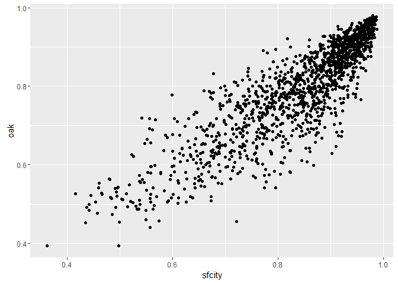

# Analyze str daily
Tourism Economics  
April 14, 2016  


```r
fpath <- c("~/Project/R projects/sf_2016/") 
```


```r
load(file=paste0(fpath,"output_data/str_daily.Rdata"))
```

Create a simple set of dates and days of week

```r
date <- seq(as.Date("1970-01-01"), as.Date("2030-01-01"), by = 1)
df <- data.frame(date)

date_df <- df %>%
  # add columns of month day
  mutate(month = lubridate::month(date, label=TRUE, abbr=TRUE)) %>%
  mutate(monthnum = lubridate::month(date, label=FALSE)) %>%
  mutate(day = day(date)) %>%
  mutate(wday = wday(date, label=TRUE)) %>%
  mutate(year = lubridate::year(date))
```

Join the simple date info onto the STR data

```r
str_daily_1 <- str_daily %>%
  left_join(date_df, by="date")  
```


Create seasonal categories

```r
seascat <- str_daily_1 %>%
  distinct(date) %>%
  # seasonal categories
  mutate(season1 = 
    ifelse(month %in% c("Jan", "Dec"), "01_Jan-Dec",
    ifelse(month %in% c("Feb", "Mar", "Apr", "May"), "02_Feb-Mar-Apr-May",
    ifelse(month %in% c("Jun"), "03_Jun",
    ifelse(month %in% c("Jul", "Aug", "Sep"), "04_Jul-Aug-Sep",
    ifelse(month %in% c("Oct"), "05_Oct",
    ifelse(month %in% c("Nov"), "06_Nov",
                            "other"))))))) %>%
  #year groupings
  mutate(yeargp = ifelse(year %in% c(2011, 2012), "yr11-12", 
                  ifelse(year %in% c(2013), "yr13",
                  ifelse(year %in% c(2014, 2015), "yr14-15",
                  "other")))) %>%
  select(date, season1, yeargp)
  
str_daily_2 <- str_daily_1 %>%
  left_join(seascat, by=c("date"))
```


How much data do we have for each geography in the total segment?

```r
str_daily_2 %>%
  filter(seg == "total") %>%
  group_by(geo_ttl, year) %>%
  summarize(a =n()) %>%
  ungroup() %>%
  spread(geo_ttl, a) %>%
   kable(digits=0, format.args = list(big.mark = ","))
```


  year   oak   sfcity   sfconv
------  ----  -------  -------
 2,011    NA      365       NA
 2,012   366      366      366
 2,013   365      365      365
 2,014   365      365      365
 2,015   365      363      365
 2,016    NA       79       44


Define some occupancy categories

```r
# occupancy categories
sfocccat1 <- str_daily_2 %>%
  filter(geo_ttl == "sfcity") %>%
  filter(seg == "total") %>%
  filter(date >= as.Date("2011-01-01") & date <= as.Date("2015-12-31")) %>%
  mutate(sfocccat1 = cut(occ, c(0,.7,.8,.9,.95,1))) %>%
  select(date, sfocccat1)

# typical sf occupancy by season and wday
typocc <- str_daily_2 %>%
  filter(geo_ttl == "sfcity") %>%
  filter(seg == "total") %>%
  filter(date >= as.Date("2011-01-01") & date <= as.Date("2015-12-31")) %>%
  group_by(geo_ttl, season1, wday) %>%
  summarize(mocc1 = mean(occ)) %>%
  ungroup() %>%
  select(-geo_ttl)

# work with the segment data
typocc_group <- str_daily_2 %>%
  filter(geo_ttl == "sfcity") %>%
  filter(seg == "group") %>%
  filter(date >= as.Date("2011-01-01") & date <= as.Date("2015-12-31")) %>%
  filter(!(is.na(occ))) %>%
  group_by(season1, wday) %>%
  summarize(mgroup1 = mean(occ)) %>%
  ungroup() %>%
  select(season1, wday, mgroup1)

# sf group 
sfgroupcat1 <- str_daily_2 %>%
  filter(geo_ttl == "sfcity") %>%
  filter(seg == "group") %>%
  filter(date >= as.Date("2012-01-01") & date <= as.Date("2015-12-31")) %>%
  mutate(sfgroupcat1 = cut(occ, c(0,.2,.4,.5,1))) %>%
  select(date, sfgroupcat1)
```

Join on these various new columns

```r
str_daily_3 <- str_daily_2 %>%
  left_join(sfocccat1, by=c("date")) %>%
  left_join(typocc, by=c("season1", "wday")) %>%
  left_join(typocc_group, by=c("season1", "wday")) %>%
  left_join(sfgroupcat1, by=c("date"))
```


# Data limitations
Looks like for SF City, we could do full year comparisons from 2011 to 2015. When we do comparisons with other geographies, we should do 2012 to 2015.  
The segmentation data for SF City is missing from 1/10/14 to 9/30/14.  


```r
dsfcity_seg <- str_daily_3 %>%
  filter(geo_ttl == "sfcity") %>%
  filter(date >= as.Date("2011-01-01") & date <= as.Date("2015-12-31"))

dsfcity_1 <- str_daily_3 %>%
  filter(seg == "total") %>%
  filter(geo_ttl == "sfcity") %>%
  filter(date >= as.Date("2011-01-01") & date <= as.Date("2015-12-31"))

doaksf_1 <- str_daily_3 %>%
  filter(seg == "total") %>%
  filter(geo_ttl %in% c("sfcity", "oak")) %>%
  filter(date >= as.Date("2012-01-01") & date <= as.Date("2015-12-31"))

doaksf_seg <- str_daily_3 %>%
  filter(geo_ttl %in% c("sfcity", "oak")) %>%
  filter(date >= as.Date("2012-01-01") & date <= as.Date("2015-12-31"))

doaksf_seg_1 <- doaksf_seg %>%
  # drop the two dates in July that are missing from the SF data
  filter(!(date == as.Date("2015-07-26"))) %>%
  filter(!(date == as.Date("2015-07-27")))
```


## Frequency: Occupancy categories

Frequency of occupancy categories overall

```r
dsfcity_1 %>%
  group_by(sfocccat1) %>%
  summarise (n = n()) %>%
  mutate(freq = n / sum(n)) %>%
  ungroup() %>%
  select(-n) %>%
  # fill NAs with 0
  spread(sfocccat1, freq, fill=0) %>%
  kable(digits=c(1,rep(3,5)), format.args = list(big.mark = ","))
```


 (0,0.7]   (0.7,0.8]   (0.8,0.9]   (0.9,0.95]   (0.95,1]
--------  ----------  ----------  -----------  ---------
     0.2       0.166       0.293        0.228      0.154

Frequency of occupancy categories by year

```r
dsfcity_1 %>%
  group_by(year, sfocccat1) %>%
  summarise (n = n()) %>%
  mutate(freq = n / sum(n)) %>%
  ungroup() %>%
  select(-n) %>%
  # fill NAs with 0
  spread(sfocccat1, freq, fill=0) %>%
  kable(digits=c(1,rep(3,5)), format.args = list(big.mark = ","))
```


  year   (0,0.7]   (0.7,0.8]   (0.8,0.9]   (0.9,0.95]   (0.95,1]
------  --------  ----------  ----------  -----------  ---------
 2,011     0.216       0.186       0.321        0.164      0.112
 2,012     0.197       0.191       0.287        0.199      0.126
 2,013     0.148       0.159       0.274        0.214      0.205
 2,014     0.121       0.151       0.279        0.268      0.181
 2,015     0.113       0.143       0.306        0.292      0.146

Frequency of occupancy categories by month (and number of days)

```r
dsfcity_1 %>%
  group_by(month, sfocccat1) %>%
  summarise (n = n()) %>%
  mutate(freq = n / sum(n)) %>%
  ungroup() %>%
  select(-n) %>%
  # fill NAs with 0
  spread(sfocccat1, freq, fill=0) %>%
  arrange(month) %>%
  kable(digits=c(1,rep(3,5)), format.args = list(big.mark = ","))
```


month    (0,0.7]   (0.7,0.8]   (0.8,0.9]   (0.9,0.95]   (0.95,1]
------  --------  ----------  ----------  -----------  ---------
Jan        0.503       0.277       0.155        0.058      0.006
Feb        0.241       0.397       0.220        0.121      0.021
Mar        0.187       0.290       0.355        0.155      0.013
Apr        0.080       0.193       0.440        0.227      0.060
May        0.097       0.135       0.419        0.239      0.110
Jun        0.000       0.080       0.327        0.400      0.193
Jul        0.046       0.111       0.255        0.255      0.333
Aug        0.000       0.039       0.219        0.355      0.387
Sep        0.033       0.040       0.327        0.287      0.313
Oct        0.026       0.077       0.335        0.316      0.245
Nov        0.280       0.153       0.273        0.173      0.120
Dec        0.413       0.213       0.194        0.142      0.039

```r
dsfcity_1 %>%
  group_by(month, sfocccat1) %>%
  summarise (n = n()) %>%
  ungroup() %>%
  # fill NAs with 0
  spread(sfocccat1, n, fill=0) %>%
  arrange(month) %>%
  kable(digits=c(1,rep(3,5)), format.args = list(big.mark = ","))
```


month    (0,0.7]   (0.7,0.8]   (0.8,0.9]   (0.9,0.95]   (0.95,1]
------  --------  ----------  ----------  -----------  ---------
Jan           78          43          24            9          1
Feb           34          56          31           17          3
Mar           29          45          55           24          2
Apr           12          29          66           34          9
May           15          21          65           37         17
Jun            0          12          49           60         29
Jul            7          17          39           39         51
Aug            0           6          34           55         60
Sep            5           6          49           43         47
Oct            4          12          52           49         38
Nov           42          23          41           26         18
Dec           64          33          30           22          6

Frequency of occupancy categories by season1 (and number of days)

```r
dsfcity_1 %>%
  group_by(season1, sfocccat1) %>%
  summarise (n = n()) %>%
  mutate(freq = n / sum(n)) %>%
  ungroup() %>%
  select(-n) %>%
  # fill NAs with 0
  spread(sfocccat1, freq, fill=0) %>%
  kable(digits=c(1,rep(3,5)), format.args = list(big.mark = ","))
```


season1               (0,0.7]   (0.7,0.8]   (0.8,0.9]   (0.9,0.95]   (0.95,1]
-------------------  --------  ----------  ----------  -----------  ---------
01_Jan-Dec              0.458       0.245       0.174        0.100      0.023
02_Feb-Mar-Apr-May      0.150       0.251       0.361        0.186      0.052
03_Jun                  0.000       0.080       0.327        0.400      0.193
04_Jul-Aug-Sep          0.026       0.063       0.266        0.299      0.345
05_Oct                  0.026       0.077       0.335        0.316      0.245
06_Nov                  0.280       0.153       0.273        0.173      0.120

```r
dsfcity_1 %>%
  group_by(season1, sfocccat1) %>%
  summarise (n = n()) %>%
  ungroup() %>%
  # fill NAs with 0
  spread(sfocccat1, n, fill=0) %>%
  kable(digits=c(1,rep(3,5)), format.args = list(big.mark = ","))
```


season1               (0,0.7]   (0.7,0.8]   (0.8,0.9]   (0.9,0.95]   (0.95,1]
-------------------  --------  ----------  ----------  -----------  ---------
01_Jan-Dec                142          76          54           31          7
02_Feb-Mar-Apr-May         90         151         217          112         31
03_Jun                      0          12          49           60         29
04_Jul-Aug-Sep             12          29         122          137        158
05_Oct                      4          12          52           49         38
06_Nov                     42          23          41           26         18

Frequency of occupancy categories by year and season1 (and number of days)

```r
dsfcity_1 %>%
  group_by(season1, year, sfocccat1) %>%
  summarise (n = n()) %>%
  mutate(freq = n / sum(n)) %>%
  ungroup() %>%
  select(-n) %>%
  # fill NAs with 0
  spread(sfocccat1, freq, fill=0) %>%
  kable(digits=c(1,rep(3,6)), format.args = list(big.mark = ","))
```


season1                year   (0,0.7]   (0.7,0.8]   (0.8,0.9]   (0.9,0.95]   (0.95,1]
-------------------  ------  --------  ----------  ----------  -----------  ---------
01_Jan-Dec            2,011     0.613       0.177       0.129        0.081      0.000
01_Jan-Dec            2,012     0.532       0.177       0.194        0.048      0.048
01_Jan-Dec            2,013     0.500       0.274       0.097        0.097      0.032
01_Jan-Dec            2,014     0.323       0.274       0.210        0.177      0.016
01_Jan-Dec            2,015     0.323       0.323       0.242        0.097      0.016
02_Feb-Mar-Apr-May    2,011     0.217       0.342       0.325        0.092      0.025
02_Feb-Mar-Apr-May    2,012     0.207       0.331       0.339        0.107      0.017
02_Feb-Mar-Apr-May    2,013     0.133       0.200       0.358        0.233      0.075
02_Feb-Mar-Apr-May    2,014     0.117       0.208       0.375        0.217      0.083
02_Feb-Mar-Apr-May    2,015     0.075       0.175       0.408        0.283      0.058
03_Jun                2,011     0.000       0.167       0.533        0.233      0.067
03_Jun                2,012     0.000       0.033       0.367        0.400      0.200
03_Jun                2,013     0.000       0.067       0.267        0.367      0.300
03_Jun                2,014     0.000       0.100       0.233        0.533      0.133
03_Jun                2,015     0.000       0.033       0.233        0.467      0.267
04_Jul-Aug-Sep        2,011     0.022       0.065       0.359        0.250      0.304
04_Jul-Aug-Sep        2,012     0.043       0.076       0.283        0.337      0.261
04_Jul-Aug-Sep        2,013     0.022       0.065       0.250        0.228      0.435
04_Jul-Aug-Sep        2,014     0.022       0.054       0.185        0.326      0.413
04_Jul-Aug-Sep        2,015     0.022       0.056       0.256        0.356      0.311
05_Oct                2,011     0.065       0.097       0.387        0.258      0.194
05_Oct                2,012     0.032       0.097       0.290        0.323      0.258
05_Oct                2,013     0.000       0.032       0.355        0.355      0.258
05_Oct                2,014     0.000       0.097       0.355        0.258      0.290
05_Oct                2,015     0.032       0.065       0.290        0.387      0.226
06_Nov                2,011     0.367       0.067       0.300        0.200      0.067
06_Nov                2,012     0.300       0.267       0.200        0.133      0.100
06_Nov                2,013     0.167       0.267       0.300        0.033      0.233
06_Nov                2,014     0.267       0.067       0.300        0.233      0.133
06_Nov                2,015     0.300       0.100       0.267        0.267      0.067

```r
dsfcity_1 %>%
  group_by(season1, year, sfocccat1) %>%
  summarise (n = n()) %>%
  ungroup() %>%
  # fill NAs with 0
  spread(sfocccat1, n, fill=0) %>%
  kable(digits=c(1,rep(3,6)), format.args = list(big.mark = ","))
```


season1                year   (0,0.7]   (0.7,0.8]   (0.8,0.9]   (0.9,0.95]   (0.95,1]
-------------------  ------  --------  ----------  ----------  -----------  ---------
01_Jan-Dec            2,011        38          11           8            5          0
01_Jan-Dec            2,012        33          11          12            3          3
01_Jan-Dec            2,013        31          17           6            6          2
01_Jan-Dec            2,014        20          17          13           11          1
01_Jan-Dec            2,015        20          20          15            6          1
02_Feb-Mar-Apr-May    2,011        26          41          39           11          3
02_Feb-Mar-Apr-May    2,012        25          40          41           13          2
02_Feb-Mar-Apr-May    2,013        16          24          43           28          9
02_Feb-Mar-Apr-May    2,014        14          25          45           26         10
02_Feb-Mar-Apr-May    2,015         9          21          49           34          7
03_Jun                2,011         0           5          16            7          2
03_Jun                2,012         0           1          11           12          6
03_Jun                2,013         0           2           8           11          9
03_Jun                2,014         0           3           7           16          4
03_Jun                2,015         0           1           7           14          8
04_Jul-Aug-Sep        2,011         2           6          33           23         28
04_Jul-Aug-Sep        2,012         4           7          26           31         24
04_Jul-Aug-Sep        2,013         2           6          23           21         40
04_Jul-Aug-Sep        2,014         2           5          17           30         38
04_Jul-Aug-Sep        2,015         2           5          23           32         28
05_Oct                2,011         2           3          12            8          6
05_Oct                2,012         1           3           9           10          8
05_Oct                2,013         0           1          11           11          8
05_Oct                2,014         0           3          11            8          9
05_Oct                2,015         1           2           9           12          7
06_Nov                2,011        11           2           9            6          2
06_Nov                2,012         9           8           6            4          3
06_Nov                2,013         5           8           9            1          7
06_Nov                2,014         8           2           9            7          4
06_Nov                2,015         9           3           8            8          2

Frequency of occupancy categories by month, day of week (and number of days)

```r
dsfcity_1 %>%
  group_by(month, wday, sfocccat1) %>%
  summarise (n = n()) %>%
  mutate(freq = n / sum(n)) %>%
  ungroup() %>%
  select(-n) %>%
  # spread, but replace NA with 0
  spread(wday, freq, fill=0) %>%
  kable(digits=c(1,rep(3,6)), format.args = list(big.mark = ","))
```


month   sfocccat1       Sun     Mon    Tues     Wed   Thurs   Fri     Sat
------  -----------  ------  ------  ------  ------  ------  ----  ------
Jan     (0,0.7]       0.591   0.455   0.364   0.364   0.609   0.7   0.455
Jan     (0.7,0.8]     0.273   0.227   0.273   0.318   0.304   0.3   0.273
Jan     (0.8,0.9]     0.136   0.227   0.227   0.227   0.043   0.0   0.182
Jan     (0.9,0.95]    0.000   0.045   0.136   0.091   0.043   0.0   0.091
Jan     (0.95,1]      0.000   0.045   0.000   0.000   0.000   0.0   0.000
Feb     (0,0.7]       0.550   0.300   0.200   0.095   0.200   0.3   0.050
Feb     (0.7,0.8]     0.450   0.350   0.250   0.286   0.400   0.5   0.550
Feb     (0.8,0.9]     0.000   0.250   0.250   0.333   0.350   0.2   0.150
Feb     (0.9,0.95]    0.000   0.100   0.200   0.238   0.050   0.0   0.250
Feb     (0.95,1]      0.000   0.000   0.100   0.048   0.000   0.0   0.000
Mar     (0,0.7]       0.696   0.136   0.136   0.000   0.045   0.1   0.130
Mar     (0.7,0.8]     0.174   0.500   0.182   0.286   0.318   0.4   0.217
Mar     (0.8,0.9]     0.130   0.273   0.318   0.381   0.455   0.4   0.522
Mar     (0.9,0.95]    0.000   0.091   0.318   0.286   0.182   0.1   0.130
Mar     (0.95,1]      0.000   0.000   0.045   0.048   0.000   0.0   0.000
Apr     (0,0.7]       0.524   0.045   0.000   0.000   0.000   0.0   0.000
Apr     (0.7,0.8]     0.286   0.318   0.182   0.045   0.190   0.1   0.238
Apr     (0.8,0.9]     0.143   0.455   0.500   0.364   0.429   0.7   0.476
Apr     (0.9,0.95]    0.048   0.136   0.273   0.409   0.333   0.2   0.190
Apr     (0.95,1]      0.000   0.045   0.045   0.182   0.048   0.0   0.095
May     (0,0.7]       0.409   0.238   0.045   0.000   0.000   0.0   0.000
May     (0.7,0.8]     0.136   0.238   0.091   0.045   0.130   0.2   0.136
May     (0.8,0.9]     0.364   0.238   0.409   0.318   0.696   0.6   0.273
May     (0.9,0.95]    0.091   0.190   0.182   0.500   0.174   0.2   0.318
May     (0.95,1]      0.000   0.095   0.273   0.136   0.000   0.0   0.273
Jun     (0.7,0.8]     0.273   0.045   0.048   0.048   0.048   0.1   0.000
Jun     (0.8,0.9]     0.636   0.409   0.143   0.095   0.286   0.4   0.273
Jun     (0.9,0.95]    0.091   0.409   0.381   0.429   0.476   0.4   0.591
Jun     (0.95,1]      0.000   0.136   0.429   0.429   0.190   0.0   0.136
Jul     (0,0.7]       0.143   0.048   0.130   0.000   0.000   0.0   0.000
Jul     (0.7,0.8]     0.238   0.095   0.043   0.217   0.136   0.0   0.000
Jul     (0.8,0.9]     0.571   0.286   0.043   0.000   0.273   0.4   0.238
Jul     (0.9,0.95]    0.048   0.333   0.174   0.130   0.409   0.3   0.381
Jul     (0.95,1]      0.000   0.238   0.609   0.652   0.182   0.2   0.381
Aug     (0.7,0.8]     0.136   0.000   0.000   0.000   0.091   0.0   0.000
Aug     (0.8,0.9]     0.591   0.455   0.095   0.045   0.227   0.1   0.000
Aug     (0.9,0.95]    0.136   0.318   0.476   0.545   0.455   0.4   0.130
Aug     (0.95,1]      0.136   0.227   0.429   0.409   0.227   0.4   0.870
Sep     (0,0.7]       0.000   0.227   0.000   0.000   0.000   0.0   0.000
Sep     (0.7,0.8]     0.091   0.000   0.182   0.000   0.000   0.0   0.000
Sep     (0.8,0.9]     0.773   0.136   0.136   0.238   0.381   0.6   0.048
Sep     (0.9,0.95]    0.136   0.409   0.318   0.143   0.238   0.4   0.381
Sep     (0.95,1]      0.000   0.227   0.364   0.619   0.381   0.0   0.571
Oct     (0,0.7]       0.048   0.045   0.000   0.043   0.000   0.0   0.000
Oct     (0.7,0.8]     0.143   0.091   0.045   0.000   0.130   0.1   0.045
Oct     (0.8,0.9]     0.667   0.455   0.227   0.174   0.391   0.4   0.091
Oct     (0.9,0.95]    0.095   0.182   0.455   0.391   0.304   0.4   0.409
Oct     (0.95,1]      0.048   0.227   0.273   0.391   0.174   0.1   0.455
Nov     (0,0.7]       0.500   0.381   0.333   0.286   0.238   0.0   0.182
Nov     (0.7,0.8]     0.227   0.143   0.000   0.048   0.143   0.4   0.136
Nov     (0.8,0.9]     0.273   0.238   0.190   0.190   0.238   0.4   0.364
Nov     (0.9,0.95]    0.000   0.095   0.286   0.190   0.333   0.1   0.182
Nov     (0.95,1]      0.000   0.143   0.190   0.286   0.048   0.0   0.136
Dec     (0,0.7]       0.545   0.565   0.565   0.455   0.364   0.3   0.091
Dec     (0.7,0.8]     0.227   0.087   0.087   0.227   0.318   0.4   0.182
Dec     (0.8,0.9]     0.182   0.087   0.174   0.136   0.091   0.2   0.455
Dec     (0.9,0.95]    0.045   0.217   0.087   0.091   0.182   0.1   0.273
Dec     (0.95,1]      0.000   0.043   0.087   0.091   0.045   0.0   0.000

```r
dsfcity_1 %>%
  group_by(month, wday, sfocccat1) %>%
  summarise (n = n()) %>%
  ungroup() %>%
  # spread, but replace NA with 0
  spread(wday, n, fill=0) %>%
  kable(digits=c(1,rep(3,6)), format.args = list(big.mark = ","))
```


month   sfocccat1     Sun   Mon   Tues   Wed   Thurs   Fri   Sat
------  -----------  ----  ----  -----  ----  ------  ----  ----
Jan     (0,0.7]        13    10      8     8      14    15    10
Jan     (0.7,0.8]       6     5      6     7       7     6     6
Jan     (0.8,0.9]       3     5      5     5       1     1     4
Jan     (0.9,0.95]      0     1      3     2       1     0     2
Jan     (0.95,1]        0     1      0     0       0     0     0
Feb     (0,0.7]        11     6      4     2       4     6     1
Feb     (0.7,0.8]       9     7      5     6       8    10    11
Feb     (0.8,0.9]       0     5      5     7       7     4     3
Feb     (0.9,0.95]      0     2      4     5       1     0     5
Feb     (0.95,1]        0     0      2     1       0     0     0
Mar     (0,0.7]        16     3      3     0       1     3     3
Mar     (0.7,0.8]       4    11      4     6       7     8     5
Mar     (0.8,0.9]       3     6      7     8      10     9    12
Mar     (0.9,0.95]      0     2      7     6       4     2     3
Mar     (0.95,1]        0     0      1     1       0     0     0
Apr     (0,0.7]        11     1      0     0       0     0     0
Apr     (0.7,0.8]       6     7      4     1       4     2     5
Apr     (0.8,0.9]       3    10     11     8       9    15    10
Apr     (0.9,0.95]      1     3      6     9       7     4     4
Apr     (0.95,1]        0     1      1     4       1     0     2
May     (0,0.7]         9     5      1     0       0     0     0
May     (0.7,0.8]       3     5      2     1       3     4     3
May     (0.8,0.9]       8     5      9     7      16    14     6
May     (0.9,0.95]      2     4      4    11       4     5     7
May     (0.95,1]        0     2      6     3       0     0     6
Jun     (0.7,0.8]       6     1      1     1       1     2     0
Jun     (0.8,0.9]      14     9      3     2       6     9     6
Jun     (0.9,0.95]      2     9      8     9      10     9    13
Jun     (0.95,1]        0     3      9     9       4     1     3
Jul     (0,0.7]         3     1      3     0       0     0     0
Jul     (0.7,0.8]       5     2      1     5       3     1     0
Jul     (0.8,0.9]      12     6      1     0       6     9     5
Jul     (0.9,0.95]      1     7      4     3       9     7     8
Jul     (0.95,1]        0     5     14    15       4     5     8
Aug     (0.7,0.8]       3     0      0     0       2     1     0
Aug     (0.8,0.9]      13    10      2     1       5     3     0
Aug     (0.9,0.95]      3     7     10    12      10    10     3
Aug     (0.95,1]        3     5      9     9       5     9    20
Sep     (0,0.7]         0     5      0     0       0     0     0
Sep     (0.7,0.8]       2     0      4     0       0     0     0
Sep     (0.8,0.9]      17     3      3     5       8    12     1
Sep     (0.9,0.95]      3     9      7     3       5     8     8
Sep     (0.95,1]        0     5      8    13       8     1    12
Oct     (0,0.7]         1     1      0     1       0     1     0
Oct     (0.7,0.8]       3     2      1     0       3     2     1
Oct     (0.8,0.9]      14    10      5     4       9     8     2
Oct     (0.9,0.95]      2     4     10     9       7     8     9
Oct     (0.95,1]        1     5      6     9       4     3    10
Nov     (0,0.7]        11     8      7     6       5     1     4
Nov     (0.7,0.8]       5     3      0     1       3     8     3
Nov     (0.8,0.9]       6     5      4     4       5     9     8
Nov     (0.9,0.95]      0     2      6     4       7     3     4
Nov     (0.95,1]        0     3      4     6       1     1     3
Dec     (0,0.7]        12    13     13    10       8     6     2
Dec     (0.7,0.8]       5     2      2     5       7     8     4
Dec     (0.8,0.9]       4     2      4     3       2     5    10
Dec     (0.9,0.95]      1     5      2     2       4     2     6
Dec     (0.95,1]        0     1      2     2       1     0     0

Frequency of occupancy categories by season1, year group, day of week (and number of days)

```r
dsfcity_1 %>%
  group_by(season1, yeargp, wday, sfocccat1) %>%
  summarise (n = n()) %>%
  mutate(freq = n / sum(n)) %>%
  ungroup() %>%
  select(-n) %>%
  # spread, but replace NA with 0
  spread(wday, freq, fill=0) %>%
  kable(digits=c(0,0,0,rep(3,7)), format.args = list(big.mark = ","))
```


season1              yeargp    sfocccat1       Sun     Mon    Tues     Wed   Thurs     Fri     Sat
-------------------  --------  -----------  ------  ------  ------  ------  ------  ------  ------
01_Jan-Dec           yr11-12   (0,0.7]       0.632   0.579   0.588   0.562   0.647   0.647   0.368
01_Jan-Dec           yr11-12   (0.7,0.8]     0.368   0.053   0.059   0.125   0.176   0.235   0.211
01_Jan-Dec           yr11-12   (0.8,0.9]     0.000   0.263   0.176   0.125   0.059   0.118   0.368
01_Jan-Dec           yr11-12   (0.9,0.95]    0.000   0.105   0.118   0.125   0.059   0.000   0.053
01_Jan-Dec           yr11-12   (0.95,1]      0.000   0.000   0.059   0.062   0.059   0.000   0.000
01_Jan-Dec           yr13      (0,0.7]       0.556   0.667   0.500   0.444   0.444   0.500   0.375
01_Jan-Dec           yr13      (0.7,0.8]     0.333   0.111   0.200   0.444   0.444   0.250   0.125
01_Jan-Dec           yr13      (0.8,0.9]     0.111   0.111   0.200   0.000   0.000   0.125   0.125
01_Jan-Dec           yr13      (0.9,0.95]    0.000   0.111   0.000   0.000   0.111   0.125   0.375
01_Jan-Dec           yr13      (0.95,1]      0.000   0.000   0.100   0.111   0.000   0.000   0.000
01_Jan-Dec           yr14-15   (0,0.7]       0.500   0.353   0.333   0.263   0.368   0.333   0.118
01_Jan-Dec           yr14-15   (0.7,0.8]     0.062   0.294   0.278   0.316   0.368   0.444   0.294
01_Jan-Dec           yr14-15   (0.8,0.9]     0.375   0.059   0.222   0.316   0.105   0.167   0.353
01_Jan-Dec           yr14-15   (0.9,0.95]    0.062   0.176   0.167   0.105   0.158   0.056   0.235
01_Jan-Dec           yr14-15   (0.95,1]      0.000   0.118   0.000   0.000   0.000   0.000   0.000
02_Feb-Mar-Apr-May   yr11-12   (0,0.7]       0.676   0.294   0.143   0.057   0.086   0.147   0.088
02_Feb-Mar-Apr-May   yr11-12   (0.7,0.8]     0.206   0.471   0.314   0.229   0.429   0.353   0.353
02_Feb-Mar-Apr-May   yr11-12   (0.8,0.9]     0.088   0.147   0.400   0.486   0.371   0.471   0.353
02_Feb-Mar-Apr-May   yr11-12   (0.9,0.95]    0.029   0.059   0.114   0.200   0.114   0.029   0.147
02_Feb-Mar-Apr-May   yr11-12   (0.95,1]      0.000   0.029   0.029   0.029   0.000   0.000   0.059
02_Feb-Mar-Apr-May   yr13      (0,0.7]       0.412   0.176   0.176   0.000   0.118   0.056   0.000
02_Feb-Mar-Apr-May   yr13      (0.7,0.8]     0.235   0.235   0.118   0.235   0.118   0.278   0.176
02_Feb-Mar-Apr-May   yr13      (0.8,0.9]     0.294   0.294   0.294   0.353   0.471   0.389   0.412
02_Feb-Mar-Apr-May   yr13      (0.9,0.95]    0.059   0.294   0.235   0.294   0.294   0.278   0.176
02_Feb-Mar-Apr-May   yr13      (0.95,1]      0.000   0.000   0.176   0.118   0.000   0.000   0.235
02_Feb-Mar-Apr-May   yr14-15   (0,0.7]       0.486   0.059   0.000   0.000   0.000   0.088   0.029
02_Feb-Mar-Apr-May   yr14-15   (0.7,0.8]     0.314   0.294   0.059   0.059   0.147   0.206   0.257
02_Feb-Mar-Apr-May   yr14-15   (0.8,0.9]     0.171   0.471   0.382   0.206   0.618   0.559   0.343
02_Feb-Mar-Apr-May   yr14-15   (0.9,0.95]    0.029   0.118   0.382   0.559   0.206   0.147   0.314
02_Feb-Mar-Apr-May   yr14-15   (0.95,1]      0.000   0.059   0.176   0.176   0.029   0.000   0.057
03_Jun               yr11-12   (0.7,0.8]     0.375   0.000   0.000   0.111   0.111   0.111   0.000
03_Jun               yr11-12   (0.8,0.9]     0.625   0.625   0.375   0.111   0.444   0.556   0.444
03_Jun               yr11-12   (0.9,0.95]    0.000   0.375   0.250   0.444   0.222   0.333   0.556
03_Jun               yr11-12   (0.95,1]      0.000   0.000   0.375   0.333   0.222   0.000   0.000
03_Jun               yr13      (0.7,0.8]     0.200   0.000   0.000   0.000   0.000   0.250   0.000
03_Jun               yr13      (0.8,0.9]     0.800   0.000   0.000   0.250   0.250   0.000   0.400
03_Jun               yr13      (0.9,0.95]    0.000   0.750   0.250   0.250   0.500   0.750   0.200
03_Jun               yr13      (0.95,1]      0.000   0.250   0.750   0.500   0.250   0.000   0.400
03_Jun               yr14-15   (0.7,0.8]     0.222   0.100   0.111   0.000   0.000   0.000   0.000
03_Jun               yr14-15   (0.8,0.9]     0.556   0.400   0.000   0.000   0.125   0.500   0.000
03_Jun               yr14-15   (0.9,0.95]    0.222   0.300   0.556   0.500   0.750   0.375   0.875
03_Jun               yr14-15   (0.95,1]      0.000   0.200   0.333   0.500   0.125   0.125   0.125
04_Jul-Aug-Sep       yr11-12   (0,0.7]       0.037   0.115   0.077   0.000   0.000   0.000   0.000
04_Jul-Aug-Sep       yr11-12   (0.7,0.8]     0.185   0.038   0.077   0.077   0.077   0.037   0.000
04_Jul-Aug-Sep       yr11-12   (0.8,0.9]     0.704   0.423   0.154   0.154   0.308   0.370   0.115
04_Jul-Aug-Sep       yr11-12   (0.9,0.95]    0.037   0.269   0.308   0.346   0.385   0.444   0.269
04_Jul-Aug-Sep       yr11-12   (0.95,1]      0.037   0.154   0.385   0.423   0.231   0.148   0.615
04_Jul-Aug-Sep       yr13      (0,0.7]       0.000   0.071   0.077   0.000   0.000   0.000   0.000
04_Jul-Aug-Sep       yr13      (0.7,0.8]     0.077   0.071   0.077   0.077   0.077   0.077   0.000
04_Jul-Aug-Sep       yr13      (0.8,0.9]     0.692   0.286   0.000   0.077   0.308   0.308   0.077
04_Jul-Aug-Sep       yr13      (0.9,0.95]    0.154   0.286   0.308   0.154   0.308   0.308   0.077
04_Jul-Aug-Sep       yr13      (0.95,1]      0.077   0.286   0.538   0.692   0.308   0.308   0.846
04_Jul-Aug-Sep       yr14-15   (0,0.7]       0.080   0.080   0.000   0.000   0.000   0.000   0.000
04_Jul-Aug-Sep       yr14-15   (0.7,0.8]     0.160   0.000   0.074   0.074   0.077   0.000   0.000
04_Jul-Aug-Sep       yr14-15   (0.8,0.9]     0.560   0.160   0.074   0.037   0.269   0.385   0.077
04_Jul-Aug-Sep       yr14-15   (0.9,0.95]    0.160   0.480   0.333   0.259   0.385   0.346   0.423
04_Jul-Aug-Sep       yr14-15   (0.95,1]      0.040   0.280   0.519   0.630   0.269   0.269   0.500
05_Oct               yr11-12   (0,0.7]       0.111   0.100   0.000   0.111   0.000   0.000   0.000
05_Oct               yr11-12   (0.7,0.8]     0.222   0.200   0.111   0.000   0.000   0.125   0.000
05_Oct               yr11-12   (0.8,0.9]     0.444   0.400   0.333   0.222   0.500   0.375   0.111
05_Oct               yr11-12   (0.9,0.95]    0.111   0.100   0.333   0.333   0.250   0.375   0.556
05_Oct               yr11-12   (0.95,1]      0.111   0.200   0.222   0.333   0.250   0.125   0.333
05_Oct               yr13      (0.7,0.8]     0.000   0.000   0.000   0.000   0.200   0.000   0.000
05_Oct               yr13      (0.8,0.9]     1.000   0.500   0.200   0.200   0.400   0.250   0.000
05_Oct               yr13      (0.9,0.95]    0.000   0.250   0.600   0.600   0.200   0.500   0.250
05_Oct               yr13      (0.95,1]      0.000   0.250   0.200   0.200   0.200   0.250   0.750
05_Oct               yr14-15   (0,0.7]       0.000   0.000   0.000   0.000   0.000   0.100   0.000
05_Oct               yr14-15   (0.7,0.8]     0.125   0.000   0.000   0.000   0.200   0.100   0.111
05_Oct               yr14-15   (0.8,0.9]     0.750   0.500   0.125   0.111   0.300   0.400   0.111
05_Oct               yr14-15   (0.9,0.95]    0.125   0.250   0.500   0.333   0.400   0.300   0.333
05_Oct               yr14-15   (0.95,1]      0.000   0.250   0.375   0.556   0.100   0.100   0.444
06_Nov               yr11-12   (0,0.7]       0.500   0.500   0.444   0.333   0.222   0.111   0.250
06_Nov               yr11-12   (0.7,0.8]     0.375   0.250   0.000   0.111   0.222   0.222   0.000
06_Nov               yr11-12   (0.8,0.9]     0.125   0.125   0.333   0.222   0.111   0.444   0.375
06_Nov               yr11-12   (0.9,0.95]    0.000   0.000   0.111   0.111   0.444   0.222   0.250
06_Nov               yr11-12   (0.95,1]      0.000   0.125   0.111   0.222   0.000   0.000   0.125
06_Nov               yr13      (0,0.7]       0.250   0.250   0.250   0.250   0.250   0.000   0.000
06_Nov               yr13      (0.7,0.8]     0.250   0.250   0.000   0.000   0.250   0.600   0.400
06_Nov               yr13      (0.8,0.9]     0.500   0.250   0.250   0.250   0.250   0.200   0.400
06_Nov               yr13      (0.9,0.95]    0.000   0.000   0.250   0.000   0.000   0.000   0.000
06_Nov               yr13      (0.95,1]      0.000   0.250   0.250   0.500   0.250   0.200   0.200
06_Nov               yr14-15   (0,0.7]       0.600   0.333   0.250   0.250   0.250   0.000   0.222
06_Nov               yr14-15   (0.7,0.8]     0.100   0.000   0.000   0.000   0.000   0.375   0.111
06_Nov               yr14-15   (0.8,0.9]     0.300   0.333   0.000   0.125   0.375   0.500   0.333
06_Nov               yr14-15   (0.9,0.95]    0.000   0.222   0.500   0.375   0.375   0.125   0.222
06_Nov               yr14-15   (0.95,1]      0.000   0.111   0.250   0.250   0.000   0.000   0.111

```r
dsfcity_1 %>%
  group_by(season1, yeargp, wday, sfocccat1) %>%
  summarise (n = n()) %>%
  ungroup() %>%
  # spread, but replace NA with 0
  spread(wday, n, fill=0) %>%
  kable(digits=c(0,0,0,rep(3,7)), format.args = list(big.mark = ","))
```


season1              yeargp    sfocccat1     Sun   Mon   Tues   Wed   Thurs   Fri   Sat
-------------------  --------  -----------  ----  ----  -----  ----  ------  ----  ----
01_Jan-Dec           yr11-12   (0,0.7]        12    11     10     9      11    11     7
01_Jan-Dec           yr11-12   (0.7,0.8]       7     1      1     2       3     4     4
01_Jan-Dec           yr11-12   (0.8,0.9]       0     5      3     2       1     2     7
01_Jan-Dec           yr11-12   (0.9,0.95]      0     2      2     2       1     0     1
01_Jan-Dec           yr11-12   (0.95,1]        0     0      1     1       1     0     0
01_Jan-Dec           yr13      (0,0.7]         5     6      5     4       4     4     3
01_Jan-Dec           yr13      (0.7,0.8]       3     1      2     4       4     2     1
01_Jan-Dec           yr13      (0.8,0.9]       1     1      2     0       0     1     1
01_Jan-Dec           yr13      (0.9,0.95]      0     1      0     0       1     1     3
01_Jan-Dec           yr13      (0.95,1]        0     0      1     1       0     0     0
01_Jan-Dec           yr14-15   (0,0.7]         8     6      6     5       7     6     2
01_Jan-Dec           yr14-15   (0.7,0.8]       1     5      5     6       7     8     5
01_Jan-Dec           yr14-15   (0.8,0.9]       6     1      4     6       2     3     6
01_Jan-Dec           yr14-15   (0.9,0.95]      1     3      3     2       3     1     4
01_Jan-Dec           yr14-15   (0.95,1]        0     2      0     0       0     0     0
02_Feb-Mar-Apr-May   yr11-12   (0,0.7]        23    10      5     2       3     5     3
02_Feb-Mar-Apr-May   yr11-12   (0.7,0.8]       7    16     11     8      15    12    12
02_Feb-Mar-Apr-May   yr11-12   (0.8,0.9]       3     5     14    17      13    16    12
02_Feb-Mar-Apr-May   yr11-12   (0.9,0.95]      1     2      4     7       4     1     5
02_Feb-Mar-Apr-May   yr11-12   (0.95,1]        0     1      1     1       0     0     2
02_Feb-Mar-Apr-May   yr13      (0,0.7]         7     3      3     0       2     1     0
02_Feb-Mar-Apr-May   yr13      (0.7,0.8]       4     4      2     4       2     5     3
02_Feb-Mar-Apr-May   yr13      (0.8,0.9]       5     5      5     6       8     7     7
02_Feb-Mar-Apr-May   yr13      (0.9,0.95]      1     5      4     5       5     5     3
02_Feb-Mar-Apr-May   yr13      (0.95,1]        0     0      3     2       0     0     4
02_Feb-Mar-Apr-May   yr14-15   (0,0.7]        17     2      0     0       0     3     1
02_Feb-Mar-Apr-May   yr14-15   (0.7,0.8]      11    10      2     2       5     7     9
02_Feb-Mar-Apr-May   yr14-15   (0.8,0.9]       6    16     13     7      21    19    12
02_Feb-Mar-Apr-May   yr14-15   (0.9,0.95]      1     4     13    19       7     5    11
02_Feb-Mar-Apr-May   yr14-15   (0.95,1]        0     2      6     6       1     0     2
03_Jun               yr11-12   (0.7,0.8]       3     0      0     1       1     1     0
03_Jun               yr11-12   (0.8,0.9]       5     5      3     1       4     5     4
03_Jun               yr11-12   (0.9,0.95]      0     3      2     4       2     3     5
03_Jun               yr11-12   (0.95,1]        0     0      3     3       2     0     0
03_Jun               yr13      (0.7,0.8]       1     0      0     0       0     1     0
03_Jun               yr13      (0.8,0.9]       4     0      0     1       1     0     2
03_Jun               yr13      (0.9,0.95]      0     3      1     1       2     3     1
03_Jun               yr13      (0.95,1]        0     1      3     2       1     0     2
03_Jun               yr14-15   (0.7,0.8]       2     1      1     0       0     0     0
03_Jun               yr14-15   (0.8,0.9]       5     4      0     0       1     4     0
03_Jun               yr14-15   (0.9,0.95]      2     3      5     4       6     3     7
03_Jun               yr14-15   (0.95,1]        0     2      3     4       1     1     1
04_Jul-Aug-Sep       yr11-12   (0,0.7]         1     3      2     0       0     0     0
04_Jul-Aug-Sep       yr11-12   (0.7,0.8]       5     1      2     2       2     1     0
04_Jul-Aug-Sep       yr11-12   (0.8,0.9]      19    11      4     4       8    10     3
04_Jul-Aug-Sep       yr11-12   (0.9,0.95]      1     7      8     9      10    12     7
04_Jul-Aug-Sep       yr11-12   (0.95,1]        1     4     10    11       6     4    16
04_Jul-Aug-Sep       yr13      (0,0.7]         0     1      1     0       0     0     0
04_Jul-Aug-Sep       yr13      (0.7,0.8]       1     1      1     1       1     1     0
04_Jul-Aug-Sep       yr13      (0.8,0.9]       9     4      0     1       4     4     1
04_Jul-Aug-Sep       yr13      (0.9,0.95]      2     4      4     2       4     4     1
04_Jul-Aug-Sep       yr13      (0.95,1]        1     4      7     9       4     4    11
04_Jul-Aug-Sep       yr14-15   (0,0.7]         2     2      0     0       0     0     0
04_Jul-Aug-Sep       yr14-15   (0.7,0.8]       4     0      2     2       2     0     0
04_Jul-Aug-Sep       yr14-15   (0.8,0.9]      14     4      2     1       7    10     2
04_Jul-Aug-Sep       yr14-15   (0.9,0.95]      4    12      9     7      10     9    11
04_Jul-Aug-Sep       yr14-15   (0.95,1]        1     7     14    17       7     7    13
05_Oct               yr11-12   (0,0.7]         1     1      0     1       0     0     0
05_Oct               yr11-12   (0.7,0.8]       2     2      1     0       0     1     0
05_Oct               yr11-12   (0.8,0.9]       4     4      3     2       4     3     1
05_Oct               yr11-12   (0.9,0.95]      1     1      3     3       2     3     5
05_Oct               yr11-12   (0.95,1]        1     2      2     3       2     1     3
05_Oct               yr13      (0.7,0.8]       0     0      0     0       1     0     0
05_Oct               yr13      (0.8,0.9]       4     2      1     1       2     1     0
05_Oct               yr13      (0.9,0.95]      0     1      3     3       1     2     1
05_Oct               yr13      (0.95,1]        0     1      1     1       1     1     3
05_Oct               yr14-15   (0,0.7]         0     0      0     0       0     1     0
05_Oct               yr14-15   (0.7,0.8]       1     0      0     0       2     1     1
05_Oct               yr14-15   (0.8,0.9]       6     4      1     1       3     4     1
05_Oct               yr14-15   (0.9,0.95]      1     2      4     3       4     3     3
05_Oct               yr14-15   (0.95,1]        0     2      3     5       1     1     4
06_Nov               yr11-12   (0,0.7]         4     4      4     3       2     1     2
06_Nov               yr11-12   (0.7,0.8]       3     2      0     1       2     2     0
06_Nov               yr11-12   (0.8,0.9]       1     1      3     2       1     4     3
06_Nov               yr11-12   (0.9,0.95]      0     0      1     1       4     2     2
06_Nov               yr11-12   (0.95,1]        0     1      1     2       0     0     1
06_Nov               yr13      (0,0.7]         1     1      1     1       1     0     0
06_Nov               yr13      (0.7,0.8]       1     1      0     0       1     3     2
06_Nov               yr13      (0.8,0.9]       2     1      1     1       1     1     2
06_Nov               yr13      (0.9,0.95]      0     0      1     0       0     0     0
06_Nov               yr13      (0.95,1]        0     1      1     2       1     1     1
06_Nov               yr14-15   (0,0.7]         6     3      2     2       2     0     2
06_Nov               yr14-15   (0.7,0.8]       1     0      0     0       0     3     1
06_Nov               yr14-15   (0.8,0.9]       3     3      0     1       3     4     3
06_Nov               yr14-15   (0.9,0.95]      0     2      4     3       3     1     2
06_Nov               yr14-15   (0.95,1]        0     1      2     2       0     0     1


## Average occupancy by month, etc.

Average occupancy by month, wday

```r
dsfcity_1 %>%
  group_by(month, wday) %>%
  summarise (occ = mean(occ)) %>%
  ungroup() %>%
  spread(wday, occ) %>%
  kable(digits=c(1,rep(3,7)), format.args = list(big.mark = ","))
```


month      Sun     Mon    Tues     Wed   Thurs     Fri     Sat
------  ------  ------  ------  ------  ------  ------  ------
Jan      0.626   0.685   0.734   0.741   0.682   0.668   0.724
Feb      0.666   0.750   0.811   0.823   0.767   0.745   0.803
Mar      0.678   0.779   0.834   0.850   0.820   0.790   0.811
Apr      0.718   0.824   0.876   0.893   0.867   0.841   0.856
May      0.767   0.798   0.878   0.906   0.867   0.859   0.889
Jun      0.827   0.892   0.929   0.928   0.905   0.887   0.917
Jul      0.808   0.885   0.913   0.913   0.894   0.905   0.930
Aug      0.870   0.909   0.940   0.945   0.916   0.927   0.964
Sep      0.860   0.863   0.907   0.934   0.918   0.898   0.952
Oct      0.839   0.874   0.916   0.917   0.879   0.871   0.936
Nov      0.677   0.739   0.774   0.796   0.809   0.821   0.837
Dec      0.672   0.713   0.715   0.726   0.733   0.755   0.830

Average occupancy by season1, day of week

```r
dsfcity_1 %>%
  group_by(season1, wday) %>%
  summarise (occ = mean(occ)) %>%
  ungroup() %>%
  spread(wday, occ) %>%
  kable(digits=c(1,rep(3,7)), format.args = list(big.mark = ","))
```


season1                 Sun     Mon    Tues     Wed   Thurs     Fri     Sat
-------------------  ------  ------  ------  ------  ------  ------  ------
01_Jan-Dec            0.649   0.699   0.725   0.733   0.707   0.711   0.777
02_Feb-Mar-Apr-May    0.708   0.789   0.851   0.869   0.832   0.811   0.840
03_Jun                0.827   0.892   0.929   0.928   0.905   0.887   0.917
04_Jul-Aug-Sep        0.846   0.886   0.920   0.931   0.910   0.910   0.949
05_Oct                0.839   0.874   0.916   0.917   0.879   0.871   0.936
06_Nov                0.677   0.739   0.774   0.796   0.809   0.821   0.837

Average occupancy by season1, year group, day of week

```r
dsfcity_1 %>%
  group_by(season1, yeargp, wday, sfocccat1) %>%
  summarise (occ = mean(occ)) %>%
  ungroup() %>%
  spread(wday, occ) %>%
  kable(digits=c(1,rep(3,7)), format.args = list(big.mark = ","))
```


season1              yeargp    sfocccat1       Sun     Mon    Tues     Wed   Thurs   Fri     Sat
-------------------  --------  -----------  ------  ------  ------  ------  ------  ----  ------
01_Jan-Dec           yr11-12   (0,0.7]       0.515   0.538   0.572   0.588   0.577   0.6   0.603
01_Jan-Dec           yr11-12   (0.7,0.8]     0.759   0.712   0.719   0.757   0.760   0.7   0.759
01_Jan-Dec           yr11-12   (0.8,0.9]        NA   0.837   0.878   0.848   0.831   0.9   0.844
01_Jan-Dec           yr11-12   (0.9,0.95]       NA   0.922   0.921   0.934   0.904    NA   0.910
01_Jan-Dec           yr11-12   (0.95,1]         NA      NA   0.976   0.974   0.964    NA      NA
01_Jan-Dec           yr13      (0,0.7]       0.523   0.606   0.596   0.580   0.582   0.6   0.645
01_Jan-Dec           yr13      (0.7,0.8]     0.758   0.742   0.711   0.775   0.766   0.8   0.773
01_Jan-Dec           yr13      (0.8,0.9]     0.867   0.859   0.875      NA      NA   0.9   0.872
01_Jan-Dec           yr13      (0.9,0.95]       NA   0.923      NA      NA   0.931   0.9   0.920
01_Jan-Dec           yr13      (0.95,1]         NA      NA   0.962   0.961      NA    NA      NA
01_Jan-Dec           yr14-15   (0,0.7]       0.573   0.561   0.615   0.601   0.646   0.6   0.574
01_Jan-Dec           yr14-15   (0.7,0.8]     0.776   0.751   0.752   0.758   0.747   0.8   0.756
01_Jan-Dec           yr14-15   (0.8,0.9]     0.838   0.852   0.833   0.859   0.830   0.8   0.861
01_Jan-Dec           yr14-15   (0.9,0.95]    0.920   0.915   0.942   0.918   0.918   0.9   0.921
01_Jan-Dec           yr14-15   (0.95,1]         NA   0.956      NA      NA      NA    NA      NA
02_Feb-Mar-Apr-May   yr11-12   (0,0.7]       0.618   0.617   0.628   0.631   0.658   0.7   0.658
02_Feb-Mar-Apr-May   yr11-12   (0.7,0.8]     0.725   0.753   0.752   0.750   0.758   0.8   0.758
02_Feb-Mar-Apr-May   yr11-12   (0.8,0.9]     0.860   0.825   0.857   0.844   0.843   0.8   0.844
02_Feb-Mar-Apr-May   yr11-12   (0.9,0.95]    0.939   0.920   0.927   0.919   0.916   0.9   0.920
02_Feb-Mar-Apr-May   yr11-12   (0.95,1]         NA   0.955   0.958   0.953      NA    NA   0.955
02_Feb-Mar-Apr-May   yr13      (0,0.7]       0.643   0.619   0.687      NA   0.692   0.7      NA
02_Feb-Mar-Apr-May   yr13      (0.7,0.8]     0.735   0.745   0.753   0.737   0.742   0.7   0.747
02_Feb-Mar-Apr-May   yr13      (0.8,0.9]     0.840   0.842   0.879   0.873   0.843   0.9   0.853
02_Feb-Mar-Apr-May   yr13      (0.9,0.95]    0.920   0.921   0.927   0.924   0.930   0.9   0.917
02_Feb-Mar-Apr-May   yr13      (0.95,1]         NA      NA   0.954   0.962      NA    NA   0.959
02_Feb-Mar-Apr-May   yr14-15   (0,0.7]       0.655   0.656      NA      NA      NA   0.7   0.657
02_Feb-Mar-Apr-May   yr14-15   (0.7,0.8]     0.758   0.757   0.783   0.794   0.758   0.7   0.766
02_Feb-Mar-Apr-May   yr14-15   (0.8,0.9]     0.854   0.858   0.856   0.866   0.863   0.8   0.840
02_Feb-Mar-Apr-May   yr14-15   (0.9,0.95]    0.916   0.924   0.930   0.925   0.921   0.9   0.925
02_Feb-Mar-Apr-May   yr14-15   (0.95,1]         NA   0.958   0.960   0.959   0.959    NA   0.966
03_Jun               yr11-12   (0.7,0.8]     0.738      NA      NA   0.770   0.793   0.8      NA
03_Jun               yr11-12   (0.8,0.9]     0.839   0.842   0.881   0.861   0.860   0.9   0.855
03_Jun               yr11-12   (0.9,0.95]       NA   0.919   0.925   0.915   0.907   0.9   0.936
03_Jun               yr11-12   (0.95,1]         NA      NA   0.965   0.972   0.964    NA      NA
03_Jun               yr13      (0.7,0.8]     0.792      NA      NA      NA      NA   0.8      NA
03_Jun               yr13      (0.8,0.9]     0.850      NA      NA   0.898   0.837    NA   0.887
03_Jun               yr13      (0.9,0.95]       NA   0.922   0.947   0.934   0.923   0.9   0.944
03_Jun               yr13      (0.95,1]         NA   0.975   0.971   0.971   0.966    NA   0.957
03_Jun               yr14-15   (0.7,0.8]     0.774   0.763   0.742      NA      NA    NA      NA
03_Jun               yr14-15   (0.8,0.9]     0.841   0.869      NA      NA   0.869   0.9      NA
03_Jun               yr14-15   (0.9,0.95]    0.914   0.923   0.922   0.912   0.925   0.9   0.922
03_Jun               yr14-15   (0.95,1]         NA   0.955   0.974   0.966   0.971   1.0   0.979
04_Jul-Aug-Sep       yr11-12   (0,0.7]       0.697   0.639   0.667      NA      NA    NA      NA
04_Jul-Aug-Sep       yr11-12   (0.7,0.8]     0.765   0.702   0.735   0.750   0.759   0.8      NA
04_Jul-Aug-Sep       yr11-12   (0.8,0.9]     0.859   0.875   0.885   0.865   0.872   0.9   0.874
04_Jul-Aug-Sep       yr11-12   (0.9,0.95]    0.932   0.926   0.924   0.928   0.931   0.9   0.943
04_Jul-Aug-Sep       yr11-12   (0.95,1]      0.957   0.962   0.973   0.970   0.964   1.0   0.966
04_Jul-Aug-Sep       yr13      (0,0.7]          NA   0.641   0.683      NA      NA    NA      NA
04_Jul-Aug-Sep       yr13      (0.7,0.8]     0.725   0.745   0.732   0.739   0.797   0.8      NA
04_Jul-Aug-Sep       yr13      (0.8,0.9]     0.855   0.880      NA   0.807   0.876   0.9   0.869
04_Jul-Aug-Sep       yr13      (0.9,0.95]    0.923   0.920   0.929   0.934   0.935   0.9   0.949
04_Jul-Aug-Sep       yr13      (0.95,1]      0.951   0.965   0.973   0.966   0.966   1.0   0.965
04_Jul-Aug-Sep       yr14-15   (0,0.7]       0.679   0.666      NA      NA      NA    NA      NA
04_Jul-Aug-Sep       yr14-15   (0.7,0.8]     0.771      NA   0.767   0.720   0.739    NA      NA
04_Jul-Aug-Sep       yr14-15   (0.8,0.9]     0.854   0.852   0.880   0.893   0.865   0.9   0.867
04_Jul-Aug-Sep       yr14-15   (0.9,0.95]    0.929   0.923   0.931   0.934   0.932   0.9   0.929
04_Jul-Aug-Sep       yr14-15   (0.95,1]      0.952   0.962   0.972   0.968   0.968   1.0   0.971
05_Oct               yr11-12   (0,0.7]       0.568   0.611      NA   0.643      NA    NA      NA
05_Oct               yr11-12   (0.7,0.8]     0.745   0.762   0.795      NA      NA   0.8      NA
05_Oct               yr11-12   (0.8,0.9]     0.846   0.848   0.823   0.855   0.832   0.8   0.834
05_Oct               yr11-12   (0.9,0.95]    0.908   0.920   0.924   0.931   0.924   0.9   0.926
05_Oct               yr11-12   (0.95,1]      0.951   0.963   0.974   0.969   0.967   1.0   0.973
05_Oct               yr13      (0.7,0.8]        NA      NA      NA      NA   0.769    NA      NA
05_Oct               yr13      (0.8,0.9]     0.860   0.856   0.895   0.835   0.886   0.8      NA
05_Oct               yr13      (0.9,0.95]       NA   0.901   0.922   0.909   0.921   0.9   0.943
05_Oct               yr13      (0.95,1]         NA   0.961   0.956   0.987   0.982   1.0   0.974
05_Oct               yr14-15   (0,0.7]          NA      NA      NA      NA      NA   0.7      NA
05_Oct               yr14-15   (0.7,0.8]     0.785      NA      NA      NA   0.730   0.8   0.797
05_Oct               yr14-15   (0.8,0.9]     0.859   0.883   0.886   0.836   0.835   0.8   0.892
05_Oct               yr14-15   (0.9,0.95]    0.939   0.912   0.937   0.933   0.930   0.9   0.931
05_Oct               yr14-15   (0.95,1]         NA   0.965   0.972   0.969   0.966   1.0   0.966
06_Nov               yr11-12   (0,0.7]       0.527   0.531   0.509   0.500   0.565   0.7   0.634
06_Nov               yr11-12   (0.7,0.8]     0.744   0.777      NA   0.727   0.721   0.7      NA
06_Nov               yr11-12   (0.8,0.9]     0.879   0.804   0.844   0.859   0.827   0.8   0.881
06_Nov               yr11-12   (0.9,0.95]       NA      NA   0.936   0.941   0.942   0.9   0.933
06_Nov               yr11-12   (0.95,1]         NA   0.964   0.963   0.962      NA    NA   0.953
06_Nov               yr13      (0,0.7]       0.558   0.520   0.481   0.503   0.603    NA      NA
06_Nov               yr13      (0.7,0.8]     0.765   0.774      NA      NA   0.788   0.8   0.765
06_Nov               yr13      (0.8,0.9]     0.843   0.865   0.833   0.862   0.816   0.8   0.844
06_Nov               yr13      (0.9,0.95]       NA      NA   0.926      NA      NA    NA      NA
06_Nov               yr13      (0.95,1]         NA   0.954   0.977   0.978   0.975   1.0   0.976
06_Nov               yr14-15   (0,0.7]       0.562   0.549   0.475   0.516   0.639    NA   0.670
06_Nov               yr14-15   (0.7,0.8]     0.757      NA      NA      NA      NA   0.8   0.799
06_Nov               yr14-15   (0.8,0.9]     0.850   0.825      NA   0.861   0.865   0.9   0.832
06_Nov               yr14-15   (0.9,0.95]       NA   0.928   0.925   0.921   0.921   0.9   0.943
06_Nov               yr14-15   (0.95,1]         NA   0.975   0.958   0.967      NA    NA   0.974

## Occ and ADR


```r
dsfcity_1 %>%
  select(year, occ, adr) %>%
  mutate(year = as.factor(year)) %>%
  ggplot(aes(x=occ, y=adr, color=year)) +
  geom_point()
```

<!-- -->

# Surrounding areas

## Initial explorations

```r
doaksf_1 %>%
  select(geo_ttl, occ, date) %>%
  spread(geo_ttl, occ) %>%
  ggplot(aes(x=sfcity, y=oak)) +
  geom_point()
```

```
## Warning: Removed 2 rows containing missing values (geom_point).
```

<!-- -->

With segment info 

```r
doaksf_seg_1 %>%
  select(geo_ttl, seg, occ, date) %>%
  unite(geoseg, geo_ttl, seg, sep="_", remove=TRUE) %>%
  spread(geoseg, occ) %>%
  ggplot(aes(x=sfcity_group, y=oak_total)) +
  geom_point()
```

```
## Warning: Removed 279 rows containing missing values (geom_point).
```

<!-- -->

## Oak daily as related to SF
Remember, SF segmentation data is missing from 1/10/14 to 9/30/14.  

### Occupancy grouped by SF-based categories
Take a look at what Oak occupancy looks like grouped by some of these SF-based categories.  

******
Grouped by SF occupancy category  

Overall (so what is oak occupancy, without regard to SF occupancy)

```r
gpoak_a <- doaksf_seg_1 %>%
  filter(geo_ttl == "oak") %>%
  group_by(season1, wday) %>%
  summarise (occ = mean(occ)) %>%
  ungroup() %>%
  spread(wday, occ) %>%
  mutate(sfocccat1 = "allcats") %>%
  select(sfocccat1, everything())

gpoak_a %>%
  kable(digits=c(1,rep(3,7)), format.args = list(big.mark = ","))
```


sfocccat1   season1                 Sun     Mon    Tues     Wed   Thurs     Fri   Sat
----------  -------------------  ------  ------  ------  ------  ------  ------  ----
allcats     01_Jan-Dec            0.572   0.681   0.733   0.738   0.693   0.626   0.7
allcats     02_Feb-Mar-Apr-May    0.650   0.768   0.849   0.856   0.806   0.762   0.8
allcats     03_Jun                0.751   0.871   0.928   0.937   0.896   0.852   0.9
allcats     04_Jul-Aug-Sep        0.774   0.856   0.905   0.908   0.876   0.876   0.9
allcats     05_Oct                0.752   0.847   0.898   0.898   0.860   0.839   0.9
allcats     06_Nov                0.622   0.746   0.797   0.810   0.779   0.716   0.7


```r
gpoak_b <- doaksf_seg_1 %>%
  filter(geo_ttl == "oak") %>%
  group_by(sfocccat1, season1, wday) %>%
  summarise (occ = mean(occ)) %>%
  ungroup() %>%
  spread(wday, occ) 

gpoak_b %>%
  kable(digits=c(1,rep(3,7)), format.args = list(big.mark = ","))
```


sfocccat1    season1                 Sun     Mon    Tues     Wed   Thurs     Fri   Sat
-----------  -------------------  ------  ------  ------  ------  ------  ------  ----
(0,0.7]      01_Jan-Dec            0.544   0.615   0.641   0.593   0.621   0.575   0.6
(0,0.7]      02_Feb-Mar-Apr-May    0.604   0.630   0.765   0.768   0.735   0.663   0.6
(0,0.7]      04_Jul-Aug-Sep        0.680   0.579   0.639      NA      NA      NA    NA
(0,0.7]      05_Oct                   NA      NA      NA   0.666      NA   0.642    NA
(0,0.7]      06_Nov                0.545   0.590   0.562   0.531   0.627      NA   0.6
(0.7,0.8]    01_Jan-Dec            0.558   0.695   0.746   0.792   0.733   0.650   0.7
(0.7,0.8]    02_Feb-Mar-Apr-May    0.668   0.742   0.765   0.789   0.768   0.707   0.7
(0.7,0.8]    03_Jun                0.704   0.722   0.826      NA      NA   0.755    NA
(0.7,0.8]    04_Jul-Aug-Sep        0.757   0.717   0.702   0.672   0.722   0.810    NA
(0.7,0.8]    05_Oct                0.719   0.838   0.894      NA   0.713   0.627   0.7
(0.7,0.8]    06_Nov                0.665   0.770      NA   0.749   0.749   0.676   0.7
(0.8,0.9]    01_Jan-Dec            0.636   0.682   0.808   0.833   0.687   0.668   0.7
(0.8,0.9]    02_Feb-Mar-Apr-May    0.740   0.796   0.836   0.840   0.809   0.787   0.7
(0.8,0.9]    03_Jun                0.759   0.858   0.874   0.873   0.853   0.822   0.8
(0.8,0.9]    04_Jul-Aug-Sep        0.768   0.846   0.846   0.777   0.853   0.829   0.8
(0.8,0.9]    05_Oct                0.748   0.821   0.825   0.807   0.868   0.833   0.8
(0.8,0.9]    06_Nov                0.724   0.823   0.863   0.886   0.832   0.724   0.7
(0.9,0.95]   01_Jan-Dec            0.757   0.777   0.888   0.838   0.808   0.748   0.7
(0.9,0.95]   02_Feb-Mar-Apr-May    0.759   0.850   0.883   0.875   0.850   0.844   0.9
(0.9,0.95]   03_Jun                0.801   0.877   0.924   0.928   0.905   0.877   0.9
(0.9,0.95]   04_Jul-Aug-Sep        0.841   0.899   0.922   0.903   0.891   0.882   0.9
(0.9,0.95]   05_Oct                0.870   0.854   0.900   0.907   0.896   0.877   0.9
(0.9,0.95]   06_Nov                   NA   0.850   0.905   0.921   0.850   0.787   0.9
(0.95,1]     01_Jan-Dec               NA   0.912   0.883   0.893   0.872      NA    NA
(0.95,1]     02_Feb-Mar-Apr-May       NA   0.936   0.929   0.916   0.906      NA   0.9
(0.95,1]     03_Jun                   NA   0.923   0.951   0.952   0.922   0.956   0.9
(0.95,1]     04_Jul-Aug-Sep        0.822   0.920   0.955   0.953   0.936   0.940   0.9
(0.95,1]     05_Oct                   NA   0.901   0.937   0.941   0.903   0.906   0.9
(0.95,1]     06_Nov                   NA   0.892   0.922   0.926   0.906   0.847   0.9

Combine the tables

```r
gpoak_c <- bind_rows(gpoak_a, gpoak_b)

gpoak_c %>%
  kable(digits=c(1,rep(3,7)), format.args = list(big.mark = ","))
```


sfocccat1    season1                 Sun     Mon    Tues     Wed   Thurs     Fri   Sat
-----------  -------------------  ------  ------  ------  ------  ------  ------  ----
allcats      01_Jan-Dec            0.572   0.681   0.733   0.738   0.693   0.626   0.7
allcats      02_Feb-Mar-Apr-May    0.650   0.768   0.849   0.856   0.806   0.762   0.8
allcats      03_Jun                0.751   0.871   0.928   0.937   0.896   0.852   0.9
allcats      04_Jul-Aug-Sep        0.774   0.856   0.905   0.908   0.876   0.876   0.9
allcats      05_Oct                0.752   0.847   0.898   0.898   0.860   0.839   0.9
allcats      06_Nov                0.622   0.746   0.797   0.810   0.779   0.716   0.7
(0,0.7]      01_Jan-Dec            0.544   0.615   0.641   0.593   0.621   0.575   0.6
(0,0.7]      02_Feb-Mar-Apr-May    0.604   0.630   0.765   0.768   0.735   0.663   0.6
(0,0.7]      04_Jul-Aug-Sep        0.680   0.579   0.639      NA      NA      NA    NA
(0,0.7]      05_Oct                   NA      NA      NA   0.666      NA   0.642    NA
(0,0.7]      06_Nov                0.545   0.590   0.562   0.531   0.627      NA   0.6
(0.7,0.8]    01_Jan-Dec            0.558   0.695   0.746   0.792   0.733   0.650   0.7
(0.7,0.8]    02_Feb-Mar-Apr-May    0.668   0.742   0.765   0.789   0.768   0.707   0.7
(0.7,0.8]    03_Jun                0.704   0.722   0.826      NA      NA   0.755    NA
(0.7,0.8]    04_Jul-Aug-Sep        0.757   0.717   0.702   0.672   0.722   0.810    NA
(0.7,0.8]    05_Oct                0.719   0.838   0.894      NA   0.713   0.627   0.7
(0.7,0.8]    06_Nov                0.665   0.770      NA   0.749   0.749   0.676   0.7
(0.8,0.9]    01_Jan-Dec            0.636   0.682   0.808   0.833   0.687   0.668   0.7
(0.8,0.9]    02_Feb-Mar-Apr-May    0.740   0.796   0.836   0.840   0.809   0.787   0.7
(0.8,0.9]    03_Jun                0.759   0.858   0.874   0.873   0.853   0.822   0.8
(0.8,0.9]    04_Jul-Aug-Sep        0.768   0.846   0.846   0.777   0.853   0.829   0.8
(0.8,0.9]    05_Oct                0.748   0.821   0.825   0.807   0.868   0.833   0.8
(0.8,0.9]    06_Nov                0.724   0.823   0.863   0.886   0.832   0.724   0.7
(0.9,0.95]   01_Jan-Dec            0.757   0.777   0.888   0.838   0.808   0.748   0.7
(0.9,0.95]   02_Feb-Mar-Apr-May    0.759   0.850   0.883   0.875   0.850   0.844   0.9
(0.9,0.95]   03_Jun                0.801   0.877   0.924   0.928   0.905   0.877   0.9
(0.9,0.95]   04_Jul-Aug-Sep        0.841   0.899   0.922   0.903   0.891   0.882   0.9
(0.9,0.95]   05_Oct                0.870   0.854   0.900   0.907   0.896   0.877   0.9
(0.9,0.95]   06_Nov                   NA   0.850   0.905   0.921   0.850   0.787   0.9
(0.95,1]     01_Jan-Dec               NA   0.912   0.883   0.893   0.872      NA    NA
(0.95,1]     02_Feb-Mar-Apr-May       NA   0.936   0.929   0.916   0.906      NA   0.9
(0.95,1]     03_Jun                   NA   0.923   0.951   0.952   0.922   0.956   0.9
(0.95,1]     04_Jul-Aug-Sep        0.822   0.920   0.955   0.953   0.936   0.940   0.9
(0.95,1]     05_Oct                   NA   0.901   0.937   0.941   0.903   0.906   0.9
(0.95,1]     06_Nov                   NA   0.892   0.922   0.926   0.906   0.847   0.9


```r
gpoak_d <- gpoak_c %>%
  group_by(season1) %>%
  mutate_each(funs(value = ./.[sfocccat1 == "allcats"]), -sfocccat1, -season1) %>%
  ungroup()

# calculate a mean of the weekdays across each row, removing NAs
gpoak_e <- gpoak_d %>% 
  mutate(mean=rowMeans(.[, sapply(., is.numeric)], na.rm=TRUE))

gpoak_e %>%
  kable(digits=c(1,rep(3,7)), format.args = list(big.mark = ","))
```


sfocccat1    season1                 Sun     Mon    Tues     Wed   Thurs     Fri   Sat    mean
-----------  -------------------  ------  ------  ------  ------  ------  ------  ----  ------
allcats      01_Jan-Dec            1.000   1.000   1.000   1.000   1.000   1.000   1.0   1.000
allcats      02_Feb-Mar-Apr-May    1.000   1.000   1.000   1.000   1.000   1.000   1.0   1.000
allcats      03_Jun                1.000   1.000   1.000   1.000   1.000   1.000   1.0   1.000
allcats      04_Jul-Aug-Sep        1.000   1.000   1.000   1.000   1.000   1.000   1.0   1.000
allcats      05_Oct                1.000   1.000   1.000   1.000   1.000   1.000   1.0   1.000
allcats      06_Nov                1.000   1.000   1.000   1.000   1.000   1.000   1.0   1.000
(0,0.7]      01_Jan-Dec            0.952   0.902   0.875   0.804   0.896   0.918   0.8   0.885
(0,0.7]      02_Feb-Mar-Apr-May    0.930   0.820   0.901   0.897   0.912   0.870   0.8   0.878
(0,0.7]      04_Jul-Aug-Sep        0.878   0.677   0.706      NA      NA      NA    NA   0.754
(0,0.7]      05_Oct                   NA      NA      NA   0.742      NA   0.766    NA   0.754
(0,0.7]      06_Nov                0.877   0.792   0.705   0.656   0.805      NA   0.8   0.774
(0.7,0.8]    01_Jan-Dec            0.976   1.019   1.017   1.074   1.058   1.039   1.0   1.026
(0.7,0.8]    02_Feb-Mar-Apr-May    1.028   0.966   0.902   0.922   0.953   0.927   0.9   0.943
(0.7,0.8]    03_Jun                0.937   0.830   0.890      NA      NA   0.886    NA   0.886
(0.7,0.8]    04_Jul-Aug-Sep        0.977   0.838   0.776   0.740   0.825   0.926    NA   0.847
(0.7,0.8]    05_Oct                0.956   0.990   0.996      NA   0.830   0.748   0.8   0.884
(0.7,0.8]    06_Nov                1.069   1.033      NA   0.925   0.962   0.943   0.9   0.974
(0.8,0.9]    01_Jan-Dec            1.112   1.001   1.102   1.129   0.992   1.067   1.0   1.064
(0.8,0.9]    02_Feb-Mar-Apr-May    1.138   1.037   0.985   0.981   1.004   1.032   1.0   1.020
(0.8,0.9]    03_Jun                1.010   0.986   0.942   0.933   0.952   0.965   0.9   0.956
(0.8,0.9]    04_Jul-Aug-Sep        0.992   0.989   0.935   0.856   0.974   0.947   0.9   0.943
(0.8,0.9]    05_Oct                0.995   0.970   0.919   0.899   1.009   0.994   0.9   0.960
(0.8,0.9]    06_Nov                1.165   1.103   1.083   1.093   1.068   1.011   1.0   1.072
(0.9,0.95]   01_Jan-Dec            1.324   1.141   1.212   1.137   1.167   1.196   1.1   1.181
(0.9,0.95]   02_Feb-Mar-Apr-May    1.168   1.107   1.041   1.022   1.055   1.107   1.1   1.087
(0.9,0.95]   03_Jun                1.066   1.007   0.996   0.991   1.010   1.030   1.0   1.015
(0.9,0.95]   04_Jul-Aug-Sep        1.086   1.051   1.019   0.995   1.017   1.008   1.0   1.021
(0.9,0.95]   05_Oct                1.157   1.009   1.003   1.010   1.042   1.045   1.0   1.036
(0.9,0.95]   06_Nov                   NA   1.139   1.136   1.137   1.092   1.099   1.2   1.128
(0.95,1]     01_Jan-Dec               NA   1.339   1.204   1.211   1.258      NA    NA   1.253
(0.95,1]     02_Feb-Mar-Apr-May       NA   1.219   1.094   1.070   1.124      NA   1.2   1.138
(0.95,1]     03_Jun                   NA   1.060   1.025   1.016   1.029   1.122   1.1   1.053
(0.95,1]     04_Jul-Aug-Sep        1.062   1.075   1.055   1.050   1.069   1.073   1.0   1.059
(0.95,1]     05_Oct                   NA   1.064   1.044   1.048   1.051   1.081   1.0   1.055
(0.95,1]     06_Nov                   NA   1.196   1.157   1.142   1.163   1.182   1.2   1.180

******
Grouped by SF group occupancy contribution

Overall (so what is oak occupancy, without regard to SF occupancy)

```r
gpoak_a_2 <- doaksf_seg_1 %>%
  filter(geo_ttl == "oak") %>%
  group_by(season1, wday) %>%
  summarise (occ = mean(occ)) %>%
  ungroup() %>%
  spread(wday, occ) %>%
  mutate(sfgroupcat1 = "allcats") %>%
  select(sfgroupcat1, everything())

gpoak_a_2 %>%
  kable(digits=c(1,rep(3,7)), format.args = list(big.mark = ","))
```


sfgroupcat1   season1                 Sun     Mon    Tues     Wed   Thurs     Fri   Sat
------------  -------------------  ------  ------  ------  ------  ------  ------  ----
allcats       01_Jan-Dec            0.572   0.681   0.733   0.738   0.693   0.626   0.7
allcats       02_Feb-Mar-Apr-May    0.650   0.768   0.849   0.856   0.806   0.762   0.8
allcats       03_Jun                0.751   0.871   0.928   0.937   0.896   0.852   0.9
allcats       04_Jul-Aug-Sep        0.774   0.856   0.905   0.908   0.876   0.876   0.9
allcats       05_Oct                0.752   0.847   0.898   0.898   0.860   0.839   0.9
allcats       06_Nov                0.622   0.746   0.797   0.810   0.779   0.716   0.7


```r
gpoak_b_2 <- doaksf_seg_1 %>%
  filter(geo_ttl == "oak") %>%
  group_by(sfgroupcat1, season1, wday) %>%
  summarise (occ = mean(occ)) %>%
  ungroup() %>%
  spread(wday, occ) 

gpoak_b_2 %>%
  kable(digits=c(1,rep(3,7)), format.args = list(big.mark = ","))
```


sfgroupcat1   season1                 Sun     Mon    Tues     Wed   Thurs     Fri   Sat
------------  -------------------  ------  ------  ------  ------  ------  ------  ----
(0,0.2]       01_Jan-Dec            0.552   0.628   0.658   0.650   0.654   0.613   0.6
(0,0.2]       02_Feb-Mar-Apr-May    0.629   0.677   0.779   0.800   0.775   0.730   0.7
(0,0.2]       03_Jun                0.700      NA   0.885      NA      NA   0.800   0.9
(0,0.2]       04_Jul-Aug-Sep        0.761   0.800   0.865   0.878   0.848   0.872   0.9
(0,0.2]       05_Oct                0.744      NA      NA   0.666      NA   0.793   0.8
(0,0.2]       06_Nov                0.545   0.590   0.562   0.531   0.651   0.669   0.6
(0.2,0.4]     01_Jan-Dec            0.593   0.745   0.830   0.828   0.752   0.639   0.7
(0.2,0.4]     02_Feb-Mar-Apr-May    0.675   0.792   0.858   0.858   0.811   0.798   0.8
(0.2,0.4]     03_Jun                0.767   0.876   0.934   0.937   0.895   0.856   0.9
(0.2,0.4]     04_Jul-Aug-Sep        0.769   0.891   0.933   0.922   0.891   0.867   0.9
(0.2,0.4]     05_Oct                0.748   0.835   0.890   0.906   0.862   0.869   0.9
(0.2,0.4]     06_Nov                0.695   0.819   0.898   0.899   0.825   0.720   0.8
(0.4,0.5]     01_Jan-Dec               NA      NA      NA   0.893   0.844      NA   0.8
(0.4,0.5]     02_Feb-Mar-Apr-May    0.685   0.868   0.899      NA      NA   0.779   0.9
(0.4,0.5]     03_Jun                   NA      NA      NA      NA      NA   0.956    NA
(0.4,0.5]     04_Jul-Aug-Sep        0.824   0.900   0.926   0.939   0.958      NA    NA
(0.4,0.5]     05_Oct                0.806   0.846   0.884   0.928   0.923   0.872    NA
(0.4,0.5]     06_Nov                0.724   0.885      NA      NA   0.906   0.843   0.9
(0.5,1]       01_Jan-Dec            0.757   0.902      NA      NA   0.862   0.792   0.8
(0.5,1]       02_Feb-Mar-Apr-May       NA      NA   0.877   0.899   0.838      NA    NA
(0.5,1]       04_Jul-Aug-Sep        0.843   0.947   0.975   0.973      NA      NA    NA
(0.5,1]       05_Oct                   NA   0.903   0.945   0.950      NA      NA    NA
(0.5,1]       06_Nov                   NA      NA   0.954   0.943      NA      NA    NA
NA            01_Jan-Dec            0.565   0.720   0.795   0.732   0.679   0.602   0.6
NA            02_Feb-Mar-Apr-May    0.658   0.786   0.872   0.876   0.820   0.778   0.8
NA            03_Jun                0.738   0.856   0.933   0.935   0.901   0.869   0.9
NA            04_Jul-Aug-Sep        0.792   0.883   0.920   0.920   0.885   0.891   0.9
NA            05_Oct                0.712   0.828   0.865   0.833   0.691   0.627    NA

Combine the tables

```r
gpoak_c_2 <- bind_rows(gpoak_a_2, gpoak_b_2)

gpoak_c_2 %>%
  kable(digits=c(1,rep(3,7)), format.args = list(big.mark = ","))
```


sfgroupcat1   season1                 Sun     Mon    Tues     Wed   Thurs     Fri   Sat
------------  -------------------  ------  ------  ------  ------  ------  ------  ----
allcats       01_Jan-Dec            0.572   0.681   0.733   0.738   0.693   0.626   0.7
allcats       02_Feb-Mar-Apr-May    0.650   0.768   0.849   0.856   0.806   0.762   0.8
allcats       03_Jun                0.751   0.871   0.928   0.937   0.896   0.852   0.9
allcats       04_Jul-Aug-Sep        0.774   0.856   0.905   0.908   0.876   0.876   0.9
allcats       05_Oct                0.752   0.847   0.898   0.898   0.860   0.839   0.9
allcats       06_Nov                0.622   0.746   0.797   0.810   0.779   0.716   0.7
(0,0.2]       01_Jan-Dec            0.552   0.628   0.658   0.650   0.654   0.613   0.6
(0,0.2]       02_Feb-Mar-Apr-May    0.629   0.677   0.779   0.800   0.775   0.730   0.7
(0,0.2]       03_Jun                0.700      NA   0.885      NA      NA   0.800   0.9
(0,0.2]       04_Jul-Aug-Sep        0.761   0.800   0.865   0.878   0.848   0.872   0.9
(0,0.2]       05_Oct                0.744      NA      NA   0.666      NA   0.793   0.8
(0,0.2]       06_Nov                0.545   0.590   0.562   0.531   0.651   0.669   0.6
(0.2,0.4]     01_Jan-Dec            0.593   0.745   0.830   0.828   0.752   0.639   0.7
(0.2,0.4]     02_Feb-Mar-Apr-May    0.675   0.792   0.858   0.858   0.811   0.798   0.8
(0.2,0.4]     03_Jun                0.767   0.876   0.934   0.937   0.895   0.856   0.9
(0.2,0.4]     04_Jul-Aug-Sep        0.769   0.891   0.933   0.922   0.891   0.867   0.9
(0.2,0.4]     05_Oct                0.748   0.835   0.890   0.906   0.862   0.869   0.9
(0.2,0.4]     06_Nov                0.695   0.819   0.898   0.899   0.825   0.720   0.8
(0.4,0.5]     01_Jan-Dec               NA      NA      NA   0.893   0.844      NA   0.8
(0.4,0.5]     02_Feb-Mar-Apr-May    0.685   0.868   0.899      NA      NA   0.779   0.9
(0.4,0.5]     03_Jun                   NA      NA      NA      NA      NA   0.956    NA
(0.4,0.5]     04_Jul-Aug-Sep        0.824   0.900   0.926   0.939   0.958      NA    NA
(0.4,0.5]     05_Oct                0.806   0.846   0.884   0.928   0.923   0.872    NA
(0.4,0.5]     06_Nov                0.724   0.885      NA      NA   0.906   0.843   0.9
(0.5,1]       01_Jan-Dec            0.757   0.902      NA      NA   0.862   0.792   0.8
(0.5,1]       02_Feb-Mar-Apr-May       NA      NA   0.877   0.899   0.838      NA    NA
(0.5,1]       04_Jul-Aug-Sep        0.843   0.947   0.975   0.973      NA      NA    NA
(0.5,1]       05_Oct                   NA   0.903   0.945   0.950      NA      NA    NA
(0.5,1]       06_Nov                   NA      NA   0.954   0.943      NA      NA    NA
NA            01_Jan-Dec            0.565   0.720   0.795   0.732   0.679   0.602   0.6
NA            02_Feb-Mar-Apr-May    0.658   0.786   0.872   0.876   0.820   0.778   0.8
NA            03_Jun                0.738   0.856   0.933   0.935   0.901   0.869   0.9
NA            04_Jul-Aug-Sep        0.792   0.883   0.920   0.920   0.885   0.891   0.9
NA            05_Oct                0.712   0.828   0.865   0.833   0.691   0.627    NA


```r
# following doesn't work because the Jun season (and maybe others) are missing from
# at least one of the category groupings

# gpoak_d_2 <- gpoak_c_2 %>%
#   group_by(season1) %>%
#   mutate_each(funs(value = ./.[sfgroupcat1 == "allcats"]), -sfgroupcat1, -season1) %>%
#   ungroup()
# 
# # calculate a mean of the weekdays across each row, removing NAs
# gpoak_e_2 <- gpoak_d_2 %>% 
#   mutate(mean=rowMeans(.[, sapply(., is.numeric)], na.rm=TRUE))
# 
# gpoak_e_2 %>%
#   kable(digits=c(1,rep(3,7)), format.args = list(big.mark = ","))
```

### Occupancy grouped by SF-based categories - modified approach
After discussing with Anthony, the suggestion 

