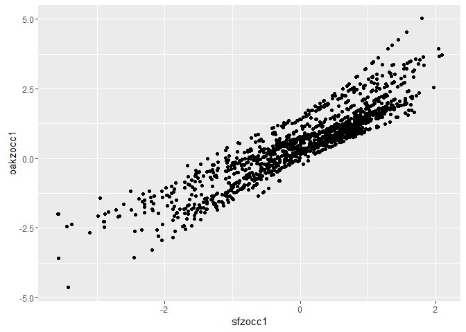

# Analyze str daily
Tourism Economics  
April 14, 2016  


```r
fpath <- c("~/Project/R projects/sf_2016/") 
```


```r
load(file=paste0(fpath,"output_data/str_daily.Rdata"))
```

# I. Set up data  

Create a simple set of dates and days of week  

```r
date <- seq(as.Date("1970-01-01"), as.Date("2030-01-01"), by = 1)
df <- data.frame(date)

date_df <- df %>%
  # add columns of month day
  mutate(month = lubridate::month(date, label=TRUE, abbr=TRUE)) %>%
  mutate(monthnum = lubridate::month(date, label=FALSE)) %>%
  mutate(day = day(date)) %>%
  mutate(wday = wday(date, label=TRUE)) %>%
  mutate(year = lubridate::year(date))
```

Join the simple date info onto the STR data  

```r
str_daily_1 <- str_daily %>%
  left_join(date_df, by="date")  
```

Create seasonal categories

```r
seascat <- str_daily_1 %>%
  distinct(date) %>%
  # seasonal categories
  mutate(season1 = 
    ifelse(month %in% c("Jan", "Dec"), "01_Jan-Dec",
    ifelse(month %in% c("Feb", "Mar", "Apr", "May"), "02_Feb-Mar-Apr-May",
    ifelse(month %in% c("Jun"), "03_Jun",
    ifelse(month %in% c("Jul", "Aug", "Sep"), "04_Jul-Aug-Sep",
    ifelse(month %in% c("Oct"), "05_Oct",
    ifelse(month %in% c("Nov"), "06_Nov",
                            "other"))))))) %>%
  #year groupings
  mutate(yeargp = ifelse(year %in% c(2011, 2012), "yr11-12", 
                  ifelse(year %in% c(2013), "yr13",
                  ifelse(year %in% c(2014, 2015), "yr14-15",
                  "other")))) %>%
  select(date, season1, yeargp)
  
str_daily_2 <- str_daily_1 %>%
  left_join(seascat, by=c("date"))
```

How much data do we have for each geography in the total segment?

```r
str_daily_2 %>%
  filter(seg == "total") %>%
  group_by(geo_ttl, year) %>%
  summarize(a =n()) %>%
  ungroup() %>%
  spread(geo_ttl, a) %>%
   kable(digits=0, format.args = list(big.mark = ","))
```


  year   oak   sfcity   sfconv
------  ----  -------  -------
 2,011    NA      365       NA
 2,012   366      366      366
 2,013   365      365      365
 2,014   365      365      365
 2,015   365      365      365
 2,016    NA       79       44

### Define some categories
Define some occupancy categories

```r
# occupancy categories
sfocccat1 <- str_daily_2 %>%
  filter(geo_ttl == "sfcity") %>%
  filter(seg == "total") %>%
  filter(date >= as.Date("2011-01-01") & date <= as.Date("2015-12-31")) %>%
  mutate(sfocccat1 = cut(occ, c(0,.7,.8,.9,.95,1))) %>%
  select(date, sfocccat1)

#######
#
# typical occupancy by season and wday

# sf
typocc <- str_daily_2 %>%
  filter(geo_ttl == "sfcity") %>%
  filter(seg == "total") %>%
  filter(date >= as.Date("2011-01-01") & date <= as.Date("2015-12-31")) %>%
  group_by(geo_ttl, season1, wday) %>%
  summarize(sfmocc1 = mean(occ),
            sfsdocc1 = sd(occ),
            sfnocc1 = n()) %>%
  ungroup() %>%
  select(-geo_ttl)

# oak
typocc_oak <- str_daily_2 %>%
  filter(geo_ttl == "oak") %>%
  filter(seg == "total") %>%
  filter(date >= as.Date("2011-01-01") & date <= as.Date("2015-12-31")) %>%
  group_by(geo_ttl, season1, wday) %>%
  summarize(oakmocc1 = mean(occ),
            oaksdocc1 = sd(occ),
            oaknocc1 = n()) %>%
  ungroup() %>%
  select(-geo_ttl)

########
#
# typical group occupancy

# sf
typocc_group <- str_daily_2 %>%
  filter(geo_ttl == "sfcity") %>%
  filter(seg == "group") %>%
  filter(date >= as.Date("2011-01-01") & date <= as.Date("2015-12-31")) %>%
  filter(!(is.na(occ))) %>%
  group_by(season1, wday) %>%
  summarize(sfmgroup1 = mean(occ),
            sfsdgroup1 = sd(occ)) %>%
  ungroup() %>%
  select(season1, wday, sfmgroup1, sfsdgroup1)

########
#
# group categories

# sf 
sfgroupcat1 <- str_daily_2 %>%
  filter(geo_ttl == "sfcity") %>%
  filter(seg == "group") %>%
  filter(date >= as.Date("2012-01-01") & date <= as.Date("2015-12-31")) %>%
  mutate(sfgroupcat1 = cut(occ, c(0,.2,.4,.5,1))) %>%
  select(date, sfgroupcat1)
```

Join on these various new columns

```r
str_daily_3 <- str_daily_2 %>%
  left_join(sfocccat1, by=c("date")) %>%
  left_join(typocc, by=c("season1", "wday")) %>%
  left_join(typocc_oak, by=c("season1", "wday")) %>%
  left_join(typocc_group, by=c("season1", "wday")) %>%
  left_join(sfgroupcat1, by=c("date"))
```

Using some of these new columns, calculate some additional measures to join

```r
# how does total occupancy for sf compare to its season1-wday mean, 
# output a list of dates with the results for those days

tempsf_a <- str_daily_3 %>%
  filter(geo_ttl == "sfcity") %>%
  filter(seg == "total") %>%
  mutate(sfzocc1 = (occ-sfmocc1)/sfsdocc1) %>%
  select(date, sfzocc1)

# similar but for group occupancy
tempsf_b <- str_daily_3 %>%
  filter(geo_ttl == "sfcity") %>%
  filter(seg == "group") %>%
  mutate(sfzgroup1 = (occ-sfmgroup1)/sfsdgroup1) %>%
  select(date, sfzgroup1)

# similar but for oak
tempoak_a <- str_daily_3 %>%
  filter(geo_ttl == "sfcity") %>%
  filter(seg == "total") %>%
  mutate(oakzocc1 = (occ-oakmocc1)/oaksdocc1) %>%
  select(date, oakzocc1)

# join them on
str_daily_4 <- str_daily_3 %>%
  left_join(tempsf_a, by=c("date")) %>%
  left_join(tempsf_b, by=c("date")) %>%
  left_join(tempoak_a, by=c("date")) %>%
  # calculate a few categories
  mutate(sfzocc1_cat = cut(sfzocc1, c(-5,-2,-1,0,1,2,2.5))) %>%
  mutate(sfzgroup1_cat = cut(sfzgroup1, c(-5,-2,-1,0,1,2,3,5)))
```


### Data limitations
Looks like for SF City, we could do full year comparisons from 2011 to 2015. When we do comparisons with other geographies, we should do 2012 to 2015.  
The segmentation data for SF City is missing from 1/10/14 to 9/30/14.  


```r
dsfcity_seg <- str_daily_4 %>%
  filter(geo_ttl == "sfcity") %>%
  filter(date >= as.Date("2011-01-01") & date <= as.Date("2015-12-31"))

dsfcity_1 <- str_daily_4 %>%
  filter(seg == "total") %>%
  filter(geo_ttl == "sfcity") %>%
  filter(date >= as.Date("2011-01-01") & date <= as.Date("2015-12-31"))

doaksf_1 <- str_daily_4 %>%
  filter(seg == "total") %>%
  filter(geo_ttl %in% c("sfcity", "oak")) %>%
  filter(date >= as.Date("2012-01-01") & date <= as.Date("2015-12-31"))

doaksf_seg <- str_daily_4 %>%
  filter(geo_ttl %in% c("sfcity", "oak")) %>%
  filter(date >= as.Date("2012-01-01") & date <= as.Date("2015-12-31"))

# doaksf_seg_1 <- doaksf_seg %>%
#   # drop the two dates in July that are missing from the SF data
#   filter(!(date == as.Date("2015-07-26"))) %>%
#   filter(!(date == as.Date("2015-07-27")))
```

What do we have in dsfcity_1?

```r
nrow(dsfcity_1)
```

```
## [1] 1826
```

```r
min(dsfcity_1$date)
```

```
## [1] "2011-01-01"
```

```r
max(dsfcity_1$date) 
```

```
## [1] "2015-12-31"
```

```r
# is occ blank for any rows?
dsfcity_1 %>%
  filter(is.na(occ)) %>%
  nrow()
```

```
## [1] 0
```

What do we have in doaksf_seg for Oakland?

```r
a <- doaksf_seg %>%
  filter(seg == "total") %>%
  filter(geo_ttl == "oak")

nrow(a)
```

```
## [1] 1461
```

```r
min(a$date)
```

```
## [1] "2012-01-01"
```

```r
max(a$date) 
```

```
## [1] "2015-12-31"
```

```r
# is occ blank for any rows?
a %>%
  filter(is.na(occ)) %>%
  nrow()
```

```
## [1] 0
```

# II. Frequency: Occupancy categories

Frequency of occupancy categories overall

```r
dsfcity_1 %>%
  group_by(sfocccat1) %>%
  summarise (n = n()) %>%
  mutate(freq = n / sum(n)) %>%
  ungroup() %>%
  select(-n) %>%
  # fill NAs with 0
  spread(sfocccat1, freq, fill=0) %>%
  kable(digits=c(1,rep(3,5)), format.args = list(big.mark = ","))
```


 (0,0.7]   (0.7,0.8]   (0.8,0.9]   (0.9,0.95]   (0.95,1]
--------  ----------  ----------  -----------  ---------
     0.2       0.166       0.294        0.227      0.154

Frequency of occupancy categories by year

```r
dsfcity_1 %>%
  group_by(year, sfocccat1) %>%
  summarise (n = n()) %>%
  mutate(freq = n / sum(n)) %>%
  ungroup() %>%
  select(-n) %>%
  # fill NAs with 0
  spread(sfocccat1, freq, fill=0) %>%
  kable(digits=c(1,rep(3,5)), format.args = list(big.mark = ","))
```


  year   (0,0.7]   (0.7,0.8]   (0.8,0.9]   (0.9,0.95]   (0.95,1]
------  --------  ----------  ----------  -----------  ---------
 2,011     0.216       0.186       0.321        0.164      0.112
 2,012     0.197       0.191       0.287        0.199      0.126
 2,013     0.148       0.159       0.274        0.214      0.205
 2,014     0.121       0.151       0.279        0.268      0.181
 2,015     0.112       0.142       0.307        0.290      0.148

Frequency of occupancy categories by wday

```r
dsfcity_1 %>%
  group_by(wday, sfocccat1) %>%
  summarise (n = n()) %>%
  mutate(freq = n / sum(n)) %>%
  ungroup() %>%
  select(-n) %>%
  # fill NAs with 0
  spread(sfocccat1, freq, fill=0) %>%
  kable(digits=c(1,rep(3,5)), format.args = list(big.mark = ","))
```


wday     (0,0.7]   (0.7,0.8]   (0.8,0.9]   (0.9,0.95]   (0.95,1]
------  --------  ----------  ----------  -----------  ---------
Sun        0.333       0.218       0.375        0.057      0.015
Mon        0.203       0.172       0.291        0.211      0.123
Tues       0.149       0.115       0.226        0.272      0.238
Wed        0.103       0.126       0.207        0.287      0.276
Thurs      0.123       0.184       0.322        0.264      0.107
Fri        0.123       0.200       0.377        0.223      0.077
Sat        0.077       0.146       0.257        0.276      0.245

Frequency of occupancy categories by month (and number of days)

```r
dsfcity_1 %>%
  group_by(month, sfocccat1) %>%
  summarise (n = n()) %>%
  mutate(freq = n / sum(n)) %>%
  ungroup() %>%
  select(-n) %>%
  # fill NAs with 0
  spread(sfocccat1, freq, fill=0) %>%
  arrange(month) %>%
  kable(digits=c(1,rep(3,5)), format.args = list(big.mark = ","))
```


month    (0,0.7]   (0.7,0.8]   (0.8,0.9]   (0.9,0.95]   (0.95,1]
------  --------  ----------  ----------  -----------  ---------
Jan        0.503       0.277       0.155        0.058      0.006
Feb        0.241       0.397       0.220        0.121      0.021
Mar        0.187       0.290       0.355        0.155      0.013
Apr        0.080       0.193       0.440        0.227      0.060
May        0.097       0.135       0.419        0.239      0.110
Jun        0.000       0.080       0.327        0.400      0.193
Jul        0.045       0.110       0.258        0.252      0.335
Aug        0.000       0.039       0.219        0.355      0.387
Sep        0.033       0.040       0.327        0.287      0.313
Oct        0.026       0.077       0.335        0.316      0.245
Nov        0.280       0.153       0.273        0.173      0.120
Dec        0.413       0.213       0.194        0.142      0.039

```r
dsfcity_1 %>%
  group_by(month, sfocccat1) %>%
  summarise (n = n()) %>%
  ungroup() %>%
  # fill NAs with 0
  spread(sfocccat1, n, fill=0) %>%
  arrange(month) %>%
  kable(digits=c(1,rep(3,5)), format.args = list(big.mark = ","))
```


month    (0,0.7]   (0.7,0.8]   (0.8,0.9]   (0.9,0.95]   (0.95,1]
------  --------  ----------  ----------  -----------  ---------
Jan           78          43          24            9          1
Feb           34          56          31           17          3
Mar           29          45          55           24          2
Apr           12          29          66           34          9
May           15          21          65           37         17
Jun            0          12          49           60         29
Jul            7          17          40           39         52
Aug            0           6          34           55         60
Sep            5           6          49           43         47
Oct            4          12          52           49         38
Nov           42          23          41           26         18
Dec           64          33          30           22          6

Frequency of occupancy categories by season1 (and number of days)

```r
dsfcity_1 %>%
  group_by(season1, sfocccat1) %>%
  summarise (n = n()) %>%
  mutate(freq = n / sum(n)) %>%
  ungroup() %>%
  select(-n) %>%
  # fill NAs with 0
  spread(sfocccat1, freq, fill=0) %>%
  kable(digits=c(1,rep(3,5)), format.args = list(big.mark = ","))
```


season1               (0,0.7]   (0.7,0.8]   (0.8,0.9]   (0.9,0.95]   (0.95,1]
-------------------  --------  ----------  ----------  -----------  ---------
01_Jan-Dec              0.458       0.245       0.174        0.100      0.023
02_Feb-Mar-Apr-May      0.150       0.251       0.361        0.186      0.052
03_Jun                  0.000       0.080       0.327        0.400      0.193
04_Jul-Aug-Sep          0.026       0.063       0.267        0.298      0.346
05_Oct                  0.026       0.077       0.335        0.316      0.245
06_Nov                  0.280       0.153       0.273        0.173      0.120

```r
dsfcity_1 %>%
  group_by(season1, sfocccat1) %>%
  summarise (n = n()) %>%
  ungroup() %>%
  # fill NAs with 0
  spread(sfocccat1, n, fill=0) %>%
  kable(digits=c(1,rep(3,5)), format.args = list(big.mark = ","))
```


season1               (0,0.7]   (0.7,0.8]   (0.8,0.9]   (0.9,0.95]   (0.95,1]
-------------------  --------  ----------  ----------  -----------  ---------
01_Jan-Dec                142          76          54           31          7
02_Feb-Mar-Apr-May         90         151         217          112         31
03_Jun                      0          12          49           60         29
04_Jul-Aug-Sep             12          29         123          137        159
05_Oct                      4          12          52           49         38
06_Nov                     42          23          41           26         18

Frequency of occupancy categories by year and season1 (and number of days)

```r
dsfcity_1 %>%
  group_by(season1, year, sfocccat1) %>%
  summarise (n = n()) %>%
  mutate(freq = n / sum(n)) %>%
  ungroup() %>%
  select(-n) %>%
  # fill NAs with 0
  spread(sfocccat1, freq, fill=0) %>%
  kable(digits=c(1,rep(3,6)), format.args = list(big.mark = ","))
```


season1                year   (0,0.7]   (0.7,0.8]   (0.8,0.9]   (0.9,0.95]   (0.95,1]
-------------------  ------  --------  ----------  ----------  -----------  ---------
01_Jan-Dec            2,011     0.613       0.177       0.129        0.081      0.000
01_Jan-Dec            2,012     0.532       0.177       0.194        0.048      0.048
01_Jan-Dec            2,013     0.500       0.274       0.097        0.097      0.032
01_Jan-Dec            2,014     0.323       0.274       0.210        0.177      0.016
01_Jan-Dec            2,015     0.323       0.323       0.242        0.097      0.016
02_Feb-Mar-Apr-May    2,011     0.217       0.342       0.325        0.092      0.025
02_Feb-Mar-Apr-May    2,012     0.207       0.331       0.339        0.107      0.017
02_Feb-Mar-Apr-May    2,013     0.133       0.200       0.358        0.233      0.075
02_Feb-Mar-Apr-May    2,014     0.117       0.208       0.375        0.217      0.083
02_Feb-Mar-Apr-May    2,015     0.075       0.175       0.408        0.283      0.058
03_Jun                2,011     0.000       0.167       0.533        0.233      0.067
03_Jun                2,012     0.000       0.033       0.367        0.400      0.200
03_Jun                2,013     0.000       0.067       0.267        0.367      0.300
03_Jun                2,014     0.000       0.100       0.233        0.533      0.133
03_Jun                2,015     0.000       0.033       0.233        0.467      0.267
04_Jul-Aug-Sep        2,011     0.022       0.065       0.359        0.250      0.304
04_Jul-Aug-Sep        2,012     0.043       0.076       0.283        0.337      0.261
04_Jul-Aug-Sep        2,013     0.022       0.065       0.250        0.228      0.435
04_Jul-Aug-Sep        2,014     0.022       0.054       0.185        0.326      0.413
04_Jul-Aug-Sep        2,015     0.022       0.054       0.261        0.348      0.315
05_Oct                2,011     0.065       0.097       0.387        0.258      0.194
05_Oct                2,012     0.032       0.097       0.290        0.323      0.258
05_Oct                2,013     0.000       0.032       0.355        0.355      0.258
05_Oct                2,014     0.000       0.097       0.355        0.258      0.290
05_Oct                2,015     0.032       0.065       0.290        0.387      0.226
06_Nov                2,011     0.367       0.067       0.300        0.200      0.067
06_Nov                2,012     0.300       0.267       0.200        0.133      0.100
06_Nov                2,013     0.167       0.267       0.300        0.033      0.233
06_Nov                2,014     0.267       0.067       0.300        0.233      0.133
06_Nov                2,015     0.300       0.100       0.267        0.267      0.067

```r
dsfcity_1 %>%
  group_by(season1, year, sfocccat1) %>%
  summarise (n = n()) %>%
  ungroup() %>%
  # fill NAs with 0
  spread(sfocccat1, n, fill=0) %>%
  kable(digits=c(1,rep(3,6)), format.args = list(big.mark = ","))
```


season1                year   (0,0.7]   (0.7,0.8]   (0.8,0.9]   (0.9,0.95]   (0.95,1]
-------------------  ------  --------  ----------  ----------  -----------  ---------
01_Jan-Dec            2,011        38          11           8            5          0
01_Jan-Dec            2,012        33          11          12            3          3
01_Jan-Dec            2,013        31          17           6            6          2
01_Jan-Dec            2,014        20          17          13           11          1
01_Jan-Dec            2,015        20          20          15            6          1
02_Feb-Mar-Apr-May    2,011        26          41          39           11          3
02_Feb-Mar-Apr-May    2,012        25          40          41           13          2
02_Feb-Mar-Apr-May    2,013        16          24          43           28          9
02_Feb-Mar-Apr-May    2,014        14          25          45           26         10
02_Feb-Mar-Apr-May    2,015         9          21          49           34          7
03_Jun                2,011         0           5          16            7          2
03_Jun                2,012         0           1          11           12          6
03_Jun                2,013         0           2           8           11          9
03_Jun                2,014         0           3           7           16          4
03_Jun                2,015         0           1           7           14          8
04_Jul-Aug-Sep        2,011         2           6          33           23         28
04_Jul-Aug-Sep        2,012         4           7          26           31         24
04_Jul-Aug-Sep        2,013         2           6          23           21         40
04_Jul-Aug-Sep        2,014         2           5          17           30         38
04_Jul-Aug-Sep        2,015         2           5          24           32         29
05_Oct                2,011         2           3          12            8          6
05_Oct                2,012         1           3           9           10          8
05_Oct                2,013         0           1          11           11          8
05_Oct                2,014         0           3          11            8          9
05_Oct                2,015         1           2           9           12          7
06_Nov                2,011        11           2           9            6          2
06_Nov                2,012         9           8           6            4          3
06_Nov                2,013         5           8           9            1          7
06_Nov                2,014         8           2           9            7          4
06_Nov                2,015         9           3           8            8          2

Frequency of occupancy categories by month, day of week (and number of days)

```r
dsfcity_1 %>%
  group_by(month, wday, sfocccat1) %>%
  summarise (n = n()) %>%
  mutate(freq = n / sum(n)) %>%
  ungroup() %>%
  select(-n) %>%
  # spread, but replace NA with 0
  spread(wday, freq, fill=0) %>%
  kable(digits=c(1,rep(3,6)), format.args = list(big.mark = ","))
```


month   sfocccat1       Sun     Mon    Tues     Wed   Thurs   Fri     Sat
------  -----------  ------  ------  ------  ------  ------  ----  ------
Jan     (0,0.7]       0.591   0.455   0.364   0.364   0.609   0.7   0.455
Jan     (0.7,0.8]     0.273   0.227   0.273   0.318   0.304   0.3   0.273
Jan     (0.8,0.9]     0.136   0.227   0.227   0.227   0.043   0.0   0.182
Jan     (0.9,0.95]    0.000   0.045   0.136   0.091   0.043   0.0   0.091
Jan     (0.95,1]      0.000   0.045   0.000   0.000   0.000   0.0   0.000
Feb     (0,0.7]       0.550   0.300   0.200   0.095   0.200   0.3   0.050
Feb     (0.7,0.8]     0.450   0.350   0.250   0.286   0.400   0.5   0.550
Feb     (0.8,0.9]     0.000   0.250   0.250   0.333   0.350   0.2   0.150
Feb     (0.9,0.95]    0.000   0.100   0.200   0.238   0.050   0.0   0.250
Feb     (0.95,1]      0.000   0.000   0.100   0.048   0.000   0.0   0.000
Mar     (0,0.7]       0.696   0.136   0.136   0.000   0.045   0.1   0.130
Mar     (0.7,0.8]     0.174   0.500   0.182   0.286   0.318   0.4   0.217
Mar     (0.8,0.9]     0.130   0.273   0.318   0.381   0.455   0.4   0.522
Mar     (0.9,0.95]    0.000   0.091   0.318   0.286   0.182   0.1   0.130
Mar     (0.95,1]      0.000   0.000   0.045   0.048   0.000   0.0   0.000
Apr     (0,0.7]       0.524   0.045   0.000   0.000   0.000   0.0   0.000
Apr     (0.7,0.8]     0.286   0.318   0.182   0.045   0.190   0.1   0.238
Apr     (0.8,0.9]     0.143   0.455   0.500   0.364   0.429   0.7   0.476
Apr     (0.9,0.95]    0.048   0.136   0.273   0.409   0.333   0.2   0.190
Apr     (0.95,1]      0.000   0.045   0.045   0.182   0.048   0.0   0.095
May     (0,0.7]       0.409   0.238   0.045   0.000   0.000   0.0   0.000
May     (0.7,0.8]     0.136   0.238   0.091   0.045   0.130   0.2   0.136
May     (0.8,0.9]     0.364   0.238   0.409   0.318   0.696   0.6   0.273
May     (0.9,0.95]    0.091   0.190   0.182   0.500   0.174   0.2   0.318
May     (0.95,1]      0.000   0.095   0.273   0.136   0.000   0.0   0.273
Jun     (0.7,0.8]     0.273   0.045   0.048   0.048   0.048   0.1   0.000
Jun     (0.8,0.9]     0.636   0.409   0.143   0.095   0.286   0.4   0.273
Jun     (0.9,0.95]    0.091   0.409   0.381   0.429   0.476   0.4   0.591
Jun     (0.95,1]      0.000   0.136   0.429   0.429   0.190   0.0   0.136
Jul     (0,0.7]       0.136   0.045   0.130   0.000   0.000   0.0   0.000
Jul     (0.7,0.8]     0.227   0.091   0.043   0.217   0.136   0.0   0.000
Jul     (0.8,0.9]     0.591   0.273   0.043   0.000   0.273   0.4   0.238
Jul     (0.9,0.95]    0.045   0.318   0.174   0.130   0.409   0.3   0.381
Jul     (0.95,1]      0.000   0.273   0.609   0.652   0.182   0.2   0.381
Aug     (0.7,0.8]     0.136   0.000   0.000   0.000   0.091   0.0   0.000
Aug     (0.8,0.9]     0.591   0.455   0.095   0.045   0.227   0.1   0.000
Aug     (0.9,0.95]    0.136   0.318   0.476   0.545   0.455   0.4   0.130
Aug     (0.95,1]      0.136   0.227   0.429   0.409   0.227   0.4   0.870
Sep     (0,0.7]       0.000   0.227   0.000   0.000   0.000   0.0   0.000
Sep     (0.7,0.8]     0.091   0.000   0.182   0.000   0.000   0.0   0.000
Sep     (0.8,0.9]     0.773   0.136   0.136   0.238   0.381   0.6   0.048
Sep     (0.9,0.95]    0.136   0.409   0.318   0.143   0.238   0.4   0.381
Sep     (0.95,1]      0.000   0.227   0.364   0.619   0.381   0.0   0.571
Oct     (0,0.7]       0.048   0.045   0.000   0.043   0.000   0.0   0.000
Oct     (0.7,0.8]     0.143   0.091   0.045   0.000   0.130   0.1   0.045
Oct     (0.8,0.9]     0.667   0.455   0.227   0.174   0.391   0.4   0.091
Oct     (0.9,0.95]    0.095   0.182   0.455   0.391   0.304   0.4   0.409
Oct     (0.95,1]      0.048   0.227   0.273   0.391   0.174   0.1   0.455
Nov     (0,0.7]       0.500   0.381   0.333   0.286   0.238   0.0   0.182
Nov     (0.7,0.8]     0.227   0.143   0.000   0.048   0.143   0.4   0.136
Nov     (0.8,0.9]     0.273   0.238   0.190   0.190   0.238   0.4   0.364
Nov     (0.9,0.95]    0.000   0.095   0.286   0.190   0.333   0.1   0.182
Nov     (0.95,1]      0.000   0.143   0.190   0.286   0.048   0.0   0.136
Dec     (0,0.7]       0.545   0.565   0.565   0.455   0.364   0.3   0.091
Dec     (0.7,0.8]     0.227   0.087   0.087   0.227   0.318   0.4   0.182
Dec     (0.8,0.9]     0.182   0.087   0.174   0.136   0.091   0.2   0.455
Dec     (0.9,0.95]    0.045   0.217   0.087   0.091   0.182   0.1   0.273
Dec     (0.95,1]      0.000   0.043   0.087   0.091   0.045   0.0   0.000

```r
dsfcity_1 %>%
  group_by(month, wday, sfocccat1) %>%
  summarise (n = n()) %>%
  ungroup() %>%
  # spread, but replace NA with 0
  spread(wday, n, fill=0) %>%
  kable(digits=c(1,rep(3,6)), format.args = list(big.mark = ","))
```


month   sfocccat1     Sun   Mon   Tues   Wed   Thurs   Fri   Sat
------  -----------  ----  ----  -----  ----  ------  ----  ----
Jan     (0,0.7]        13    10      8     8      14    15    10
Jan     (0.7,0.8]       6     5      6     7       7     6     6
Jan     (0.8,0.9]       3     5      5     5       1     1     4
Jan     (0.9,0.95]      0     1      3     2       1     0     2
Jan     (0.95,1]        0     1      0     0       0     0     0
Feb     (0,0.7]        11     6      4     2       4     6     1
Feb     (0.7,0.8]       9     7      5     6       8    10    11
Feb     (0.8,0.9]       0     5      5     7       7     4     3
Feb     (0.9,0.95]      0     2      4     5       1     0     5
Feb     (0.95,1]        0     0      2     1       0     0     0
Mar     (0,0.7]        16     3      3     0       1     3     3
Mar     (0.7,0.8]       4    11      4     6       7     8     5
Mar     (0.8,0.9]       3     6      7     8      10     9    12
Mar     (0.9,0.95]      0     2      7     6       4     2     3
Mar     (0.95,1]        0     0      1     1       0     0     0
Apr     (0,0.7]        11     1      0     0       0     0     0
Apr     (0.7,0.8]       6     7      4     1       4     2     5
Apr     (0.8,0.9]       3    10     11     8       9    15    10
Apr     (0.9,0.95]      1     3      6     9       7     4     4
Apr     (0.95,1]        0     1      1     4       1     0     2
May     (0,0.7]         9     5      1     0       0     0     0
May     (0.7,0.8]       3     5      2     1       3     4     3
May     (0.8,0.9]       8     5      9     7      16    14     6
May     (0.9,0.95]      2     4      4    11       4     5     7
May     (0.95,1]        0     2      6     3       0     0     6
Jun     (0.7,0.8]       6     1      1     1       1     2     0
Jun     (0.8,0.9]      14     9      3     2       6     9     6
Jun     (0.9,0.95]      2     9      8     9      10     9    13
Jun     (0.95,1]        0     3      9     9       4     1     3
Jul     (0,0.7]         3     1      3     0       0     0     0
Jul     (0.7,0.8]       5     2      1     5       3     1     0
Jul     (0.8,0.9]      13     6      1     0       6     9     5
Jul     (0.9,0.95]      1     7      4     3       9     7     8
Jul     (0.95,1]        0     6     14    15       4     5     8
Aug     (0.7,0.8]       3     0      0     0       2     1     0
Aug     (0.8,0.9]      13    10      2     1       5     3     0
Aug     (0.9,0.95]      3     7     10    12      10    10     3
Aug     (0.95,1]        3     5      9     9       5     9    20
Sep     (0,0.7]         0     5      0     0       0     0     0
Sep     (0.7,0.8]       2     0      4     0       0     0     0
Sep     (0.8,0.9]      17     3      3     5       8    12     1
Sep     (0.9,0.95]      3     9      7     3       5     8     8
Sep     (0.95,1]        0     5      8    13       8     1    12
Oct     (0,0.7]         1     1      0     1       0     1     0
Oct     (0.7,0.8]       3     2      1     0       3     2     1
Oct     (0.8,0.9]      14    10      5     4       9     8     2
Oct     (0.9,0.95]      2     4     10     9       7     8     9
Oct     (0.95,1]        1     5      6     9       4     3    10
Nov     (0,0.7]        11     8      7     6       5     1     4
Nov     (0.7,0.8]       5     3      0     1       3     8     3
Nov     (0.8,0.9]       6     5      4     4       5     9     8
Nov     (0.9,0.95]      0     2      6     4       7     3     4
Nov     (0.95,1]        0     3      4     6       1     1     3
Dec     (0,0.7]        12    13     13    10       8     6     2
Dec     (0.7,0.8]       5     2      2     5       7     8     4
Dec     (0.8,0.9]       4     2      4     3       2     5    10
Dec     (0.9,0.95]      1     5      2     2       4     2     6
Dec     (0.95,1]        0     1      2     2       1     0     0

Frequency of occupancy categories by season1, year group, day of week (and number of days)

```r
dsfcity_1 %>%
  group_by(season1, yeargp, wday, sfocccat1) %>%
  summarise (n = n()) %>%
  mutate(freq = n / sum(n)) %>%
  ungroup() %>%
  select(-n) %>%
  complete(season1, yeargp, wday, sfocccat1) %>%
  # spread, but replace NA with 0
  spread(wday, freq, fill=0) %>%
  kable(digits=c(0,0,0,rep(3,9)), format.args = list(big.mark = ","))
```


season1              yeargp    sfocccat1       Sun     Mon    Tues     Wed   Thurs     Fri     Sat
-------------------  --------  -----------  ------  ------  ------  ------  ------  ------  ------
01_Jan-Dec           yr11-12   (0,0.7]       0.632   0.579   0.588   0.562   0.647   0.647   0.368
01_Jan-Dec           yr11-12   (0.7,0.8]     0.368   0.053   0.059   0.125   0.176   0.235   0.211
01_Jan-Dec           yr11-12   (0.8,0.9]     0.000   0.263   0.176   0.125   0.059   0.118   0.368
01_Jan-Dec           yr11-12   (0.9,0.95]    0.000   0.105   0.118   0.125   0.059   0.000   0.053
01_Jan-Dec           yr11-12   (0.95,1]      0.000   0.000   0.059   0.062   0.059   0.000   0.000
01_Jan-Dec           yr13      (0,0.7]       0.556   0.667   0.500   0.444   0.444   0.500   0.375
01_Jan-Dec           yr13      (0.7,0.8]     0.333   0.111   0.200   0.444   0.444   0.250   0.125
01_Jan-Dec           yr13      (0.8,0.9]     0.111   0.111   0.200   0.000   0.000   0.125   0.125
01_Jan-Dec           yr13      (0.9,0.95]    0.000   0.111   0.000   0.000   0.111   0.125   0.375
01_Jan-Dec           yr13      (0.95,1]      0.000   0.000   0.100   0.111   0.000   0.000   0.000
01_Jan-Dec           yr14-15   (0,0.7]       0.500   0.353   0.333   0.263   0.368   0.333   0.118
01_Jan-Dec           yr14-15   (0.7,0.8]     0.062   0.294   0.278   0.316   0.368   0.444   0.294
01_Jan-Dec           yr14-15   (0.8,0.9]     0.375   0.059   0.222   0.316   0.105   0.167   0.353
01_Jan-Dec           yr14-15   (0.9,0.95]    0.062   0.176   0.167   0.105   0.158   0.056   0.235
01_Jan-Dec           yr14-15   (0.95,1]      0.000   0.118   0.000   0.000   0.000   0.000   0.000
02_Feb-Mar-Apr-May   yr11-12   (0,0.7]       0.676   0.294   0.143   0.057   0.086   0.147   0.088
02_Feb-Mar-Apr-May   yr11-12   (0.7,0.8]     0.206   0.471   0.314   0.229   0.429   0.353   0.353
02_Feb-Mar-Apr-May   yr11-12   (0.8,0.9]     0.088   0.147   0.400   0.486   0.371   0.471   0.353
02_Feb-Mar-Apr-May   yr11-12   (0.9,0.95]    0.029   0.059   0.114   0.200   0.114   0.029   0.147
02_Feb-Mar-Apr-May   yr11-12   (0.95,1]      0.000   0.029   0.029   0.029   0.000   0.000   0.059
02_Feb-Mar-Apr-May   yr13      (0,0.7]       0.412   0.176   0.176   0.000   0.118   0.056   0.000
02_Feb-Mar-Apr-May   yr13      (0.7,0.8]     0.235   0.235   0.118   0.235   0.118   0.278   0.176
02_Feb-Mar-Apr-May   yr13      (0.8,0.9]     0.294   0.294   0.294   0.353   0.471   0.389   0.412
02_Feb-Mar-Apr-May   yr13      (0.9,0.95]    0.059   0.294   0.235   0.294   0.294   0.278   0.176
02_Feb-Mar-Apr-May   yr13      (0.95,1]      0.000   0.000   0.176   0.118   0.000   0.000   0.235
02_Feb-Mar-Apr-May   yr14-15   (0,0.7]       0.486   0.059   0.000   0.000   0.000   0.088   0.029
02_Feb-Mar-Apr-May   yr14-15   (0.7,0.8]     0.314   0.294   0.059   0.059   0.147   0.206   0.257
02_Feb-Mar-Apr-May   yr14-15   (0.8,0.9]     0.171   0.471   0.382   0.206   0.618   0.559   0.343
02_Feb-Mar-Apr-May   yr14-15   (0.9,0.95]    0.029   0.118   0.382   0.559   0.206   0.147   0.314
02_Feb-Mar-Apr-May   yr14-15   (0.95,1]      0.000   0.059   0.176   0.176   0.029   0.000   0.057
03_Jun               yr11-12   (0,0.7]       0.000   0.000   0.000   0.000   0.000   0.000   0.000
03_Jun               yr11-12   (0.7,0.8]     0.375   0.000   0.000   0.111   0.111   0.111   0.000
03_Jun               yr11-12   (0.8,0.9]     0.625   0.625   0.375   0.111   0.444   0.556   0.444
03_Jun               yr11-12   (0.9,0.95]    0.000   0.375   0.250   0.444   0.222   0.333   0.556
03_Jun               yr11-12   (0.95,1]      0.000   0.000   0.375   0.333   0.222   0.000   0.000
03_Jun               yr13      (0,0.7]       0.000   0.000   0.000   0.000   0.000   0.000   0.000
03_Jun               yr13      (0.7,0.8]     0.200   0.000   0.000   0.000   0.000   0.250   0.000
03_Jun               yr13      (0.8,0.9]     0.800   0.000   0.000   0.250   0.250   0.000   0.400
03_Jun               yr13      (0.9,0.95]    0.000   0.750   0.250   0.250   0.500   0.750   0.200
03_Jun               yr13      (0.95,1]      0.000   0.250   0.750   0.500   0.250   0.000   0.400
03_Jun               yr14-15   (0,0.7]       0.000   0.000   0.000   0.000   0.000   0.000   0.000
03_Jun               yr14-15   (0.7,0.8]     0.222   0.100   0.111   0.000   0.000   0.000   0.000
03_Jun               yr14-15   (0.8,0.9]     0.556   0.400   0.000   0.000   0.125   0.500   0.000
03_Jun               yr14-15   (0.9,0.95]    0.222   0.300   0.556   0.500   0.750   0.375   0.875
03_Jun               yr14-15   (0.95,1]      0.000   0.200   0.333   0.500   0.125   0.125   0.125
04_Jul-Aug-Sep       yr11-12   (0,0.7]       0.037   0.115   0.077   0.000   0.000   0.000   0.000
04_Jul-Aug-Sep       yr11-12   (0.7,0.8]     0.185   0.038   0.077   0.077   0.077   0.037   0.000
04_Jul-Aug-Sep       yr11-12   (0.8,0.9]     0.704   0.423   0.154   0.154   0.308   0.370   0.115
04_Jul-Aug-Sep       yr11-12   (0.9,0.95]    0.037   0.269   0.308   0.346   0.385   0.444   0.269
04_Jul-Aug-Sep       yr11-12   (0.95,1]      0.037   0.154   0.385   0.423   0.231   0.148   0.615
04_Jul-Aug-Sep       yr13      (0,0.7]       0.000   0.071   0.077   0.000   0.000   0.000   0.000
04_Jul-Aug-Sep       yr13      (0.7,0.8]     0.077   0.071   0.077   0.077   0.077   0.077   0.000
04_Jul-Aug-Sep       yr13      (0.8,0.9]     0.692   0.286   0.000   0.077   0.308   0.308   0.077
04_Jul-Aug-Sep       yr13      (0.9,0.95]    0.154   0.286   0.308   0.154   0.308   0.308   0.077
04_Jul-Aug-Sep       yr13      (0.95,1]      0.077   0.286   0.538   0.692   0.308   0.308   0.846
04_Jul-Aug-Sep       yr14-15   (0,0.7]       0.077   0.077   0.000   0.000   0.000   0.000   0.000
04_Jul-Aug-Sep       yr14-15   (0.7,0.8]     0.154   0.000   0.074   0.074   0.077   0.000   0.000
04_Jul-Aug-Sep       yr14-15   (0.8,0.9]     0.577   0.154   0.074   0.037   0.269   0.385   0.077
04_Jul-Aug-Sep       yr14-15   (0.9,0.95]    0.154   0.462   0.333   0.259   0.385   0.346   0.423
04_Jul-Aug-Sep       yr14-15   (0.95,1]      0.038   0.308   0.519   0.630   0.269   0.269   0.500
05_Oct               yr11-12   (0,0.7]       0.111   0.100   0.000   0.111   0.000   0.000   0.000
05_Oct               yr11-12   (0.7,0.8]     0.222   0.200   0.111   0.000   0.000   0.125   0.000
05_Oct               yr11-12   (0.8,0.9]     0.444   0.400   0.333   0.222   0.500   0.375   0.111
05_Oct               yr11-12   (0.9,0.95]    0.111   0.100   0.333   0.333   0.250   0.375   0.556
05_Oct               yr11-12   (0.95,1]      0.111   0.200   0.222   0.333   0.250   0.125   0.333
05_Oct               yr13      (0,0.7]       0.000   0.000   0.000   0.000   0.000   0.000   0.000
05_Oct               yr13      (0.7,0.8]     0.000   0.000   0.000   0.000   0.200   0.000   0.000
05_Oct               yr13      (0.8,0.9]     1.000   0.500   0.200   0.200   0.400   0.250   0.000
05_Oct               yr13      (0.9,0.95]    0.000   0.250   0.600   0.600   0.200   0.500   0.250
05_Oct               yr13      (0.95,1]      0.000   0.250   0.200   0.200   0.200   0.250   0.750
05_Oct               yr14-15   (0,0.7]       0.000   0.000   0.000   0.000   0.000   0.100   0.000
05_Oct               yr14-15   (0.7,0.8]     0.125   0.000   0.000   0.000   0.200   0.100   0.111
05_Oct               yr14-15   (0.8,0.9]     0.750   0.500   0.125   0.111   0.300   0.400   0.111
05_Oct               yr14-15   (0.9,0.95]    0.125   0.250   0.500   0.333   0.400   0.300   0.333
05_Oct               yr14-15   (0.95,1]      0.000   0.250   0.375   0.556   0.100   0.100   0.444
06_Nov               yr11-12   (0,0.7]       0.500   0.500   0.444   0.333   0.222   0.111   0.250
06_Nov               yr11-12   (0.7,0.8]     0.375   0.250   0.000   0.111   0.222   0.222   0.000
06_Nov               yr11-12   (0.8,0.9]     0.125   0.125   0.333   0.222   0.111   0.444   0.375
06_Nov               yr11-12   (0.9,0.95]    0.000   0.000   0.111   0.111   0.444   0.222   0.250
06_Nov               yr11-12   (0.95,1]      0.000   0.125   0.111   0.222   0.000   0.000   0.125
06_Nov               yr13      (0,0.7]       0.250   0.250   0.250   0.250   0.250   0.000   0.000
06_Nov               yr13      (0.7,0.8]     0.250   0.250   0.000   0.000   0.250   0.600   0.400
06_Nov               yr13      (0.8,0.9]     0.500   0.250   0.250   0.250   0.250   0.200   0.400
06_Nov               yr13      (0.9,0.95]    0.000   0.000   0.250   0.000   0.000   0.000   0.000
06_Nov               yr13      (0.95,1]      0.000   0.250   0.250   0.500   0.250   0.200   0.200
06_Nov               yr14-15   (0,0.7]       0.600   0.333   0.250   0.250   0.250   0.000   0.222
06_Nov               yr14-15   (0.7,0.8]     0.100   0.000   0.000   0.000   0.000   0.375   0.111
06_Nov               yr14-15   (0.8,0.9]     0.300   0.333   0.000   0.125   0.375   0.500   0.333
06_Nov               yr14-15   (0.9,0.95]    0.000   0.222   0.500   0.375   0.375   0.125   0.222
06_Nov               yr14-15   (0.95,1]      0.000   0.111   0.250   0.250   0.000   0.000   0.111

```r
dsfcity_1 %>%
  group_by(season1, yeargp, wday, sfocccat1) %>%
  summarise (n = n()) %>%
  ungroup() %>%
  complete(season1, yeargp, wday, sfocccat1) %>%
  # spread, but replace NA with 0
  spread(wday, n, fill=0) %>%
  kable(digits=c(0,0,0,rep(3,9)), format.args = list(big.mark = ","))
```


season1              yeargp    sfocccat1     Sun   Mon   Tues   Wed   Thurs   Fri   Sat
-------------------  --------  -----------  ----  ----  -----  ----  ------  ----  ----
01_Jan-Dec           yr11-12   (0,0.7]        12    11     10     9      11    11     7
01_Jan-Dec           yr11-12   (0.7,0.8]       7     1      1     2       3     4     4
01_Jan-Dec           yr11-12   (0.8,0.9]       0     5      3     2       1     2     7
01_Jan-Dec           yr11-12   (0.9,0.95]      0     2      2     2       1     0     1
01_Jan-Dec           yr11-12   (0.95,1]        0     0      1     1       1     0     0
01_Jan-Dec           yr13      (0,0.7]         5     6      5     4       4     4     3
01_Jan-Dec           yr13      (0.7,0.8]       3     1      2     4       4     2     1
01_Jan-Dec           yr13      (0.8,0.9]       1     1      2     0       0     1     1
01_Jan-Dec           yr13      (0.9,0.95]      0     1      0     0       1     1     3
01_Jan-Dec           yr13      (0.95,1]        0     0      1     1       0     0     0
01_Jan-Dec           yr14-15   (0,0.7]         8     6      6     5       7     6     2
01_Jan-Dec           yr14-15   (0.7,0.8]       1     5      5     6       7     8     5
01_Jan-Dec           yr14-15   (0.8,0.9]       6     1      4     6       2     3     6
01_Jan-Dec           yr14-15   (0.9,0.95]      1     3      3     2       3     1     4
01_Jan-Dec           yr14-15   (0.95,1]        0     2      0     0       0     0     0
02_Feb-Mar-Apr-May   yr11-12   (0,0.7]        23    10      5     2       3     5     3
02_Feb-Mar-Apr-May   yr11-12   (0.7,0.8]       7    16     11     8      15    12    12
02_Feb-Mar-Apr-May   yr11-12   (0.8,0.9]       3     5     14    17      13    16    12
02_Feb-Mar-Apr-May   yr11-12   (0.9,0.95]      1     2      4     7       4     1     5
02_Feb-Mar-Apr-May   yr11-12   (0.95,1]        0     1      1     1       0     0     2
02_Feb-Mar-Apr-May   yr13      (0,0.7]         7     3      3     0       2     1     0
02_Feb-Mar-Apr-May   yr13      (0.7,0.8]       4     4      2     4       2     5     3
02_Feb-Mar-Apr-May   yr13      (0.8,0.9]       5     5      5     6       8     7     7
02_Feb-Mar-Apr-May   yr13      (0.9,0.95]      1     5      4     5       5     5     3
02_Feb-Mar-Apr-May   yr13      (0.95,1]        0     0      3     2       0     0     4
02_Feb-Mar-Apr-May   yr14-15   (0,0.7]        17     2      0     0       0     3     1
02_Feb-Mar-Apr-May   yr14-15   (0.7,0.8]      11    10      2     2       5     7     9
02_Feb-Mar-Apr-May   yr14-15   (0.8,0.9]       6    16     13     7      21    19    12
02_Feb-Mar-Apr-May   yr14-15   (0.9,0.95]      1     4     13    19       7     5    11
02_Feb-Mar-Apr-May   yr14-15   (0.95,1]        0     2      6     6       1     0     2
03_Jun               yr11-12   (0,0.7]         0     0      0     0       0     0     0
03_Jun               yr11-12   (0.7,0.8]       3     0      0     1       1     1     0
03_Jun               yr11-12   (0.8,0.9]       5     5      3     1       4     5     4
03_Jun               yr11-12   (0.9,0.95]      0     3      2     4       2     3     5
03_Jun               yr11-12   (0.95,1]        0     0      3     3       2     0     0
03_Jun               yr13      (0,0.7]         0     0      0     0       0     0     0
03_Jun               yr13      (0.7,0.8]       1     0      0     0       0     1     0
03_Jun               yr13      (0.8,0.9]       4     0      0     1       1     0     2
03_Jun               yr13      (0.9,0.95]      0     3      1     1       2     3     1
03_Jun               yr13      (0.95,1]        0     1      3     2       1     0     2
03_Jun               yr14-15   (0,0.7]         0     0      0     0       0     0     0
03_Jun               yr14-15   (0.7,0.8]       2     1      1     0       0     0     0
03_Jun               yr14-15   (0.8,0.9]       5     4      0     0       1     4     0
03_Jun               yr14-15   (0.9,0.95]      2     3      5     4       6     3     7
03_Jun               yr14-15   (0.95,1]        0     2      3     4       1     1     1
04_Jul-Aug-Sep       yr11-12   (0,0.7]         1     3      2     0       0     0     0
04_Jul-Aug-Sep       yr11-12   (0.7,0.8]       5     1      2     2       2     1     0
04_Jul-Aug-Sep       yr11-12   (0.8,0.9]      19    11      4     4       8    10     3
04_Jul-Aug-Sep       yr11-12   (0.9,0.95]      1     7      8     9      10    12     7
04_Jul-Aug-Sep       yr11-12   (0.95,1]        1     4     10    11       6     4    16
04_Jul-Aug-Sep       yr13      (0,0.7]         0     1      1     0       0     0     0
04_Jul-Aug-Sep       yr13      (0.7,0.8]       1     1      1     1       1     1     0
04_Jul-Aug-Sep       yr13      (0.8,0.9]       9     4      0     1       4     4     1
04_Jul-Aug-Sep       yr13      (0.9,0.95]      2     4      4     2       4     4     1
04_Jul-Aug-Sep       yr13      (0.95,1]        1     4      7     9       4     4    11
04_Jul-Aug-Sep       yr14-15   (0,0.7]         2     2      0     0       0     0     0
04_Jul-Aug-Sep       yr14-15   (0.7,0.8]       4     0      2     2       2     0     0
04_Jul-Aug-Sep       yr14-15   (0.8,0.9]      15     4      2     1       7    10     2
04_Jul-Aug-Sep       yr14-15   (0.9,0.95]      4    12      9     7      10     9    11
04_Jul-Aug-Sep       yr14-15   (0.95,1]        1     8     14    17       7     7    13
05_Oct               yr11-12   (0,0.7]         1     1      0     1       0     0     0
05_Oct               yr11-12   (0.7,0.8]       2     2      1     0       0     1     0
05_Oct               yr11-12   (0.8,0.9]       4     4      3     2       4     3     1
05_Oct               yr11-12   (0.9,0.95]      1     1      3     3       2     3     5
05_Oct               yr11-12   (0.95,1]        1     2      2     3       2     1     3
05_Oct               yr13      (0,0.7]         0     0      0     0       0     0     0
05_Oct               yr13      (0.7,0.8]       0     0      0     0       1     0     0
05_Oct               yr13      (0.8,0.9]       4     2      1     1       2     1     0
05_Oct               yr13      (0.9,0.95]      0     1      3     3       1     2     1
05_Oct               yr13      (0.95,1]        0     1      1     1       1     1     3
05_Oct               yr14-15   (0,0.7]         0     0      0     0       0     1     0
05_Oct               yr14-15   (0.7,0.8]       1     0      0     0       2     1     1
05_Oct               yr14-15   (0.8,0.9]       6     4      1     1       3     4     1
05_Oct               yr14-15   (0.9,0.95]      1     2      4     3       4     3     3
05_Oct               yr14-15   (0.95,1]        0     2      3     5       1     1     4
06_Nov               yr11-12   (0,0.7]         4     4      4     3       2     1     2
06_Nov               yr11-12   (0.7,0.8]       3     2      0     1       2     2     0
06_Nov               yr11-12   (0.8,0.9]       1     1      3     2       1     4     3
06_Nov               yr11-12   (0.9,0.95]      0     0      1     1       4     2     2
06_Nov               yr11-12   (0.95,1]        0     1      1     2       0     0     1
06_Nov               yr13      (0,0.7]         1     1      1     1       1     0     0
06_Nov               yr13      (0.7,0.8]       1     1      0     0       1     3     2
06_Nov               yr13      (0.8,0.9]       2     1      1     1       1     1     2
06_Nov               yr13      (0.9,0.95]      0     0      1     0       0     0     0
06_Nov               yr13      (0.95,1]        0     1      1     2       1     1     1
06_Nov               yr14-15   (0,0.7]         6     3      2     2       2     0     2
06_Nov               yr14-15   (0.7,0.8]       1     0      0     0       0     3     1
06_Nov               yr14-15   (0.8,0.9]       3     3      0     1       3     4     3
06_Nov               yr14-15   (0.9,0.95]      0     2      4     3       3     1     2
06_Nov               yr14-15   (0.95,1]        0     1      2     2       0     0     1

# III.A. Average occupancy by month, etc.

Average occupancy by month, wday

```r
dsfcity_1 %>%
  group_by(month, wday) %>%
  summarise (occ = mean(occ)) %>%
  ungroup() %>%
  spread(wday, occ) %>%
  kable(digits=c(1,rep(3,9)), format.args = list(big.mark = ","))
```


month      Sun     Mon    Tues     Wed   Thurs     Fri     Sat
------  ------  ------  ------  ------  ------  ------  ------
Jan      0.626   0.685   0.734   0.741   0.682   0.668   0.724
Feb      0.666   0.750   0.811   0.823   0.767   0.745   0.803
Mar      0.678   0.779   0.834   0.850   0.820   0.790   0.811
Apr      0.718   0.824   0.876   0.893   0.867   0.841   0.856
May      0.767   0.798   0.878   0.906   0.867   0.859   0.889
Jun      0.827   0.892   0.929   0.928   0.905   0.887   0.917
Jul      0.812   0.889   0.913   0.913   0.894   0.905   0.930
Aug      0.870   0.909   0.940   0.945   0.916   0.927   0.964
Sep      0.860   0.863   0.907   0.934   0.918   0.898   0.952
Oct      0.839   0.874   0.916   0.917   0.879   0.871   0.936
Nov      0.677   0.739   0.774   0.796   0.809   0.821   0.837
Dec      0.672   0.713   0.715   0.726   0.733   0.755   0.830

Average occupancy by season1, day of week

```r
dsfcity_1 %>%
  group_by(season1, wday) %>%
  summarise (occ = mean(occ)) %>%
  ungroup() %>%
  spread(wday, occ) %>%
  kable(digits=c(1,rep(3,9)), format.args = list(big.mark = ","))
```


season1                 Sun     Mon    Tues     Wed   Thurs     Fri     Sat
-------------------  ------  ------  ------  ------  ------  ------  ------
01_Jan-Dec            0.649   0.699   0.725   0.733   0.707   0.711   0.777
02_Feb-Mar-Apr-May    0.708   0.789   0.851   0.869   0.832   0.811   0.840
03_Jun                0.827   0.892   0.929   0.928   0.905   0.887   0.917
04_Jul-Aug-Sep        0.847   0.887   0.920   0.931   0.910   0.910   0.949
05_Oct                0.839   0.874   0.916   0.917   0.879   0.871   0.936
06_Nov                0.677   0.739   0.774   0.796   0.809   0.821   0.837

Average occupancy by season1, year group, day of week

```r
dsfcity_1 %>%
  group_by(season1, yeargp, wday, sfocccat1) %>%
  summarise (occ = mean(occ)) %>%
  ungroup() %>%
  complete(season1, yeargp, wday, sfocccat1) %>%
  spread(wday, occ) %>%
  kable(digits=c(1,rep(3,9)), format.args = list(big.mark = ","))
```


season1              yeargp    sfocccat1       Sun     Mon    Tues     Wed   Thurs     Fri     Sat
-------------------  --------  -----------  ------  ------  ------  ------  ------  ------  ------
01_Jan-Dec           yr11-12   (0,0.7]       0.515   0.538   0.572   0.588   0.577   0.614   0.603
01_Jan-Dec           yr11-12   (0.7,0.8]     0.759   0.712   0.719   0.757   0.760   0.736   0.759
01_Jan-Dec           yr11-12   (0.8,0.9]        NA   0.837   0.878   0.848   0.831   0.875   0.844
01_Jan-Dec           yr11-12   (0.9,0.95]       NA   0.922   0.921   0.934   0.904      NA   0.910
01_Jan-Dec           yr11-12   (0.95,1]         NA      NA   0.976   0.974   0.964      NA      NA
01_Jan-Dec           yr13      (0,0.7]       0.523   0.606   0.596   0.580   0.582   0.598   0.645
01_Jan-Dec           yr13      (0.7,0.8]     0.758   0.742   0.711   0.775   0.766   0.756   0.773
01_Jan-Dec           yr13      (0.8,0.9]     0.867   0.859   0.875      NA      NA   0.861   0.872
01_Jan-Dec           yr13      (0.9,0.95]       NA   0.923      NA      NA   0.931   0.914   0.920
01_Jan-Dec           yr13      (0.95,1]         NA      NA   0.962   0.961      NA      NA      NA
01_Jan-Dec           yr14-15   (0,0.7]       0.573   0.561   0.615   0.601   0.646   0.647   0.574
01_Jan-Dec           yr14-15   (0.7,0.8]     0.776   0.751   0.752   0.758   0.747   0.761   0.756
01_Jan-Dec           yr14-15   (0.8,0.9]     0.838   0.852   0.833   0.859   0.830   0.843   0.861
01_Jan-Dec           yr14-15   (0.9,0.95]    0.920   0.915   0.942   0.918   0.918   0.938   0.921
01_Jan-Dec           yr14-15   (0.95,1]         NA   0.956      NA      NA      NA      NA      NA
02_Feb-Mar-Apr-May   yr11-12   (0,0.7]       0.618   0.617   0.628   0.631   0.658   0.663   0.658
02_Feb-Mar-Apr-May   yr11-12   (0.7,0.8]     0.725   0.753   0.752   0.750   0.758   0.760   0.758
02_Feb-Mar-Apr-May   yr11-12   (0.8,0.9]     0.860   0.825   0.857   0.844   0.843   0.843   0.844
02_Feb-Mar-Apr-May   yr11-12   (0.9,0.95]    0.939   0.920   0.927   0.919   0.916   0.905   0.920
02_Feb-Mar-Apr-May   yr11-12   (0.95,1]         NA   0.955   0.958   0.953      NA      NA   0.955
02_Feb-Mar-Apr-May   yr13      (0,0.7]       0.643   0.619   0.687      NA   0.692   0.660      NA
02_Feb-Mar-Apr-May   yr13      (0.7,0.8]     0.735   0.745   0.753   0.737   0.742   0.743   0.747
02_Feb-Mar-Apr-May   yr13      (0.8,0.9]     0.840   0.842   0.879   0.873   0.843   0.864   0.853
02_Feb-Mar-Apr-May   yr13      (0.9,0.95]    0.920   0.921   0.927   0.924   0.930   0.918   0.917
02_Feb-Mar-Apr-May   yr13      (0.95,1]         NA      NA   0.954   0.962      NA      NA   0.959
02_Feb-Mar-Apr-May   yr14-15   (0,0.7]       0.655   0.656      NA      NA      NA   0.672   0.657
02_Feb-Mar-Apr-May   yr14-15   (0.7,0.8]     0.758   0.757   0.783   0.794   0.758   0.746   0.766
02_Feb-Mar-Apr-May   yr14-15   (0.8,0.9]     0.854   0.858   0.856   0.866   0.863   0.847   0.840
02_Feb-Mar-Apr-May   yr14-15   (0.9,0.95]    0.916   0.924   0.930   0.925   0.921   0.910   0.925
02_Feb-Mar-Apr-May   yr14-15   (0.95,1]         NA   0.958   0.960   0.959   0.959      NA   0.966
03_Jun               yr11-12   (0,0.7]          NA      NA      NA      NA      NA      NA      NA
03_Jun               yr11-12   (0.7,0.8]     0.738      NA      NA   0.770   0.793   0.783      NA
03_Jun               yr11-12   (0.8,0.9]     0.839   0.842   0.881   0.861   0.860   0.856   0.855
03_Jun               yr11-12   (0.9,0.95]       NA   0.919   0.925   0.915   0.907   0.928   0.936
03_Jun               yr11-12   (0.95,1]         NA      NA   0.965   0.972   0.964      NA      NA
03_Jun               yr13      (0,0.7]          NA      NA      NA      NA      NA      NA      NA
03_Jun               yr13      (0.7,0.8]     0.792      NA      NA      NA      NA   0.788      NA
03_Jun               yr13      (0.8,0.9]     0.850      NA      NA   0.898   0.837      NA   0.887
03_Jun               yr13      (0.9,0.95]       NA   0.922   0.947   0.934   0.923   0.925   0.944
03_Jun               yr13      (0.95,1]         NA   0.975   0.971   0.971   0.966      NA   0.957
03_Jun               yr14-15   (0,0.7]          NA      NA      NA      NA      NA      NA      NA
03_Jun               yr14-15   (0.7,0.8]     0.774   0.763   0.742      NA      NA      NA      NA
03_Jun               yr14-15   (0.8,0.9]     0.841   0.869      NA      NA   0.869   0.880      NA
03_Jun               yr14-15   (0.9,0.95]    0.914   0.923   0.922   0.912   0.925   0.912   0.922
03_Jun               yr14-15   (0.95,1]         NA   0.955   0.974   0.966   0.971   0.969   0.979
04_Jul-Aug-Sep       yr11-12   (0,0.7]       0.697   0.639   0.667      NA      NA      NA      NA
04_Jul-Aug-Sep       yr11-12   (0.7,0.8]     0.765   0.702   0.735   0.750   0.759   0.795      NA
04_Jul-Aug-Sep       yr11-12   (0.8,0.9]     0.859   0.875   0.885   0.865   0.872   0.865   0.874
04_Jul-Aug-Sep       yr11-12   (0.9,0.95]    0.932   0.926   0.924   0.928   0.931   0.928   0.943
04_Jul-Aug-Sep       yr11-12   (0.95,1]      0.957   0.962   0.973   0.970   0.964   0.975   0.966
04_Jul-Aug-Sep       yr13      (0,0.7]          NA   0.641   0.683      NA      NA      NA      NA
04_Jul-Aug-Sep       yr13      (0.7,0.8]     0.725   0.745   0.732   0.739   0.797   0.784      NA
04_Jul-Aug-Sep       yr13      (0.8,0.9]     0.855   0.880      NA   0.807   0.876   0.873   0.869
04_Jul-Aug-Sep       yr13      (0.9,0.95]    0.923   0.920   0.929   0.934   0.935   0.934   0.949
04_Jul-Aug-Sep       yr13      (0.95,1]      0.951   0.965   0.973   0.966   0.966   0.971   0.965
04_Jul-Aug-Sep       yr14-15   (0,0.7]       0.679   0.666      NA      NA      NA      NA      NA
04_Jul-Aug-Sep       yr14-15   (0.7,0.8]     0.771      NA   0.767   0.720   0.739      NA      NA
04_Jul-Aug-Sep       yr14-15   (0.8,0.9]     0.857   0.852   0.880   0.893   0.865   0.866   0.867
04_Jul-Aug-Sep       yr14-15   (0.9,0.95]    0.929   0.923   0.931   0.934   0.932   0.919   0.929
04_Jul-Aug-Sep       yr14-15   (0.95,1]      0.952   0.962   0.972   0.968   0.968   0.967   0.971
05_Oct               yr11-12   (0,0.7]       0.568   0.611      NA   0.643      NA      NA      NA
05_Oct               yr11-12   (0.7,0.8]     0.745   0.762   0.795      NA      NA   0.775      NA
05_Oct               yr11-12   (0.8,0.9]     0.846   0.848   0.823   0.855   0.832   0.845   0.834
05_Oct               yr11-12   (0.9,0.95]    0.908   0.920   0.924   0.931   0.924   0.914   0.926
05_Oct               yr11-12   (0.95,1]      0.951   0.963   0.974   0.969   0.967   0.952   0.973
05_Oct               yr13      (0,0.7]          NA      NA      NA      NA      NA      NA      NA
05_Oct               yr13      (0.7,0.8]        NA      NA      NA      NA   0.769      NA      NA
05_Oct               yr13      (0.8,0.9]     0.860   0.856   0.895   0.835   0.886   0.838      NA
05_Oct               yr13      (0.9,0.95]       NA   0.901   0.922   0.909   0.921   0.926   0.943
05_Oct               yr13      (0.95,1]         NA   0.961   0.956   0.987   0.982   0.968   0.974
05_Oct               yr14-15   (0,0.7]          NA      NA      NA      NA      NA   0.688      NA
05_Oct               yr14-15   (0.7,0.8]     0.785      NA      NA      NA   0.730   0.754   0.797
05_Oct               yr14-15   (0.8,0.9]     0.859   0.883   0.886   0.836   0.835   0.834   0.892
05_Oct               yr14-15   (0.9,0.95]    0.939   0.912   0.937   0.933   0.930   0.917   0.931
05_Oct               yr14-15   (0.95,1]         NA   0.965   0.972   0.969   0.966   0.959   0.966
06_Nov               yr11-12   (0,0.7]       0.527   0.531   0.509   0.500   0.565   0.682   0.634
06_Nov               yr11-12   (0.7,0.8]     0.744   0.777      NA   0.727   0.721   0.735      NA
06_Nov               yr11-12   (0.8,0.9]     0.879   0.804   0.844   0.859   0.827   0.842   0.881
06_Nov               yr11-12   (0.9,0.95]       NA      NA   0.936   0.941   0.942   0.935   0.933
06_Nov               yr11-12   (0.95,1]         NA   0.964   0.963   0.962      NA      NA   0.953
06_Nov               yr13      (0,0.7]       0.558   0.520   0.481   0.503   0.603      NA      NA
06_Nov               yr13      (0.7,0.8]     0.765   0.774      NA      NA   0.788   0.751   0.765
06_Nov               yr13      (0.8,0.9]     0.843   0.865   0.833   0.862   0.816   0.803   0.844
06_Nov               yr13      (0.9,0.95]       NA      NA   0.926      NA      NA      NA      NA
06_Nov               yr13      (0.95,1]         NA   0.954   0.977   0.978   0.975   0.957   0.976
06_Nov               yr14-15   (0,0.7]       0.562   0.549   0.475   0.516   0.639      NA   0.670
06_Nov               yr14-15   (0.7,0.8]     0.757      NA      NA      NA      NA   0.779   0.799
06_Nov               yr14-15   (0.8,0.9]     0.850   0.825      NA   0.861   0.865   0.857   0.832
06_Nov               yr14-15   (0.9,0.95]       NA   0.928   0.925   0.921   0.921   0.902   0.943
06_Nov               yr14-15   (0.95,1]         NA   0.975   0.958   0.967      NA      NA   0.974

Average ADR by season1, year group, day of week

```r
dsfcity_1 %>%
  group_by(season1, yeargp, wday, sfocccat1) %>%
  summarise (adr = mean(adr)) %>%
  ungroup() %>%
  complete(season1, yeargp, wday, sfocccat1) %>%
  spread(wday, adr) %>%
  kable(digits=c(1,rep(3,9)), format.args = list(big.mark = ","))
```


season1              yeargp    sfocccat1         Sun       Mon      Tues       Wed     Thurs       Fri       Sat
-------------------  --------  -----------  --------  --------  --------  --------  --------  --------  --------
01_Jan-Dec           yr11-12   (0,0.7]       146.973   143.953   146.819   144.244   152.617   141.991   136.590
01_Jan-Dec           yr11-12   (0.7,0.8]     162.131   168.782   176.596   200.551   148.120   154.601   146.173
01_Jan-Dec           yr11-12   (0.8,0.9]          NA   204.551   229.371   217.364   162.783   160.563   163.276
01_Jan-Dec           yr11-12   (0.9,0.95]         NA   201.022   174.467   176.019   171.088        NA   159.829
01_Jan-Dec           yr11-12   (0.95,1]           NA        NA   198.471   199.508   192.363        NA        NA
01_Jan-Dec           yr13      (0,0.7]       151.858   164.174   162.888   153.080   160.969   148.652   149.720
01_Jan-Dec           yr13      (0.7,0.8]     196.175   176.557   182.294   212.807   172.493   165.809   149.331
01_Jan-Dec           yr13      (0.8,0.9]     193.314   308.852   273.589        NA        NA   172.835   166.963
01_Jan-Dec           yr13      (0.9,0.95]         NA   217.061        NA        NA   209.149   161.483   171.625
01_Jan-Dec           yr13      (0.95,1]           NA        NA   227.773   228.454        NA        NA        NA
01_Jan-Dec           yr14-15   (0,0.7]       172.853   173.252   177.660   163.453   167.147   167.886   147.204
01_Jan-Dec           yr14-15   (0.7,0.8]     206.090   199.675   198.972   209.437   214.195   180.062   186.152
01_Jan-Dec           yr14-15   (0.8,0.9]     246.610   161.710   226.086   264.311   201.345   207.937   190.217
01_Jan-Dec           yr14-15   (0.9,0.95]    310.360   280.938   366.174   288.689   281.683   316.030   221.247
01_Jan-Dec           yr14-15   (0.95,1]           NA   401.647        NA        NA        NA        NA        NA
02_Feb-Mar-Apr-May   yr11-12   (0,0.7]       153.688   157.356   159.014   166.528   165.243   147.520   145.116
02_Feb-Mar-Apr-May   yr11-12   (0.7,0.8]     156.516   172.376   162.222   164.677   162.304   152.444   148.145
02_Feb-Mar-Apr-May   yr11-12   (0.8,0.9]     184.293   182.142   185.553   178.582   173.695   166.550   156.660
02_Feb-Mar-Apr-May   yr11-12   (0.9,0.95]    206.559   209.177   224.123   186.396   199.388   219.045   175.681
02_Feb-Mar-Apr-May   yr11-12   (0.95,1]           NA   206.420   203.370   278.690        NA        NA   190.582
02_Feb-Mar-Apr-May   yr13      (0,0.7]       161.735   163.171   178.390        NA   177.067   148.336        NA
02_Feb-Mar-Apr-May   yr13      (0.7,0.8]     173.205   188.010   181.564   178.705   172.479   160.709   151.502
02_Feb-Mar-Apr-May   yr13      (0.8,0.9]     210.475   195.146   195.015   198.435   186.614   185.044   165.905
02_Feb-Mar-Apr-May   yr13      (0.9,0.95]    205.972   225.655   211.218   206.353   204.786   202.307   194.439
02_Feb-Mar-Apr-May   yr13      (0.95,1]           NA        NA   234.407   218.845        NA        NA   225.419
02_Feb-Mar-Apr-May   yr14-15   (0,0.7]       187.128   183.496        NA        NA        NA   170.349   164.976
02_Feb-Mar-Apr-May   yr14-15   (0.7,0.8]     201.632   208.371   200.031   202.819   194.849   188.363   176.716
02_Feb-Mar-Apr-May   yr14-15   (0.8,0.9]     232.069   227.084   222.695   226.297   216.168   197.523   185.289
02_Feb-Mar-Apr-May   yr14-15   (0.9,0.95]    270.602   261.548   248.221   242.171   248.858   229.745   222.467
02_Feb-Mar-Apr-May   yr14-15   (0.95,1]           NA   321.587   284.284   269.407   216.118        NA   217.330
03_Jun               yr11-12   (0,0.7]            NA        NA        NA        NA        NA        NA        NA
03_Jun               yr11-12   (0.7,0.8]     157.510        NA        NA   154.406   164.592   152.136        NA
03_Jun               yr11-12   (0.8,0.9]     180.855   169.713   177.811   173.325   173.228   169.123   156.909
03_Jun               yr11-12   (0.9,0.95]         NA   201.417   187.185   183.450   172.277   192.437   191.610
03_Jun               yr11-12   (0.95,1]           NA        NA   204.482   210.340   218.181        NA        NA
03_Jun               yr13      (0,0.7]            NA        NA        NA        NA        NA        NA        NA
03_Jun               yr13      (0.7,0.8]     174.000        NA        NA        NA        NA   180.749        NA
03_Jun               yr13      (0.8,0.9]     201.056        NA        NA   202.381   193.528        NA   184.376
03_Jun               yr13      (0.9,0.95]         NA   211.819   222.180   219.636   208.769   213.224   211.025
03_Jun               yr13      (0.95,1]           NA   226.986   222.541   228.163   228.124        NA   218.455
03_Jun               yr14-15   (0,0.7]            NA        NA        NA        NA        NA        NA        NA
03_Jun               yr14-15   (0.7,0.8]     197.729   187.500   213.730        NA        NA        NA        NA
03_Jun               yr14-15   (0.8,0.9]     229.206   229.696        NA        NA   233.900   217.725        NA
03_Jun               yr14-15   (0.9,0.95]    249.910   246.553   245.997   242.938   243.854   240.315   228.209
03_Jun               yr14-15   (0.95,1]           NA   277.922   278.443   271.420   272.740   280.500   285.030
04_Jul-Aug-Sep       yr11-12   (0,0.7]       182.362   151.819   148.793        NA        NA        NA        NA
04_Jul-Aug-Sep       yr11-12   (0.7,0.8]     172.006   144.487   165.027   152.082   174.589   165.718        NA
04_Jul-Aug-Sep       yr11-12   (0.8,0.9]     179.034   185.920   184.135   176.051   179.342   179.502   162.113
04_Jul-Aug-Sep       yr11-12   (0.9,0.95]    308.315   208.840   186.343   192.866   191.686   189.924   197.057
04_Jul-Aug-Sep       yr11-12   (0.95,1]      237.743   216.893   230.673   221.859   217.704   195.499   195.457
04_Jul-Aug-Sep       yr13      (0,0.7]            NA   166.181   167.811        NA        NA        NA        NA
04_Jul-Aug-Sep       yr13      (0.7,0.8]     197.412   170.619   176.255   169.482   206.028   203.193        NA
04_Jul-Aug-Sep       yr13      (0.8,0.9]     205.277   227.494        NA   176.825   227.829   211.751   199.295
04_Jul-Aug-Sep       yr13      (0.9,0.95]    281.043   217.580   223.345   240.363   205.787   218.471   193.870
04_Jul-Aug-Sep       yr13      (0.95,1]      273.417   282.020   264.735   248.764   235.473   225.326   231.103
04_Jul-Aug-Sep       yr14-15   (0,0.7]       203.989   193.356        NA        NA        NA        NA        NA
04_Jul-Aug-Sep       yr14-15   (0.7,0.8]     233.718        NA   197.597   193.310   192.230        NA        NA
04_Jul-Aug-Sep       yr14-15   (0.8,0.9]     239.155   261.257   235.880   221.873   240.375   223.986   211.467
04_Jul-Aug-Sep       yr14-15   (0.9,0.95]    287.285   271.991   274.891   274.409   246.154   237.655   238.075
04_Jul-Aug-Sep       yr14-15   (0.95,1]      272.987   290.739   298.219   281.172   287.584   262.668   259.718
05_Oct               yr11-12   (0,0.7]       157.689   173.034        NA   183.178        NA        NA        NA
05_Oct               yr11-12   (0.7,0.8]     191.299   198.143   223.607        NA        NA   171.921        NA
05_Oct               yr11-12   (0.8,0.9]     207.165   208.329   193.216   204.443   216.521   196.171   165.771
05_Oct               yr11-12   (0.9,0.95]    212.107   223.429   225.077   228.231   217.232   232.810   215.232
05_Oct               yr11-12   (0.95,1]      280.736   310.977   312.995   279.674   241.015   222.810   233.278
05_Oct               yr13      (0,0.7]            NA        NA        NA        NA        NA        NA        NA
05_Oct               yr13      (0.7,0.8]          NA        NA        NA        NA   217.353        NA        NA
05_Oct               yr13      (0.8,0.9]     240.106   235.083   230.921   253.573   232.612   214.946        NA
05_Oct               yr13      (0.9,0.95]         NA   256.315   250.610   239.694   237.908   252.862   230.663
05_Oct               yr13      (0.95,1]           NA   273.416   276.921   267.035   264.672   255.005   267.441
05_Oct               yr14-15   (0,0.7]            NA        NA        NA        NA        NA   206.130        NA
05_Oct               yr14-15   (0.7,0.8]     220.740        NA        NA        NA   232.939   195.468   187.470
05_Oct               yr14-15   (0.8,0.9]     276.516   275.994   270.329   244.379   272.850   241.993   222.240
05_Oct               yr14-15   (0.9,0.95]    334.460   312.160   310.757   311.480   268.110   255.397   266.020
05_Oct               yr14-15   (0.95,1]           NA   343.155   322.100   322.798   269.280   264.410   277.870
06_Nov               yr11-12   (0,0.7]       139.365   147.023   150.392   142.807   134.798   136.512   136.688
06_Nov               yr11-12   (0.7,0.8]     171.950   182.692        NA   175.674   177.253   149.537        NA
06_Nov               yr11-12   (0.8,0.9]     214.157   199.404   191.550   187.457   164.391   171.978   160.721
06_Nov               yr11-12   (0.9,0.95]         NA        NA   228.147   222.038   204.879   185.213   191.511
06_Nov               yr11-12   (0.95,1]           NA   232.171   216.178   209.594        NA        NA   177.222
06_Nov               yr13      (0,0.7]       146.529   146.956   147.581   146.558   146.201        NA        NA
06_Nov               yr13      (0.7,0.8]     190.079   209.376        NA        NA   210.349   179.587   163.464
06_Nov               yr13      (0.8,0.9]     246.203   208.371   218.793   220.242   204.391   150.997   172.142
06_Nov               yr13      (0.9,0.95]         NA        NA   218.378        NA        NA        NA        NA
06_Nov               yr13      (0.95,1]           NA   338.734   341.580   279.978   244.229   242.248   246.142
06_Nov               yr14-15   (0,0.7]       174.448   168.653   152.195   157.495   160.370        NA   159.580
06_Nov               yr14-15   (0.7,0.8]     217.560        NA        NA        NA        NA   167.493   170.520
06_Nov               yr14-15   (0.8,0.9]     241.970   225.003        NA   255.970   221.490   225.250   183.970
06_Nov               yr14-15   (0.9,0.95]         NA   271.530   258.188   239.567   244.493   206.220   265.320
06_Nov               yr14-15   (0.95,1]           NA   271.130   252.260   258.155        NA        NA   207.930


Average ADR change by occupancy category
(So this is the average ADR by year and occ category, and then the percentage change relative to the yr11-12 period as a base.)

```r
dsfcity_1 %>%
  group_by(yeargp, sfocccat1) %>%
  summarise (adr = mean(adr)) %>%
  ungroup() %>%
  complete(yeargp, sfocccat1) %>%
  mutate(adr_chg = adr / adr[yeargp == "yr11-12"] -1) %>%
  kable(digits=c(1,rep(3,9)), format.args = list(big.mark = ","))
```


yeargp    sfocccat1         adr   adr_chg
--------  -----------  --------  --------
yr11-12   (0,0.7]       149.138     0.000
yr11-12   (0.7,0.8]     163.102     0.000
yr11-12   (0.8,0.9]     179.596     0.000
yr11-12   (0.9,0.95]    198.099     0.000
yr11-12   (0.95,1]      220.988     0.000
yr13      (0,0.7]       158.997     0.066
yr13      (0.7,0.8]     180.142     0.104
yr13      (0.8,0.9]     204.280     0.137
yr13      (0.9,0.95]    216.603     0.093
yr13      (0.95,1]      246.745     0.117
yr14-15   (0,0.7]       174.285     0.169
yr14-15   (0.7,0.8]     197.898     0.213
yr14-15   (0.8,0.9]     225.337     0.255
yr14-15   (0.9,0.95]    255.616     0.290
yr14-15   (0.95,1]      282.735     0.279


## Occ and ADR


```r
dsfcity_1 %>%
  select(year, occ, adr) %>%
  mutate(year = as.factor(year)) %>%
  ggplot(aes(x=occ, y=adr, color=year)) +
  geom_point()
```

<!-- -->

# IV. Oak daily as related to SF

Remember, SF segmentation data is missing from 1/10/14 to 9/30/14.   

Initial explorations  

```r
doaksf_1 %>%
  select(geo_ttl, occ, date) %>%
  spread(geo_ttl, occ) %>%
  ggplot(aes(x=sfcity, y=oak)) +
  geom_point()
```

<!-- -->

With segment info   

```r
doaksf_seg %>%
  select(geo_ttl, seg, occ, date) %>%
  unite(geoseg, geo_ttl, seg, sep="_", remove=TRUE) %>%
  spread(geoseg, occ) %>%
  ggplot(aes(x=sfcity_group, y=oak_total)) +
  geom_point()
```

```
## Warning: Removed 279 rows containing missing values (geom_point).
```

<!-- -->

## IV.A. Occupancy impact to Oak grouped by SF-based categories: _Initial approach_
This initial approach is based on the simple occupancy categories for SF, rather than z-scores)  
  
******
### Grouped by SF occupancy category
Take a look at what Oak occupancy looks like grouped by some of these SF-based categories.  

Overall (so what is oak occupancy, without regard to SF occupancy)

```r
gpoak_a <- doaksf_seg %>%
  filter(geo_ttl == "oak") %>%
  filter(seg == "total") %>%
  group_by(season1, wday) %>%
  summarise (occ = mean(occ)) %>%
  ungroup() %>%
  spread(wday, occ) %>%
  mutate(sfocccat1 = "allcats") %>%
  select(sfocccat1, everything())

gpoak_a %>%
  kable(digits=c(1,rep(3,9)), format.args = list(big.mark = ","))
```


sfocccat1   season1                 Sun     Mon    Tues     Wed   Thurs     Fri     Sat
----------  -------------------  ------  ------  ------  ------  ------  ------  ------
allcats     01_Jan-Dec            0.572   0.681   0.733   0.738   0.693   0.626   0.656
allcats     02_Feb-Mar-Apr-May    0.650   0.768   0.849   0.856   0.806   0.762   0.775
allcats     03_Jun                0.751   0.871   0.928   0.937   0.896   0.852   0.872
allcats     04_Jul-Aug-Sep        0.775   0.858   0.905   0.908   0.876   0.876   0.918
allcats     05_Oct                0.752   0.847   0.898   0.898   0.860   0.839   0.892
allcats     06_Nov                0.622   0.746   0.797   0.810   0.779   0.716   0.728

```r
# mean by category
gpoak_b <- doaksf_seg %>%
  filter(geo_ttl == "oak") %>%
  group_by(sfocccat1, season1, wday) %>%
  summarise (occ = mean(occ)) %>%
  ungroup() %>%
  spread(wday, occ) 

gpoak_b %>%
  kable(digits=c(1,rep(3,9)), format.args = list(big.mark = ","))
```


sfocccat1    season1                 Sun     Mon    Tues     Wed   Thurs     Fri     Sat
-----------  -------------------  ------  ------  ------  ------  ------  ------  ------
(0,0.7]      01_Jan-Dec            0.544   0.615   0.641   0.593   0.621   0.575   0.556
(0,0.7]      02_Feb-Mar-Apr-May    0.604   0.630   0.765   0.768   0.735   0.663   0.629
(0,0.7]      04_Jul-Aug-Sep        0.680   0.579   0.639      NA      NA      NA      NA
(0,0.7]      05_Oct                   NA      NA      NA   0.666      NA   0.642      NA
(0,0.7]      06_Nov                0.545   0.590   0.562   0.531   0.627      NA   0.588
(0.7,0.8]    01_Jan-Dec            0.558   0.695   0.746   0.792   0.733   0.650   0.654
(0.7,0.8]    02_Feb-Mar-Apr-May    0.668   0.742   0.765   0.789   0.768   0.707   0.700
(0.7,0.8]    03_Jun                0.704   0.722   0.826      NA      NA   0.755      NA
(0.7,0.8]    04_Jul-Aug-Sep        0.757   0.717   0.702   0.672   0.722   0.810      NA
(0.7,0.8]    05_Oct                0.719   0.838   0.894      NA   0.713   0.627   0.699
(0.7,0.8]    06_Nov                0.665   0.770      NA   0.749   0.749   0.676   0.662
(0.8,0.9]    01_Jan-Dec            0.636   0.682   0.808   0.833   0.687   0.668   0.686
(0.8,0.9]    02_Feb-Mar-Apr-May    0.740   0.796   0.836   0.840   0.809   0.787   0.747
(0.8,0.9]    03_Jun                0.759   0.858   0.874   0.873   0.853   0.822   0.787
(0.8,0.9]    04_Jul-Aug-Sep        0.770   0.846   0.846   0.777   0.853   0.829   0.831
(0.8,0.9]    05_Oct                0.748   0.821   0.825   0.807   0.868   0.833   0.835
(0.8,0.9]    06_Nov                0.724   0.823   0.863   0.886   0.832   0.724   0.713
(0.9,0.95]   01_Jan-Dec            0.757   0.777   0.888   0.838   0.808   0.748   0.719
(0.9,0.95]   02_Feb-Mar-Apr-May    0.759   0.850   0.883   0.875   0.850   0.844   0.861
(0.9,0.95]   03_Jun                0.801   0.877   0.924   0.928   0.905   0.877   0.878
(0.9,0.95]   04_Jul-Aug-Sep        0.841   0.899   0.922   0.903   0.891   0.882   0.895
(0.9,0.95]   05_Oct                0.870   0.854   0.900   0.907   0.896   0.877   0.880
(0.9,0.95]   06_Nov                   NA   0.850   0.905   0.921   0.850   0.787   0.850
(0.95,1]     01_Jan-Dec               NA   0.912   0.883   0.893   0.872      NA      NA
(0.95,1]     02_Feb-Mar-Apr-May       NA   0.936   0.929   0.916   0.906      NA   0.915
(0.95,1]     03_Jun                   NA   0.923   0.951   0.952   0.922   0.956   0.930
(0.95,1]     04_Jul-Aug-Sep        0.822   0.922   0.955   0.953   0.936   0.940   0.941
(0.95,1]     05_Oct                   NA   0.901   0.937   0.941   0.903   0.906   0.928
(0.95,1]     06_Nov                   NA   0.892   0.922   0.926   0.906   0.847   0.902

```r
#  combine the tables
gpoak_c <- bind_rows(gpoak_a, gpoak_b) %>%
  tidyr::complete(sfocccat1, season1) %>%
  arrange(season1) 

gpoak_c %>%
  kable(digits=c(1,rep(3,9)), format.args = list(big.mark = ","))
```


sfocccat1    season1                 Sun     Mon    Tues     Wed   Thurs     Fri     Sat
-----------  -------------------  ------  ------  ------  ------  ------  ------  ------
(0,0.7]      01_Jan-Dec            0.544   0.615   0.641   0.593   0.621   0.575   0.556
(0.7,0.8]    01_Jan-Dec            0.558   0.695   0.746   0.792   0.733   0.650   0.654
(0.8,0.9]    01_Jan-Dec            0.636   0.682   0.808   0.833   0.687   0.668   0.686
(0.9,0.95]   01_Jan-Dec            0.757   0.777   0.888   0.838   0.808   0.748   0.719
(0.95,1]     01_Jan-Dec               NA   0.912   0.883   0.893   0.872      NA      NA
allcats      01_Jan-Dec            0.572   0.681   0.733   0.738   0.693   0.626   0.656
(0,0.7]      02_Feb-Mar-Apr-May    0.604   0.630   0.765   0.768   0.735   0.663   0.629
(0.7,0.8]    02_Feb-Mar-Apr-May    0.668   0.742   0.765   0.789   0.768   0.707   0.700
(0.8,0.9]    02_Feb-Mar-Apr-May    0.740   0.796   0.836   0.840   0.809   0.787   0.747
(0.9,0.95]   02_Feb-Mar-Apr-May    0.759   0.850   0.883   0.875   0.850   0.844   0.861
(0.95,1]     02_Feb-Mar-Apr-May       NA   0.936   0.929   0.916   0.906      NA   0.915
allcats      02_Feb-Mar-Apr-May    0.650   0.768   0.849   0.856   0.806   0.762   0.775
(0,0.7]      03_Jun                   NA      NA      NA      NA      NA      NA      NA
(0.7,0.8]    03_Jun                0.704   0.722   0.826      NA      NA   0.755      NA
(0.8,0.9]    03_Jun                0.759   0.858   0.874   0.873   0.853   0.822   0.787
(0.9,0.95]   03_Jun                0.801   0.877   0.924   0.928   0.905   0.877   0.878
(0.95,1]     03_Jun                   NA   0.923   0.951   0.952   0.922   0.956   0.930
allcats      03_Jun                0.751   0.871   0.928   0.937   0.896   0.852   0.872
(0,0.7]      04_Jul-Aug-Sep        0.680   0.579   0.639      NA      NA      NA      NA
(0.7,0.8]    04_Jul-Aug-Sep        0.757   0.717   0.702   0.672   0.722   0.810      NA
(0.8,0.9]    04_Jul-Aug-Sep        0.770   0.846   0.846   0.777   0.853   0.829   0.831
(0.9,0.95]   04_Jul-Aug-Sep        0.841   0.899   0.922   0.903   0.891   0.882   0.895
(0.95,1]     04_Jul-Aug-Sep        0.822   0.922   0.955   0.953   0.936   0.940   0.941
allcats      04_Jul-Aug-Sep        0.775   0.858   0.905   0.908   0.876   0.876   0.918
(0,0.7]      05_Oct                   NA      NA      NA   0.666      NA   0.642      NA
(0.7,0.8]    05_Oct                0.719   0.838   0.894      NA   0.713   0.627   0.699
(0.8,0.9]    05_Oct                0.748   0.821   0.825   0.807   0.868   0.833   0.835
(0.9,0.95]   05_Oct                0.870   0.854   0.900   0.907   0.896   0.877   0.880
(0.95,1]     05_Oct                   NA   0.901   0.937   0.941   0.903   0.906   0.928
allcats      05_Oct                0.752   0.847   0.898   0.898   0.860   0.839   0.892
(0,0.7]      06_Nov                0.545   0.590   0.562   0.531   0.627      NA   0.588
(0.7,0.8]    06_Nov                0.665   0.770      NA   0.749   0.749   0.676   0.662
(0.8,0.9]    06_Nov                0.724   0.823   0.863   0.886   0.832   0.724   0.713
(0.9,0.95]   06_Nov                   NA   0.850   0.905   0.921   0.850   0.787   0.850
(0.95,1]     06_Nov                   NA   0.892   0.922   0.926   0.906   0.847   0.902
allcats      06_Nov                0.622   0.746   0.797   0.810   0.779   0.716   0.728

```r
# report frequency in each category
gpoak_b_freq <- doaksf_seg %>%
  filter(geo_ttl == "oak") %>%
  filter(seg == "total") %>%
  filter(!(is.na(sfocccat1))) %>%
  group_by(season1, wday, sfocccat1) %>%
  summarise (n = n()) %>%
  mutate(freq = n / sum(n)) %>%
  ungroup() %>%
  select(-n) %>%
  spread(wday, freq, fill=0) 

gpoak_b_freq %>%
  select(sfocccat1, everything()) %>%
  mutate(mean=rowMeans(.[, sapply(., is.numeric)], na.rm=TRUE)) %>%
  kable(digits=c(1,rep(3,9)), format.args = list(big.mark = ","))
```


sfocccat1    season1                 Sun     Mon    Tues     Wed   Thurs     Fri     Sat    mean
-----------  -------------------  ------  ------  ------  ------  ------  ------  ------  ------
(0,0.7]      01_Jan-Dec            0.543   0.472   0.432   0.361   0.444   0.441   0.235   0.419
(0.7,0.8]    01_Jan-Dec            0.229   0.194   0.216   0.306   0.361   0.324   0.206   0.262
(0.8,0.9]    01_Jan-Dec            0.200   0.111   0.216   0.222   0.056   0.176   0.324   0.186
(0.9,0.95]   01_Jan-Dec            0.029   0.167   0.081   0.056   0.111   0.059   0.235   0.105
(0.95,1]     01_Jan-Dec            0.000   0.056   0.054   0.056   0.028   0.000   0.000   0.028
(0,0.7]      02_Feb-Mar-Apr-May    0.536   0.132   0.059   0.014   0.043   0.101   0.043   0.133
(0.7,0.8]    02_Feb-Mar-Apr-May    0.246   0.338   0.132   0.130   0.232   0.261   0.261   0.229
(0.8,0.9]    02_Feb-Mar-Apr-May    0.188   0.353   0.382   0.333   0.507   0.478   0.348   0.370
(0.9,0.95]   02_Feb-Mar-Apr-May    0.029   0.147   0.294   0.391   0.203   0.159   0.246   0.210
(0.95,1]     02_Feb-Mar-Apr-May    0.000   0.029   0.132   0.130   0.014   0.000   0.101   0.058
(0.7,0.8]    03_Jun                0.222   0.056   0.059   0.000   0.000   0.059   0.000   0.056
(0.8,0.9]    03_Jun                0.667   0.278   0.059   0.062   0.250   0.412   0.167   0.271
(0.9,0.95]   03_Jun                0.111   0.500   0.412   0.438   0.500   0.471   0.667   0.443
(0.95,1]     03_Jun                0.000   0.167   0.471   0.500   0.250   0.059   0.167   0.230
(0,0.7]      04_Jul-Aug-Sep        0.057   0.094   0.038   0.000   0.000   0.000   0.000   0.027
(0.7,0.8]    04_Jul-Aug-Sep        0.132   0.019   0.075   0.075   0.096   0.038   0.000   0.062
(0.8,0.9]    04_Jul-Aug-Sep        0.623   0.264   0.075   0.057   0.269   0.346   0.077   0.244
(0.9,0.95]   04_Jul-Aug-Sep        0.132   0.358   0.321   0.283   0.385   0.365   0.327   0.310
(0.95,1]     04_Jul-Aug-Sep        0.057   0.264   0.491   0.585   0.250   0.250   0.596   0.356
(0,0.7]      05_Oct                0.000   0.000   0.000   0.053   0.000   0.056   0.000   0.015
(0.7,0.8]    05_Oct                0.125   0.059   0.056   0.000   0.158   0.056   0.059   0.073
(0.8,0.9]    05_Oct                0.812   0.529   0.167   0.105   0.316   0.333   0.059   0.332
(0.9,0.95]   05_Oct                0.062   0.176   0.500   0.421   0.316   0.444   0.353   0.325
(0.95,1]     05_Oct                0.000   0.235   0.278   0.421   0.211   0.111   0.529   0.255
(0,0.7]      06_Nov                0.500   0.353   0.312   0.250   0.235   0.000   0.167   0.260
(0.7,0.8]    06_Nov                0.222   0.118   0.000   0.062   0.176   0.444   0.167   0.170
(0.8,0.9]    06_Nov                0.278   0.294   0.125   0.125   0.235   0.389   0.389   0.262
(0.9,0.95]   06_Nov                0.000   0.118   0.312   0.188   0.294   0.111   0.167   0.170
(0.95,1]     06_Nov                0.000   0.118   0.250   0.375   0.059   0.056   0.111   0.138

Compare as ratio to mean for that season-wday

```r
gpoak_d <- gpoak_c %>%
  group_by(season1) %>%
  mutate_each(funs(value = ./.[sfocccat1 == "allcats"]), -sfocccat1, -season1) %>%
  ungroup()

# calculate a mean of the weekdays across each row, removing NAs
gpoak_e <- gpoak_d %>% 
  mutate(mean=rowMeans(.[, sapply(., is.numeric)], na.rm=TRUE))

gpoak_e %>%
  kable(digits=c(1,rep(3,9)), format.args = list(big.mark = ","))
```


sfocccat1    season1                 Sun     Mon    Tues     Wed   Thurs     Fri     Sat    mean
-----------  -------------------  ------  ------  ------  ------  ------  ------  ------  ------
(0,0.7]      01_Jan-Dec            0.952   0.902   0.875   0.804   0.896   0.918   0.847   0.885
(0.7,0.8]    01_Jan-Dec            0.976   1.019   1.017   1.074   1.058   1.039   0.996   1.026
(0.8,0.9]    01_Jan-Dec            1.112   1.001   1.102   1.129   0.992   1.067   1.045   1.064
(0.9,0.95]   01_Jan-Dec            1.324   1.141   1.212   1.137   1.167   1.196   1.095   1.181
(0.95,1]     01_Jan-Dec               NA   1.339   1.204   1.211   1.258      NA      NA   1.253
allcats      01_Jan-Dec            1.000   1.000   1.000   1.000   1.000   1.000   1.000   1.000
(0,0.7]      02_Feb-Mar-Apr-May    0.930   0.820   0.901   0.897   0.912   0.870   0.812   0.878
(0.7,0.8]    02_Feb-Mar-Apr-May    1.028   0.966   0.902   0.922   0.953   0.927   0.903   0.943
(0.8,0.9]    02_Feb-Mar-Apr-May    1.138   1.037   0.985   0.981   1.004   1.032   0.964   1.020
(0.9,0.95]   02_Feb-Mar-Apr-May    1.168   1.107   1.041   1.022   1.055   1.107   1.111   1.087
(0.95,1]     02_Feb-Mar-Apr-May       NA   1.219   1.094   1.070   1.124      NA   1.181   1.138
allcats      02_Feb-Mar-Apr-May    1.000   1.000   1.000   1.000   1.000   1.000   1.000   1.000
(0,0.7]      03_Jun                   NA      NA      NA      NA      NA      NA      NA     NaN
(0.7,0.8]    03_Jun                0.937   0.830   0.890      NA      NA   0.886      NA   0.886
(0.8,0.9]    03_Jun                1.010   0.986   0.942   0.933   0.952   0.965   0.902   0.956
(0.9,0.95]   03_Jun                1.066   1.007   0.996   0.991   1.010   1.030   1.008   1.015
(0.95,1]     03_Jun                   NA   1.060   1.025   1.016   1.029   1.122   1.067   1.053
allcats      03_Jun                1.000   1.000   1.000   1.000   1.000   1.000   1.000   1.000
(0,0.7]      04_Jul-Aug-Sep        0.877   0.676   0.706      NA      NA      NA      NA   0.753
(0.7,0.8]    04_Jul-Aug-Sep        0.976   0.836   0.776   0.740   0.825   0.926      NA   0.846
(0.8,0.9]    04_Jul-Aug-Sep        0.993   0.987   0.935   0.856   0.974   0.947   0.905   0.942
(0.9,0.95]   04_Jul-Aug-Sep        1.085   1.048   1.019   0.995   1.017   1.008   0.975   1.021
(0.95,1]     04_Jul-Aug-Sep        1.061   1.075   1.055   1.050   1.069   1.073   1.026   1.058
allcats      04_Jul-Aug-Sep        1.000   1.000   1.000   1.000   1.000   1.000   1.000   1.000
(0,0.7]      05_Oct                   NA      NA      NA   0.742      NA   0.766      NA   0.754
(0.7,0.8]    05_Oct                0.956   0.990   0.996      NA   0.830   0.748   0.783   0.884
(0.8,0.9]    05_Oct                0.995   0.970   0.919   0.899   1.009   0.994   0.937   0.960
(0.9,0.95]   05_Oct                1.157   1.009   1.003   1.010   1.042   1.045   0.987   1.036
(0.95,1]     05_Oct                   NA   1.064   1.044   1.048   1.051   1.081   1.040   1.055
allcats      05_Oct                1.000   1.000   1.000   1.000   1.000   1.000   1.000   1.000
(0,0.7]      06_Nov                0.877   0.792   0.705   0.656   0.805      NA   0.808   0.774
(0.7,0.8]    06_Nov                1.069   1.033      NA   0.925   0.962   0.943   0.910   0.974
(0.8,0.9]    06_Nov                1.165   1.103   1.083   1.093   1.068   1.011   0.980   1.072
(0.9,0.95]   06_Nov                   NA   1.139   1.136   1.137   1.092   1.099   1.168   1.128
(0.95,1]     06_Nov                   NA   1.196   1.157   1.142   1.163   1.182   1.240   1.180
allcats      06_Nov                1.000   1.000   1.000   1.000   1.000   1.000   1.000   1.000

******
### Grouped by SF group occupancy contribution


```r
# Overall (so what is oak occupancy, without regard to SF occupancy)
gpoak_a_2 <- doaksf_seg %>%
  filter(geo_ttl == "oak") %>%
  filter(!(is.na(sfgroupcat1))) %>%
  group_by(season1, wday) %>%
  summarise (occ = mean(occ)) %>%
  ungroup() %>%
  spread(wday, occ) %>%
  mutate(sfgroupcat1 = "allcats") %>%
  select(sfgroupcat1, everything())

gpoak_a_2 %>%
  kable(digits=c(1,rep(3,9)), format.args = list(big.mark = ","))
```


sfgroupcat1   season1                 Sun     Mon    Tues     Wed   Thurs     Fri     Sat
------------  -------------------  ------  ------  ------  ------  ------  ------  ------
allcats       01_Jan-Dec            0.573   0.677   0.725   0.738   0.695   0.630   0.661
allcats       02_Feb-Mar-Apr-May    0.647   0.762   0.841   0.849   0.802   0.757   0.774
allcats       03_Jun                0.757   0.876   0.926   0.937   0.895   0.847   0.868
allcats       04_Jul-Aug-Sep        0.770   0.849   0.900   0.904   0.873   0.871   0.916
allcats       05_Oct                0.755   0.848   0.900   0.902   0.869   0.851   0.892
allcats       06_Nov                0.622   0.746   0.797   0.810   0.779   0.716   0.728

```r
# mean by categories
gpoak_b_2 <- doaksf_seg %>%
  filter(geo_ttl == "oak") %>%
  filter(!(is.na(sfgroupcat1))) %>%
  group_by(sfgroupcat1, season1, wday) %>%
  summarise (occ = mean(occ)) %>%
  ungroup() %>%
  spread(wday, occ) 

gpoak_b_2 %>%
  kable(digits=c(1,rep(3,9)), format.args = list(big.mark = ","))
```


sfgroupcat1   season1                 Sun     Mon    Tues     Wed   Thurs     Fri     Sat
------------  -------------------  ------  ------  ------  ------  ------  ------  ------
(0,0.2]       01_Jan-Dec            0.552   0.628   0.658   0.650   0.654   0.613   0.642
(0,0.2]       02_Feb-Mar-Apr-May    0.629   0.677   0.779   0.800   0.775   0.730   0.746
(0,0.2]       03_Jun                0.700      NA   0.885      NA      NA   0.800   0.863
(0,0.2]       04_Jul-Aug-Sep        0.764   0.800   0.865   0.878   0.848   0.872   0.914
(0,0.2]       05_Oct                0.744      NA      NA   0.666      NA   0.793   0.839
(0,0.2]       06_Nov                0.545   0.590   0.562   0.531   0.651   0.669   0.648
(0.2,0.4]     01_Jan-Dec            0.593   0.745   0.830   0.828   0.752   0.639   0.692
(0.2,0.4]     02_Feb-Mar-Apr-May    0.675   0.792   0.858   0.858   0.811   0.798   0.841
(0.2,0.4]     03_Jun                0.767   0.876   0.934   0.937   0.895   0.856   0.873
(0.2,0.4]     04_Jul-Aug-Sep        0.769   0.895   0.933   0.922   0.891   0.867   0.921
(0.2,0.4]     05_Oct                0.748   0.835   0.890   0.906   0.862   0.869   0.908
(0.2,0.4]     06_Nov                0.695   0.819   0.898   0.899   0.825   0.720   0.808
(0.4,0.5]     01_Jan-Dec               NA      NA      NA   0.893   0.844      NA   0.771
(0.4,0.5]     02_Feb-Mar-Apr-May    0.685   0.868   0.899      NA      NA   0.779   0.861
(0.4,0.5]     03_Jun                   NA      NA      NA      NA      NA   0.956      NA
(0.4,0.5]     04_Jul-Aug-Sep        0.824   0.900   0.926   0.939   0.958      NA      NA
(0.4,0.5]     05_Oct                0.806   0.846   0.884   0.928   0.923   0.872      NA
(0.4,0.5]     06_Nov                0.724   0.885      NA      NA   0.906   0.843   0.885
(0.5,1]       01_Jan-Dec            0.757   0.902      NA      NA   0.862   0.792   0.848
(0.5,1]       02_Feb-Mar-Apr-May       NA      NA   0.877   0.899   0.838      NA      NA
(0.5,1]       04_Jul-Aug-Sep        0.843   0.947   0.975   0.973      NA      NA      NA
(0.5,1]       05_Oct                   NA   0.903   0.945   0.950      NA      NA      NA
(0.5,1]       06_Nov                   NA      NA   0.954   0.943      NA      NA      NA

```r
# combine the tables
gpoak_c_2 <- bind_rows(gpoak_a_2, gpoak_b_2) %>%
  # complete fills in the missing combinations because otherwise
  # there are some categories that are missing (dropped in the summarize step)
  tidyr::complete(sfgroupcat1, season1) %>%
  arrange(season1) 

gpoak_c_2 %>%
  kable(digits=c(1,rep(3,9)), format.args = list(big.mark = ","))
```


sfgroupcat1   season1                 Sun     Mon    Tues     Wed   Thurs     Fri     Sat
------------  -------------------  ------  ------  ------  ------  ------  ------  ------
(0,0.2]       01_Jan-Dec            0.552   0.628   0.658   0.650   0.654   0.613   0.642
(0.2,0.4]     01_Jan-Dec            0.593   0.745   0.830   0.828   0.752   0.639   0.692
(0.4,0.5]     01_Jan-Dec               NA      NA      NA   0.893   0.844      NA   0.771
(0.5,1]       01_Jan-Dec            0.757   0.902      NA      NA   0.862   0.792   0.848
allcats       01_Jan-Dec            0.573   0.677   0.725   0.738   0.695   0.630   0.661
(0,0.2]       02_Feb-Mar-Apr-May    0.629   0.677   0.779   0.800   0.775   0.730   0.746
(0.2,0.4]     02_Feb-Mar-Apr-May    0.675   0.792   0.858   0.858   0.811   0.798   0.841
(0.4,0.5]     02_Feb-Mar-Apr-May    0.685   0.868   0.899      NA      NA   0.779   0.861
(0.5,1]       02_Feb-Mar-Apr-May       NA      NA   0.877   0.899   0.838      NA      NA
allcats       02_Feb-Mar-Apr-May    0.647   0.762   0.841   0.849   0.802   0.757   0.774
(0,0.2]       03_Jun                0.700      NA   0.885      NA      NA   0.800   0.863
(0.2,0.4]     03_Jun                0.767   0.876   0.934   0.937   0.895   0.856   0.873
(0.4,0.5]     03_Jun                   NA      NA      NA      NA      NA   0.956      NA
(0.5,1]       03_Jun                   NA      NA      NA      NA      NA      NA      NA
allcats       03_Jun                0.757   0.876   0.926   0.937   0.895   0.847   0.868
(0,0.2]       04_Jul-Aug-Sep        0.764   0.800   0.865   0.878   0.848   0.872   0.914
(0.2,0.4]     04_Jul-Aug-Sep        0.769   0.895   0.933   0.922   0.891   0.867   0.921
(0.4,0.5]     04_Jul-Aug-Sep        0.824   0.900   0.926   0.939   0.958      NA      NA
(0.5,1]       04_Jul-Aug-Sep        0.843   0.947   0.975   0.973      NA      NA      NA
allcats       04_Jul-Aug-Sep        0.770   0.849   0.900   0.904   0.873   0.871   0.916
(0,0.2]       05_Oct                0.744      NA      NA   0.666      NA   0.793   0.839
(0.2,0.4]     05_Oct                0.748   0.835   0.890   0.906   0.862   0.869   0.908
(0.4,0.5]     05_Oct                0.806   0.846   0.884   0.928   0.923   0.872      NA
(0.5,1]       05_Oct                   NA   0.903   0.945   0.950      NA      NA      NA
allcats       05_Oct                0.755   0.848   0.900   0.902   0.869   0.851   0.892
(0,0.2]       06_Nov                0.545   0.590   0.562   0.531   0.651   0.669   0.648
(0.2,0.4]     06_Nov                0.695   0.819   0.898   0.899   0.825   0.720   0.808
(0.4,0.5]     06_Nov                0.724   0.885      NA      NA   0.906   0.843   0.885
(0.5,1]       06_Nov                   NA      NA   0.954   0.943      NA      NA      NA
allcats       06_Nov                0.622   0.746   0.797   0.810   0.779   0.716   0.728

```r
# report frequency in each category
gpoak_b_2_freq <- doaksf_seg %>%
  filter(geo_ttl == "oak") %>%
  filter(seg == "total") %>%
  filter(!(is.na(sfgroupcat1))) %>%
  group_by(season1, wday, sfgroupcat1) %>%
  summarise (n = n()) %>%
  mutate(freq = n / sum(n)) %>%
  ungroup() %>%
  select(-n) %>%
  spread(wday, freq, fill=0) 

gpoak_b_2_freq %>%
  select(sfgroupcat1, everything()) %>%
  mutate(mean=rowMeans(.[, sapply(., is.numeric)], na.rm=TRUE)) %>%
  kable(digits=c(1,rep(3,9)), format.args = list(big.mark = ","))
```


sfgroupcat1   season1                 Sun     Mon    Tues     Wed   Thurs     Fri     Sat    mean
------------  -------------------  ------  ------  ------  ------  ------  ------  ------  ------
(0,0.2]       01_Jan-Dec            0.613   0.625   0.606   0.516   0.645   0.759   0.767   0.647
(0.2,0.4]     01_Jan-Dec            0.355   0.344   0.394   0.452   0.290   0.172   0.167   0.311
(0.4,0.5]     01_Jan-Dec            0.000   0.000   0.000   0.032   0.032   0.000   0.033   0.014
(0.5,1]       01_Jan-Dec            0.032   0.031   0.000   0.000   0.032   0.069   0.033   0.028
(0,0.2]       02_Feb-Mar-Apr-May    0.615   0.275   0.235   0.173   0.269   0.577   0.725   0.410
(0.2,0.4]     02_Feb-Mar-Apr-May    0.346   0.706   0.725   0.808   0.712   0.346   0.196   0.548
(0.4,0.5]     02_Feb-Mar-Apr-May    0.038   0.020   0.020   0.000   0.000   0.077   0.078   0.033
(0.5,1]       02_Feb-Mar-Apr-May    0.000   0.000   0.020   0.019   0.019   0.000   0.000   0.008
(0,0.2]       03_Jun                0.154   0.000   0.154   0.000   0.000   0.308   0.500   0.159
(0.2,0.4]     03_Jun                0.846   1.000   0.846   1.000   1.000   0.615   0.500   0.830
(0.4,0.5]     03_Jun                0.000   0.000   0.000   0.000   0.000   0.077   0.000   0.011
(0,0.2]       04_Jul-Aug-Sep        0.700   0.500   0.513   0.475   0.513   0.667   0.744   0.587
(0.2,0.4]     04_Jul-Aug-Sep        0.225   0.400   0.359   0.425   0.436   0.333   0.256   0.348
(0.4,0.5]     04_Jul-Aug-Sep        0.025   0.075   0.077   0.075   0.051   0.000   0.000   0.043
(0.5,1]       04_Jul-Aug-Sep        0.050   0.025   0.051   0.025   0.000   0.000   0.000   0.022
(0,0.2]       05_Oct                0.067   0.000   0.000   0.056   0.000   0.235   0.235   0.085
(0.2,0.4]     05_Oct                0.800   0.750   0.765   0.556   0.889   0.706   0.765   0.747
(0.4,0.5]     05_Oct                0.133   0.062   0.059   0.333   0.111   0.059   0.000   0.108
(0.5,1]       05_Oct                0.000   0.188   0.176   0.056   0.000   0.000   0.000   0.060
(0,0.2]       06_Nov                0.500   0.353   0.312   0.250   0.294   0.333   0.556   0.371
(0.2,0.4]     06_Nov                0.444   0.529   0.625   0.688   0.647   0.556   0.333   0.546
(0.4,0.5]     06_Nov                0.056   0.118   0.000   0.000   0.059   0.111   0.111   0.065
(0.5,1]       06_Nov                0.000   0.000   0.062   0.062   0.000   0.000   0.000   0.018

Compare as ratio to mean for that season-wday

```r
gpoak_d_2 <- gpoak_c_2 %>%
  group_by(season1) %>%
  mutate_each(funs(value = ./.[sfgroupcat1 == "allcats"]), -sfgroupcat1, -season1) %>%
  ungroup()

# calculate a mean of the weekdays across each row, removing NAs
gpoak_e_2 <- gpoak_d_2 %>%
  mutate(mean=rowMeans(.[, sapply(., is.numeric)], na.rm=TRUE))

gpoak_e_2 %>%
  kable(digits=c(1,rep(3,9)), format.args = list(big.mark = ","))
```


sfgroupcat1   season1                 Sun     Mon    Tues     Wed   Thurs     Fri     Sat    mean
------------  -------------------  ------  ------  ------  ------  ------  ------  ------  ------
(0,0.2]       01_Jan-Dec            0.963   0.928   0.907   0.881   0.941   0.974   0.970   0.938
(0.2,0.4]     01_Jan-Dec            1.035   1.100   1.144   1.121   1.081   1.014   1.046   1.077
(0.4,0.5]     01_Jan-Dec               NA      NA      NA   1.210   1.214      NA   1.166   1.196
(0.5,1]       01_Jan-Dec            1.322   1.333      NA      NA   1.240   1.257   1.283   1.287
allcats       01_Jan-Dec            1.000   1.000   1.000   1.000   1.000   1.000   1.000   1.000
(0,0.2]       02_Feb-Mar-Apr-May    0.972   0.889   0.926   0.942   0.967   0.964   0.964   0.946
(0.2,0.4]     02_Feb-Mar-Apr-May    1.043   1.039   1.021   1.011   1.011   1.054   1.087   1.038
(0.4,0.5]     02_Feb-Mar-Apr-May    1.059   1.139   1.070      NA      NA   1.028   1.113   1.082
(0.5,1]       02_Feb-Mar-Apr-May       NA      NA   1.043   1.059   1.046      NA      NA   1.049
allcats       02_Feb-Mar-Apr-May    1.000   1.000   1.000   1.000   1.000   1.000   1.000   1.000
(0,0.2]       03_Jun                0.926      NA   0.955      NA      NA   0.945   0.994   0.955
(0.2,0.4]     03_Jun                1.014   1.000   1.008   1.000   1.000   1.011   1.006   1.006
(0.4,0.5]     03_Jun                   NA      NA      NA      NA      NA   1.129      NA   1.129
(0.5,1]       03_Jun                   NA      NA      NA      NA      NA      NA      NA     NaN
allcats       03_Jun                1.000   1.000   1.000   1.000   1.000   1.000   1.000   1.000
(0,0.2]       04_Jul-Aug-Sep        0.991   0.942   0.961   0.971   0.972   1.002   0.998   0.977
(0.2,0.4]     04_Jul-Aug-Sep        0.998   1.054   1.037   1.021   1.021   0.996   1.005   1.019
(0.4,0.5]     04_Jul-Aug-Sep        1.070   1.059   1.029   1.039   1.098      NA      NA   1.059
(0.5,1]       04_Jul-Aug-Sep        1.094   1.115   1.084   1.077      NA      NA      NA   1.092
allcats       04_Jul-Aug-Sep        1.000   1.000   1.000   1.000   1.000   1.000   1.000   1.000
(0,0.2]       05_Oct                0.986      NA      NA   0.739      NA   0.932   0.941   0.899
(0.2,0.4]     05_Oct                0.990   0.984   0.990   1.004   0.992   1.021   1.018   1.000
(0.4,0.5]     05_Oct                1.067   0.997   0.982   1.028   1.062   1.024      NA   1.027
(0.5,1]       05_Oct                   NA   1.065   1.051   1.053      NA      NA      NA   1.056
allcats       05_Oct                1.000   1.000   1.000   1.000   1.000   1.000   1.000   1.000
(0,0.2]       06_Nov                0.877   0.792   0.705   0.656   0.837   0.933   0.891   0.813
(0.2,0.4]     06_Nov                1.117   1.097   1.128   1.110   1.059   1.005   1.110   1.090
(0.4,0.5]     06_Nov                1.164   1.187      NA      NA   1.163   1.177   1.216   1.181
(0.5,1]       06_Nov                   NA      NA   1.197   1.165      NA      NA      NA   1.181
allcats       06_Nov                1.000   1.000   1.000   1.000   1.000   1.000   1.000   1.000

## IV.B. Occupancy impact to Oak grouped by SF-based categories: _Modified approach_
This initial approach is based on z-scores of various occupancy measures in SF

After discussing with Anthony, the suggestion was to look at days when SF occupancy is a standard deviation above its average, and whether Oakland is also

Graph of occupancy z-scores (number of standard deviations above or below mean)

```r
doaksf_seg %>%
  filter(geo_ttl == "oak") %>%
  filter(seg == "total") %>%
  ggplot(aes(x=sfzocc1, y=oakzocc1)) +
  geom_point()
```

<!-- -->


******
### Grouped by SF total occupancy (using z-score)  
Oakland occupancy during various sf occupancy categories based on z-score of total occupancy

```r
# mean occupancy in all categories
tk2oak_a <- doaksf_seg %>%
  filter(geo_ttl == "oak") %>%
  filter(seg == "total") %>%
  group_by(season1, wday) %>%
  summarise (occ = mean(occ)) %>%
  ungroup() %>%
  spread(wday, occ) %>%
  mutate(sfzocc1_cat = "allcats") %>%
  select(sfzocc1_cat, everything())

tk2oak_a %>%
  kable(digits=c(1,rep(3,8)), format.args = list(big.mark = ","))
```


sfzocc1_cat   season1                 Sun     Mon    Tues     Wed   Thurs     Fri     Sat
------------  -------------------  ------  ------  ------  ------  ------  ------  ------
allcats       01_Jan-Dec            0.572   0.681   0.733   0.738   0.693   0.626   0.656
allcats       02_Feb-Mar-Apr-May    0.650   0.768   0.849   0.856   0.806   0.762   0.775
allcats       03_Jun                0.751   0.871   0.928   0.937   0.896   0.852   0.872
allcats       04_Jul-Aug-Sep        0.775   0.858   0.905   0.908   0.876   0.876   0.918
allcats       05_Oct                0.752   0.847   0.898   0.898   0.860   0.839   0.892
allcats       06_Nov                0.622   0.746   0.797   0.810   0.779   0.716   0.728

```r
# mean occupancy by categories
tk2oak_b <- doaksf_seg %>%
  filter(geo_ttl == "oak") %>%
  filter(seg == "total") %>%
  group_by(season1, wday, sfzocc1_cat) %>%
  summarise (occ = mean(occ)) %>%
  ungroup() %>%
  spread(wday, occ) 

tk2oak_b %>%
  kable(digits=c(1,rep(3,9)), format.args = list(big.mark = ","))
```


season1              sfzocc1_cat      Sun     Mon    Tues     Wed   Thurs     Fri     Sat
-------------------  ------------  ------  ------  ------  ------  ------  ------  ------
01_Jan-Dec           (-5,-2]           NA   0.393      NA      NA   0.499      NA      NA
01_Jan-Dec           (-2,-1]        0.516   0.566   0.521   0.532   0.525   0.509   0.508
01_Jan-Dec           (-1,0]         0.561   0.637   0.747   0.678   0.666   0.607   0.630
01_Jan-Dec           (0,1]          0.559   0.690   0.801   0.821   0.730   0.655   0.687
01_Jan-Dec           (1,2]          0.651   0.811   0.841   0.870   0.799   0.672   0.719
01_Jan-Dec           (2,2.5]           NA      NA      NA      NA      NA   0.823      NA
02_Feb-Mar-Apr-May   (-5,-2]        0.553   0.654   0.735   0.772   0.706   0.658   0.629
02_Feb-Mar-Apr-May   (-2,-1]        0.574   0.619   0.752   0.780   0.749   0.678   0.655
02_Feb-Mar-Apr-May   (-1,0]         0.612   0.729   0.810   0.827   0.782   0.733   0.730
02_Feb-Mar-Apr-May   (0,1]          0.668   0.791   0.865   0.869   0.822   0.779   0.787
02_Feb-Mar-Apr-May   (1,2]          0.758   0.858   0.929   0.913   0.858   0.850   0.907
02_Feb-Mar-Apr-May   (2,2.5]        0.759      NA      NA      NA      NA      NA      NA
03_Jun               (-5,-2]           NA   0.722   0.826      NA      NA      NA      NA
03_Jun               (-2,-1]        0.715      NA      NA      NA   0.820   0.768   0.794
03_Jun               (-1,0]         0.707   0.844   0.919   0.914   0.880   0.811   0.811
03_Jun               (0,1]          0.765   0.880   0.943   0.950   0.901   0.864   0.904
03_Jun               (1,2]          0.796   0.923      NA   0.951   0.922   0.937   0.944
04_Jul-Aug-Sep       (-5,-2]        0.680   0.579   0.662   0.672   0.707   0.810   0.836
04_Jul-Aug-Sep       (-2,-1]        0.770   0.717   0.719   0.763   0.788   0.809   0.881
04_Jul-Aug-Sep       (-1,0]         0.749   0.828   0.874   0.872   0.862   0.847   0.894
04_Jul-Aug-Sep       (0,1]          0.784   0.903   0.944   0.943   0.907   0.893   0.938
04_Jul-Aug-Sep       (1,2]          0.838      NA      NA      NA   0.941   0.946   0.963
05_Oct               (-5,-2]           NA      NA   0.894   0.666   0.691   0.642   0.699
05_Oct               (-2,-1]        0.694   0.838   0.709   0.807   0.725   0.627      NA
05_Oct               (-1,0]         0.733   0.802   0.887   0.906   0.869   0.841   0.866
05_Oct               (0,1]          0.756   0.849   0.906   0.930   0.888   0.868   0.913
05_Oct               (1,2]          0.870   0.901   0.959      NA   0.903   0.906      NA
06_Nov               (-2,-1]        0.495   0.583   0.520   0.531   0.627   0.655   0.588
06_Nov               (-1,0]         0.560   0.625   0.728   0.749   0.749   0.682   0.669
06_Nov               (0,1]          0.673   0.808   0.903   0.917   0.846   0.747   0.773
06_Nov               (1,2]          0.732   0.871      NA      NA   0.856   0.807   0.902

```r
# combine the tables
tk2oak_c <- bind_rows(tk2oak_a, tk2oak_b) %>%
  complete(sfzocc1_cat, season1) %>%
  arrange(season1)

tk2oak_c %>%
  kable(digits=c(1,rep(3,9)), format.args = list(big.mark = ","))
```


sfzocc1_cat   season1                 Sun     Mon    Tues     Wed   Thurs     Fri     Sat
------------  -------------------  ------  ------  ------  ------  ------  ------  ------
(-1,0]        01_Jan-Dec            0.561   0.637   0.747   0.678   0.666   0.607   0.630
(-2,-1]       01_Jan-Dec            0.516   0.566   0.521   0.532   0.525   0.509   0.508
(-5,-2]       01_Jan-Dec               NA   0.393      NA      NA   0.499      NA      NA
(0,1]         01_Jan-Dec            0.559   0.690   0.801   0.821   0.730   0.655   0.687
(1,2]         01_Jan-Dec            0.651   0.811   0.841   0.870   0.799   0.672   0.719
(2,2.5]       01_Jan-Dec               NA      NA      NA      NA      NA   0.823      NA
allcats       01_Jan-Dec            0.572   0.681   0.733   0.738   0.693   0.626   0.656
(-1,0]        02_Feb-Mar-Apr-May    0.612   0.729   0.810   0.827   0.782   0.733   0.730
(-2,-1]       02_Feb-Mar-Apr-May    0.574   0.619   0.752   0.780   0.749   0.678   0.655
(-5,-2]       02_Feb-Mar-Apr-May    0.553   0.654   0.735   0.772   0.706   0.658   0.629
(0,1]         02_Feb-Mar-Apr-May    0.668   0.791   0.865   0.869   0.822   0.779   0.787
(1,2]         02_Feb-Mar-Apr-May    0.758   0.858   0.929   0.913   0.858   0.850   0.907
(2,2.5]       02_Feb-Mar-Apr-May    0.759      NA      NA      NA      NA      NA      NA
allcats       02_Feb-Mar-Apr-May    0.650   0.768   0.849   0.856   0.806   0.762   0.775
(-1,0]        03_Jun                0.707   0.844   0.919   0.914   0.880   0.811   0.811
(-2,-1]       03_Jun                0.715      NA      NA      NA   0.820   0.768   0.794
(-5,-2]       03_Jun                   NA   0.722   0.826      NA      NA      NA      NA
(0,1]         03_Jun                0.765   0.880   0.943   0.950   0.901   0.864   0.904
(1,2]         03_Jun                0.796   0.923      NA   0.951   0.922   0.937   0.944
(2,2.5]       03_Jun                   NA      NA      NA      NA      NA      NA      NA
allcats       03_Jun                0.751   0.871   0.928   0.937   0.896   0.852   0.872
(-1,0]        04_Jul-Aug-Sep        0.749   0.828   0.874   0.872   0.862   0.847   0.894
(-2,-1]       04_Jul-Aug-Sep        0.770   0.717   0.719   0.763   0.788   0.809   0.881
(-5,-2]       04_Jul-Aug-Sep        0.680   0.579   0.662   0.672   0.707   0.810   0.836
(0,1]         04_Jul-Aug-Sep        0.784   0.903   0.944   0.943   0.907   0.893   0.938
(1,2]         04_Jul-Aug-Sep        0.838      NA      NA      NA   0.941   0.946   0.963
(2,2.5]       04_Jul-Aug-Sep           NA      NA      NA      NA      NA      NA      NA
allcats       04_Jul-Aug-Sep        0.775   0.858   0.905   0.908   0.876   0.876   0.918
(-1,0]        05_Oct                0.733   0.802   0.887   0.906   0.869   0.841   0.866
(-2,-1]       05_Oct                0.694   0.838   0.709   0.807   0.725   0.627      NA
(-5,-2]       05_Oct                   NA      NA   0.894   0.666   0.691   0.642   0.699
(0,1]         05_Oct                0.756   0.849   0.906   0.930   0.888   0.868   0.913
(1,2]         05_Oct                0.870   0.901   0.959      NA   0.903   0.906      NA
(2,2.5]       05_Oct                   NA      NA      NA      NA      NA      NA      NA
allcats       05_Oct                0.752   0.847   0.898   0.898   0.860   0.839   0.892
(-1,0]        06_Nov                0.560   0.625   0.728   0.749   0.749   0.682   0.669
(-2,-1]       06_Nov                0.495   0.583   0.520   0.531   0.627   0.655   0.588
(-5,-2]       06_Nov                   NA      NA      NA      NA      NA      NA      NA
(0,1]         06_Nov                0.673   0.808   0.903   0.917   0.846   0.747   0.773
(1,2]         06_Nov                0.732   0.871      NA      NA   0.856   0.807   0.902
(2,2.5]       06_Nov                   NA      NA      NA      NA      NA      NA      NA
allcats       06_Nov                0.622   0.746   0.797   0.810   0.779   0.716   0.728

```r
# report frequency in each category
tk2oak_b_freq <- doaksf_seg %>%
  filter(geo_ttl == "oak") %>%
  filter(seg == "total") %>%
  filter(!(is.na(sfzocc1_cat))) %>%
  group_by(season1, wday, sfzocc1_cat) %>%
  summarise (n = n()) %>%
  mutate(freq = n / sum(n)) %>%
  ungroup() %>%
  select(-n) %>%
  spread(wday, freq, fill=0) 

tk2oak_b_freq %>%
  select(sfzocc1_cat, everything()) %>%
  mutate(mean=rowMeans(.[, sapply(., is.numeric)], na.rm=TRUE)) %>%
  kable(digits=c(1,rep(3,9)), format.args = list(big.mark = ","))
```


sfzocc1_cat   season1                 Sun     Mon    Tues     Wed   Thurs     Fri     Sat    mean
------------  -------------------  ------  ------  ------  ------  ------  ------  ------  ------
(-5,-2]       01_Jan-Dec            0.000   0.028   0.000   0.000   0.028   0.000   0.000   0.008
(-2,-1]       01_Jan-Dec            0.200   0.056   0.216   0.194   0.111   0.147   0.147   0.153
(-1,0]        01_Jan-Dec            0.286   0.389   0.324   0.250   0.306   0.324   0.206   0.298
(0,1]         01_Jan-Dec            0.286   0.306   0.216   0.389   0.389   0.324   0.412   0.332
(1,2]         01_Jan-Dec            0.229   0.222   0.243   0.167   0.167   0.176   0.235   0.206
(2,2.5]       01_Jan-Dec            0.000   0.000   0.000   0.000   0.000   0.029   0.000   0.004
(-5,-2]       02_Feb-Mar-Apr-May    0.014   0.015   0.015   0.029   0.014   0.043   0.029   0.023
(-2,-1]       02_Feb-Mar-Apr-May    0.087   0.103   0.103   0.087   0.101   0.159   0.101   0.106
(-1,0]        02_Feb-Mar-Apr-May    0.449   0.279   0.221   0.232   0.333   0.203   0.362   0.297
(0,1]         02_Feb-Mar-Apr-May    0.261   0.397   0.515   0.493   0.362   0.391   0.290   0.387
(1,2]         02_Feb-Mar-Apr-May    0.159   0.206   0.147   0.159   0.188   0.203   0.217   0.183
(2,2.5]       02_Feb-Mar-Apr-May    0.029   0.000   0.000   0.000   0.000   0.000   0.000   0.004
(-5,-2]       03_Jun                0.000   0.056   0.059   0.000   0.000   0.000   0.000   0.016
(-2,-1]       03_Jun                0.111   0.000   0.000   0.000   0.062   0.118   0.056   0.050
(-1,0]        03_Jun                0.222   0.222   0.353   0.375   0.250   0.176   0.333   0.276
(0,1]         03_Jun                0.500   0.556   0.588   0.500   0.438   0.588   0.500   0.524
(1,2]         03_Jun                0.167   0.167   0.000   0.125   0.250   0.118   0.111   0.134
(-5,-2]       04_Jul-Aug-Sep        0.075   0.094   0.075   0.075   0.077   0.038   0.058   0.071
(-2,-1]       04_Jul-Aug-Sep        0.094   0.019   0.038   0.038   0.058   0.135   0.096   0.068
(-1,0]        04_Jul-Aug-Sep        0.245   0.151   0.132   0.113   0.269   0.308   0.212   0.204
(0,1]         04_Jul-Aug-Sep        0.415   0.736   0.755   0.774   0.500   0.308   0.615   0.586
(1,2]         04_Jul-Aug-Sep        0.170   0.000   0.000   0.000   0.096   0.212   0.019   0.071
(-5,-2]       05_Oct                0.000   0.000   0.056   0.053   0.053   0.056   0.059   0.039
(-2,-1]       05_Oct                0.062   0.059   0.056   0.105   0.105   0.056   0.000   0.063
(-1,0]        05_Oct                0.312   0.294   0.278   0.211   0.211   0.278   0.176   0.251
(0,1]         05_Oct                0.562   0.412   0.444   0.632   0.421   0.500   0.765   0.534
(1,2]         05_Oct                0.062   0.235   0.167   0.000   0.211   0.111   0.000   0.112
(-2,-1]       06_Nov                0.167   0.294   0.250   0.250   0.235   0.167   0.167   0.218
(-1,0]        06_Nov                0.278   0.059   0.062   0.062   0.176   0.389   0.278   0.186
(0,1]         06_Nov                0.389   0.412   0.688   0.688   0.471   0.278   0.444   0.481
(1,2]         06_Nov                0.167   0.235   0.000   0.000   0.118   0.167   0.111   0.114

Compare as ratio to mean for that season-wday

```r
tk2oak_d <- tk2oak_c %>%
  group_by(season1) %>%
  mutate_each(funs(value = ./.[sfzocc1_cat == "allcats"]), -sfzocc1_cat, -season1) %>%
  ungroup()

# calculate a mean of the weekdays across each row, removing NAs
tk2oak_e <- tk2oak_d %>%
  mutate(mean=rowMeans(.[, sapply(., is.numeric)], na.rm=TRUE))

tk2oak_e %>%
  kable(digits=c(1,rep(3,9)), format.args = list(big.mark = ","))
```


sfzocc1_cat   season1                 Sun     Mon    Tues     Wed   Thurs     Fri     Sat    mean
------------  -------------------  ------  ------  ------  ------  ------  ------  ------  ------
(-1,0]        01_Jan-Dec            0.980   0.935   1.020   0.920   0.962   0.969   0.959   0.964
(-2,-1]       01_Jan-Dec            0.902   0.831   0.711   0.722   0.758   0.813   0.774   0.787
(-5,-2]       01_Jan-Dec               NA   0.577      NA      NA   0.720      NA      NA   0.649
(0,1]         01_Jan-Dec            0.977   1.013   1.093   1.114   1.053   1.047   1.047   1.049
(1,2]         01_Jan-Dec            1.139   1.190   1.148   1.179   1.153   1.074   1.095   1.140
(2,2.5]       01_Jan-Dec               NA      NA      NA      NA      NA   1.316      NA   1.316
allcats       01_Jan-Dec            1.000   1.000   1.000   1.000   1.000   1.000   1.000   1.000
(-1,0]        02_Feb-Mar-Apr-May    0.942   0.949   0.955   0.966   0.970   0.961   0.942   0.955
(-2,-1]       02_Feb-Mar-Apr-May    0.883   0.806   0.886   0.912   0.929   0.889   0.846   0.879
(-5,-2]       02_Feb-Mar-Apr-May    0.851   0.851   0.866   0.902   0.876   0.863   0.812   0.860
(0,1]         02_Feb-Mar-Apr-May    1.027   1.031   1.019   1.016   1.019   1.021   1.016   1.021
(1,2]         02_Feb-Mar-Apr-May    1.166   1.118   1.095   1.067   1.064   1.114   1.171   1.114
(2,2.5]       02_Feb-Mar-Apr-May    1.168      NA      NA      NA      NA      NA      NA   1.168
allcats       02_Feb-Mar-Apr-May    1.000   1.000   1.000   1.000   1.000   1.000   1.000   1.000
(-1,0]        03_Jun                0.940   0.970   0.991   0.976   0.982   0.951   0.931   0.963
(-2,-1]       03_Jun                0.951      NA      NA      NA   0.915   0.901   0.911   0.919
(-5,-2]       03_Jun                   NA   0.830   0.890      NA      NA      NA      NA   0.860
(0,1]         03_Jun                1.018   1.011   1.017   1.014   1.006   1.014   1.038   1.017
(1,2]         03_Jun                1.059   1.060      NA   1.016   1.029   1.100   1.083   1.058
(2,2.5]       03_Jun                   NA      NA      NA      NA      NA      NA      NA     NaN
allcats       03_Jun                1.000   1.000   1.000   1.000   1.000   1.000   1.000   1.000
(-1,0]        04_Jul-Aug-Sep        0.966   0.965   0.965   0.961   0.984   0.968   0.974   0.969
(-2,-1]       04_Jul-Aug-Sep        0.993   0.836   0.795   0.841   0.900   0.924   0.960   0.893
(-5,-2]       04_Jul-Aug-Sep        0.877   0.676   0.731   0.740   0.807   0.926   0.911   0.810
(0,1]         04_Jul-Aug-Sep        1.011   1.053   1.043   1.039   1.036   1.019   1.022   1.032
(1,2]         04_Jul-Aug-Sep        1.080      NA      NA      NA   1.075   1.081   1.049   1.071
(2,2.5]       04_Jul-Aug-Sep           NA      NA      NA      NA      NA      NA      NA     NaN
allcats       04_Jul-Aug-Sep        1.000   1.000   1.000   1.000   1.000   1.000   1.000   1.000
(-1,0]        05_Oct                0.974   0.947   0.988   1.009   1.011   1.003   0.971   0.986
(-2,-1]       05_Oct                0.923   0.990   0.790   0.899   0.843   0.748      NA   0.865
(-5,-2]       05_Oct                   NA      NA   0.996   0.742   0.804   0.766   0.783   0.818
(0,1]         05_Oct                1.005   1.003   1.009   1.036   1.033   1.035   1.023   1.020
(1,2]         05_Oct                1.157   1.064   1.068      NA   1.051   1.081      NA   1.084
(2,2.5]       05_Oct                   NA      NA      NA      NA      NA      NA      NA     NaN
allcats       05_Oct                1.000   1.000   1.000   1.000   1.000   1.000   1.000   1.000
(-1,0]        06_Nov                0.901   0.838   0.914   0.925   0.962   0.952   0.919   0.916
(-2,-1]       06_Nov                0.796   0.782   0.653   0.656   0.805   0.914   0.808   0.773
(-5,-2]       06_Nov                   NA      NA      NA      NA      NA      NA      NA     NaN
(0,1]         06_Nov                1.082   1.083   1.134   1.132   1.087   1.043   1.063   1.089
(1,2]         06_Nov                1.177   1.168      NA      NA   1.099   1.127   1.240   1.162
(2,2.5]       06_Nov                   NA      NA      NA      NA      NA      NA      NA     NaN
allcats       06_Nov                1.000   1.000   1.000   1.000   1.000   1.000   1.000   1.000


Graph of occupancy z-scores (group for sf, total for oak). I think the striations come from the fact that we've calculated a z-score relative to 42 different category means for each. So dates that fit in a certain season-wday are being divided by the same number, and maybe the relationship between those two numbers (sf and oak) stays as a consistent underlying pattern).

```r
doaksf_seg %>%
  filter(geo_ttl == "oak") %>%
  filter(seg == "total") %>%
  ggplot(aes(x=sfzgroup1, y=oakzocc1)) +
  geom_point()
```

```
## Warning: Removed 279 rows containing missing values (geom_point).
```

<!-- -->


******
### Grouped by SF group occupancy (using z-score)  

Oakland occupancy during various sf group demand categories based on z-score of group occupancy. The NAs in sfzgroup1_cat are days when we don't have SF group data. I decided to drop them so that the relative frequency would make sense.

```r
# mean occupancy in all categories
tk2oak_a_2 <- doaksf_seg %>%
  filter(geo_ttl == "oak") %>%
  filter(seg == "total") %>%
  filter(!(is.na(sfzgroup1_cat))) %>%
  group_by(season1, wday) %>%
  summarise (occ = mean(occ)) %>%
  ungroup() %>%
  spread(wday, occ) %>%
  mutate(sfzgroup1_cat = "allcats") %>%
  select(sfzgroup1_cat, everything())

tk2oak_a_2 %>%
  kable(digits=c(1,rep(3,8)), format.args = list(big.mark = ","))
```


sfzgroup1_cat   season1                 Sun     Mon    Tues     Wed   Thurs     Fri     Sat
--------------  -------------------  ------  ------  ------  ------  ------  ------  ------
allcats         01_Jan-Dec            0.573   0.677   0.725   0.738   0.695   0.630   0.661
allcats         02_Feb-Mar-Apr-May    0.647   0.762   0.841   0.849   0.802   0.757   0.774
allcats         03_Jun                0.757   0.876   0.926   0.937   0.895   0.847   0.868
allcats         04_Jul-Aug-Sep        0.770   0.849   0.900   0.904   0.873   0.871   0.916
allcats         05_Oct                0.755   0.848   0.900   0.902   0.869   0.851   0.892
allcats         06_Nov                0.622   0.746   0.797   0.810   0.779   0.716   0.728

```r
# mean occupancy by categories
tk2oak_b_2 <- doaksf_seg %>%
  filter(geo_ttl == "oak") %>%
  filter(seg == "total") %>%
  filter(!(is.na(sfzgroup1_cat))) %>%
  group_by(season1, wday, sfzgroup1_cat) %>%
  summarise (occ = mean(occ)) %>%
  ungroup() %>%
  spread(wday, occ) 

tk2oak_b_2 %>%
  kable(digits=c(1,rep(3,8)), format.args = list(big.mark = ","))
```


season1              sfzgroup1_cat      Sun     Mon    Tues     Wed   Thurs     Fri     Sat
-------------------  --------------  ------  ------  ------  ------  ------  ------  ------
01_Jan-Dec           (-2,-1]          0.554   0.554   0.555   0.566   0.589   0.596   0.604
01_Jan-Dec           (-1,0]           0.551   0.687   0.725   0.724   0.659   0.605   0.629
01_Jan-Dec           (0,1]            0.573   0.679   0.798   0.816   0.745   0.644   0.688
01_Jan-Dec           (1,2]            0.645   0.803   0.860   0.868   0.831      NA   0.629
01_Jan-Dec           (2,3]               NA   0.902      NA      NA   0.853      NA   0.771
01_Jan-Dec           (3,5]            0.757      NA      NA      NA      NA   0.792   0.848
02_Feb-Mar-Apr-May   (-5,-2]             NA      NA      NA      NA   0.693      NA      NA
02_Feb-Mar-Apr-May   (-2,-1]          0.593   0.651   0.761   0.794   0.784   0.699   0.697
02_Feb-Mar-Apr-May   (-1,0]           0.638   0.746   0.832   0.834   0.794   0.743   0.758
02_Feb-Mar-Apr-May   (0,1]            0.643   0.788   0.857   0.864   0.816   0.798   0.798
02_Feb-Mar-Apr-May   (1,2]            0.791   0.838   0.896   0.891   0.823   0.871   0.901
02_Feb-Mar-Apr-May   (2,3]            0.681   0.868      NA      NA      NA   0.779   0.861
02_Feb-Mar-Apr-May   (3,5]               NA      NA   0.877   0.899   0.838      NA      NA
03_Jun               (-5,-2]             NA      NA   0.826      NA      NA      NA      NA
03_Jun               (-2,-1]          0.704   0.877   0.945   0.951      NA      NA   0.830
03_Jun               (-1,0]           0.755   0.826   0.939   0.915   0.886   0.823   0.859
03_Jun               (0,1]            0.759   0.891   0.934   0.937   0.835   0.865   0.843
03_Jun               (1,2]            0.753   0.880   0.926   0.967   0.957   0.918   0.905
03_Jun               (2,3]            0.834      NA      NA   0.966   0.928   0.956   0.971
04_Jul-Aug-Sep       (-2,-1]          0.705   0.583   0.724   0.688   0.724   0.829   0.900
04_Jul-Aug-Sep       (-1,0]           0.770   0.850   0.906   0.920   0.877   0.893   0.920
04_Jul-Aug-Sep       (0,1]            0.776   0.891   0.932   0.928   0.886   0.870   0.922
04_Jul-Aug-Sep       (1,2]            0.760   0.885   0.923   0.931      NA   0.890   0.938
04_Jul-Aug-Sep       (2,3]            0.824   0.947   0.975   0.972      NA      NA   0.897
04_Jul-Aug-Sep       (3,5]            0.843      NA      NA      NA   0.958      NA      NA
05_Oct               (-5,-2]             NA      NA      NA   0.666      NA      NA   0.699
05_Oct               (-2,-1]          0.744   0.838   0.894   0.919   0.843   0.771   0.835
05_Oct               (-1,0]           0.743   0.824   0.885   0.903   0.860   0.871   0.927
05_Oct               (0,1]            0.755   0.868   0.905   0.922   0.892   0.850   0.895
05_Oct               (1,2]            0.806   0.903   0.945   0.934   0.873   0.894   0.937
05_Oct               (2,3]               NA      NA      NA      NA   0.923      NA      NA
06_Nov               (-2,-1]          0.516   0.624   0.520   0.531   0.627   0.670   0.616
06_Nov               (-1,0]           0.577   0.627   0.802   0.834   0.770   0.682   0.668
06_Nov               (0,1]            0.699   0.806   0.901   0.914   0.843   0.742   0.818
06_Nov               (1,2]            0.717   0.886   0.954   0.943   0.906   0.825   0.890
06_Nov               (2,3]               NA      NA      NA      NA      NA      NA   0.857

```r
# combine the tables
tk2oak_c_2 <- bind_rows(tk2oak_a_2, tk2oak_b_2) %>%
  complete(sfzgroup1_cat, season1) %>%
  arrange(season1)

tk2oak_c_2 %>%
  kable(digits=c(1,rep(3,8)), format.args = list(big.mark = ","))
```


sfzgroup1_cat   season1                 Sun     Mon    Tues     Wed   Thurs     Fri     Sat
--------------  -------------------  ------  ------  ------  ------  ------  ------  ------
(-1,0]          01_Jan-Dec            0.551   0.687   0.725   0.724   0.659   0.605   0.629
(-2,-1]         01_Jan-Dec            0.554   0.554   0.555   0.566   0.589   0.596   0.604
(-5,-2]         01_Jan-Dec               NA      NA      NA      NA      NA      NA      NA
(0,1]           01_Jan-Dec            0.573   0.679   0.798   0.816   0.745   0.644   0.688
(1,2]           01_Jan-Dec            0.645   0.803   0.860   0.868   0.831      NA   0.629
(2,3]           01_Jan-Dec               NA   0.902      NA      NA   0.853      NA   0.771
(3,5]           01_Jan-Dec            0.757      NA      NA      NA      NA   0.792   0.848
allcats         01_Jan-Dec            0.573   0.677   0.725   0.738   0.695   0.630   0.661
(-1,0]          02_Feb-Mar-Apr-May    0.638   0.746   0.832   0.834   0.794   0.743   0.758
(-2,-1]         02_Feb-Mar-Apr-May    0.593   0.651   0.761   0.794   0.784   0.699   0.697
(-5,-2]         02_Feb-Mar-Apr-May       NA      NA      NA      NA   0.693      NA      NA
(0,1]           02_Feb-Mar-Apr-May    0.643   0.788   0.857   0.864   0.816   0.798   0.798
(1,2]           02_Feb-Mar-Apr-May    0.791   0.838   0.896   0.891   0.823   0.871   0.901
(2,3]           02_Feb-Mar-Apr-May    0.681   0.868      NA      NA      NA   0.779   0.861
(3,5]           02_Feb-Mar-Apr-May       NA      NA   0.877   0.899   0.838      NA      NA
allcats         02_Feb-Mar-Apr-May    0.647   0.762   0.841   0.849   0.802   0.757   0.774
(-1,0]          03_Jun                0.755   0.826   0.939   0.915   0.886   0.823   0.859
(-2,-1]         03_Jun                0.704   0.877   0.945   0.951      NA      NA   0.830
(-5,-2]         03_Jun                   NA      NA   0.826      NA      NA      NA      NA
(0,1]           03_Jun                0.759   0.891   0.934   0.937   0.835   0.865   0.843
(1,2]           03_Jun                0.753   0.880   0.926   0.967   0.957   0.918   0.905
(2,3]           03_Jun                0.834      NA      NA   0.966   0.928   0.956   0.971
(3,5]           03_Jun                   NA      NA      NA      NA      NA      NA      NA
allcats         03_Jun                0.757   0.876   0.926   0.937   0.895   0.847   0.868
(-1,0]          04_Jul-Aug-Sep        0.770   0.850   0.906   0.920   0.877   0.893   0.920
(-2,-1]         04_Jul-Aug-Sep        0.705   0.583   0.724   0.688   0.724   0.829   0.900
(-5,-2]         04_Jul-Aug-Sep           NA      NA      NA      NA      NA      NA      NA
(0,1]           04_Jul-Aug-Sep        0.776   0.891   0.932   0.928   0.886   0.870   0.922
(1,2]           04_Jul-Aug-Sep        0.760   0.885   0.923   0.931      NA   0.890   0.938
(2,3]           04_Jul-Aug-Sep        0.824   0.947   0.975   0.972      NA      NA   0.897
(3,5]           04_Jul-Aug-Sep        0.843      NA      NA      NA   0.958      NA      NA
allcats         04_Jul-Aug-Sep        0.770   0.849   0.900   0.904   0.873   0.871   0.916
(-1,0]          05_Oct                0.743   0.824   0.885   0.903   0.860   0.871   0.927
(-2,-1]         05_Oct                0.744   0.838   0.894   0.919   0.843   0.771   0.835
(-5,-2]         05_Oct                   NA      NA      NA   0.666      NA      NA   0.699
(0,1]           05_Oct                0.755   0.868   0.905   0.922   0.892   0.850   0.895
(1,2]           05_Oct                0.806   0.903   0.945   0.934   0.873   0.894   0.937
(2,3]           05_Oct                   NA      NA      NA      NA   0.923      NA      NA
(3,5]           05_Oct                   NA      NA      NA      NA      NA      NA      NA
allcats         05_Oct                0.755   0.848   0.900   0.902   0.869   0.851   0.892
(-1,0]          06_Nov                0.577   0.627   0.802   0.834   0.770   0.682   0.668
(-2,-1]         06_Nov                0.516   0.624   0.520   0.531   0.627   0.670   0.616
(-5,-2]         06_Nov                   NA      NA      NA      NA      NA      NA      NA
(0,1]           06_Nov                0.699   0.806   0.901   0.914   0.843   0.742   0.818
(1,2]           06_Nov                0.717   0.886   0.954   0.943   0.906   0.825   0.890
(2,3]           06_Nov                   NA      NA      NA      NA      NA      NA   0.857
(3,5]           06_Nov                   NA      NA      NA      NA      NA      NA      NA
allcats         06_Nov                0.622   0.746   0.797   0.810   0.779   0.716   0.728

```r
# report frequency in each category
tk2oak_b_2_freq <- doaksf_seg %>%
  filter(geo_ttl == "oak") %>%
  filter(seg == "total") %>%
  filter(!(is.na(sfzgroup1_cat))) %>%
  group_by(season1, wday, sfzgroup1_cat) %>%
  summarise (n = n()) %>%
  mutate(freq = n / sum(n)) %>%
  ungroup() %>%
  select(-n) %>%
  spread(wday, freq, fill=0) 

tk2oak_b_2_freq %>%
  mutate(mean=rowMeans(.[, sapply(., is.numeric)], na.rm=TRUE)) %>%
  kable(digits=c(1,rep(3,9)), format.args = list(big.mark = ","))
```


season1              sfzgroup1_cat      Sun     Mon    Tues     Wed   Thurs     Fri     Sat    mean
-------------------  --------------  ------  ------  ------  ------  ------  ------  ------  ------
01_Jan-Dec           (-2,-1]          0.161   0.281   0.273   0.290   0.258   0.138   0.133   0.219
01_Jan-Dec           (-1,0]           0.452   0.312   0.242   0.161   0.258   0.448   0.367   0.320
01_Jan-Dec           (0,1]            0.258   0.188   0.303   0.355   0.355   0.345   0.400   0.315
01_Jan-Dec           (1,2]            0.097   0.188   0.182   0.194   0.065   0.000   0.033   0.108
01_Jan-Dec           (2,3]            0.000   0.031   0.000   0.000   0.065   0.000   0.033   0.018
01_Jan-Dec           (3,5]            0.032   0.000   0.000   0.000   0.000   0.069   0.033   0.019
02_Feb-Mar-Apr-May   (-5,-2]          0.000   0.000   0.000   0.000   0.019   0.000   0.000   0.003
02_Feb-Mar-Apr-May   (-2,-1]          0.096   0.157   0.157   0.096   0.077   0.096   0.078   0.108
02_Feb-Mar-Apr-May   (-1,0]           0.442   0.333   0.333   0.423   0.481   0.615   0.627   0.465
02_Feb-Mar-Apr-May   (0,1]            0.327   0.333   0.314   0.327   0.308   0.154   0.176   0.277
02_Feb-Mar-Apr-May   (1,2]            0.058   0.157   0.176   0.135   0.096   0.058   0.039   0.103
02_Feb-Mar-Apr-May   (2,3]            0.077   0.020   0.000   0.000   0.000   0.077   0.078   0.036
02_Feb-Mar-Apr-May   (3,5]            0.000   0.000   0.020   0.019   0.019   0.000   0.000   0.008
03_Jun               (-5,-2]          0.000   0.000   0.077   0.000   0.000   0.000   0.000   0.011
03_Jun               (-2,-1]          0.077   0.154   0.077   0.167   0.000   0.000   0.071   0.078
03_Jun               (-1,0]           0.462   0.154   0.231   0.333   0.667   0.692   0.500   0.434
03_Jun               (0,1]            0.077   0.462   0.462   0.333   0.083   0.154   0.214   0.255
03_Jun               (1,2]            0.308   0.231   0.154   0.083   0.083   0.077   0.143   0.154
03_Jun               (2,3]            0.077   0.000   0.000   0.083   0.167   0.077   0.071   0.068
04_Jul-Aug-Sep       (-2,-1]          0.075   0.075   0.103   0.100   0.077   0.205   0.179   0.116
04_Jul-Aug-Sep       (-1,0]           0.600   0.500   0.462   0.500   0.513   0.308   0.410   0.470
04_Jul-Aug-Sep       (0,1]            0.175   0.250   0.231   0.250   0.359   0.385   0.282   0.276
04_Jul-Aug-Sep       (1,2]            0.075   0.125   0.154   0.075   0.000   0.103   0.051   0.083
04_Jul-Aug-Sep       (2,3]            0.025   0.050   0.051   0.075   0.000   0.000   0.077   0.040
04_Jul-Aug-Sep       (3,5]            0.050   0.000   0.000   0.000   0.051   0.000   0.000   0.014
05_Oct               (-5,-2]          0.000   0.000   0.000   0.056   0.000   0.000   0.059   0.016
05_Oct               (-2,-1]          0.067   0.062   0.059   0.056   0.167   0.176   0.059   0.092
05_Oct               (-1,0]           0.467   0.562   0.588   0.444   0.500   0.353   0.294   0.458
05_Oct               (0,1]            0.333   0.188   0.176   0.222   0.111   0.294   0.529   0.265
05_Oct               (1,2]            0.133   0.188   0.176   0.222   0.111   0.176   0.059   0.152
05_Oct               (2,3]            0.000   0.000   0.000   0.000   0.111   0.000   0.000   0.016
06_Nov               (-2,-1]          0.111   0.176   0.250   0.250   0.235   0.222   0.167   0.202
06_Nov               (-1,0]           0.500   0.235   0.125   0.125   0.235   0.389   0.444   0.293
06_Nov               (0,1]            0.167   0.412   0.562   0.562   0.471   0.222   0.222   0.374
06_Nov               (1,2]            0.222   0.176   0.062   0.062   0.059   0.167   0.111   0.123
06_Nov               (2,3]            0.000   0.000   0.000   0.000   0.000   0.000   0.056   0.008

Compare as ratio to mean for that season-wday

```r
tk2oak_d_2 <- tk2oak_c_2 %>%
  group_by(season1) %>%
  mutate_each(funs(value = ./.[sfzgroup1_cat == "allcats"]), -sfzgroup1_cat, -season1) %>%
  ungroup()

# calculate a mean of the weekdays across each row, removing NAs
tk2oak_e_2 <- tk2oak_d_2 %>%
  mutate(mean=rowMeans(.[, sapply(., is.numeric)], na.rm=TRUE))

tk2oak_e_2 %>%
  kable(digits=c(1,rep(3,9)), format.args = list(big.mark = ","))
```


sfzgroup1_cat   season1                 Sun     Mon    Tues     Wed   Thurs     Fri     Sat    mean
--------------  -------------------  ------  ------  ------  ------  ------  ------  ------  ------
(-1,0]          01_Jan-Dec            0.961   1.016   1.000   0.981   0.948   0.960   0.951   0.974
(-2,-1]         01_Jan-Dec            0.967   0.819   0.766   0.766   0.847   0.946   0.914   0.861
(-5,-2]         01_Jan-Dec               NA      NA      NA      NA      NA      NA      NA     NaN
(0,1]           01_Jan-Dec            1.001   1.003   1.100   1.105   1.072   1.023   1.041   1.049
(1,2]           01_Jan-Dec            1.125   1.186   1.186   1.175   1.196      NA   0.951   1.137
(2,3]           01_Jan-Dec               NA   1.333      NA      NA   1.227      NA   1.166   1.242
(3,5]           01_Jan-Dec            1.322      NA      NA      NA      NA   1.257   1.283   1.287
allcats         01_Jan-Dec            1.000   1.000   1.000   1.000   1.000   1.000   1.000   1.000
(-1,0]          02_Feb-Mar-Apr-May    0.985   0.979   0.989   0.983   0.991   0.981   0.979   0.984
(-2,-1]         02_Feb-Mar-Apr-May    0.916   0.855   0.906   0.935   0.978   0.923   0.901   0.916
(-5,-2]         02_Feb-Mar-Apr-May       NA      NA      NA      NA   0.864      NA      NA   0.864
(0,1]           02_Feb-Mar-Apr-May    0.993   1.034   1.019   1.018   1.017   1.054   1.031   1.024
(1,2]           02_Feb-Mar-Apr-May    1.223   1.100   1.066   1.049   1.027   1.150   1.165   1.111
(2,3]           02_Feb-Mar-Apr-May    1.053   1.139      NA      NA      NA   1.028   1.113   1.083
(3,5]           02_Feb-Mar-Apr-May       NA      NA   1.043   1.059   1.046      NA      NA   1.049
allcats         02_Feb-Mar-Apr-May    1.000   1.000   1.000   1.000   1.000   1.000   1.000   1.000
(-1,0]          03_Jun                0.997   0.943   1.014   0.977   0.990   0.972   0.989   0.983
(-2,-1]         03_Jun                0.931   1.001   1.020   1.015      NA      NA   0.956   0.984
(-5,-2]         03_Jun                   NA      NA   0.891      NA      NA      NA      NA   0.891
(0,1]           03_Jun                1.003   1.017   1.008   1.000   0.934   1.021   0.971   0.993
(1,2]           03_Jun                0.995   1.004   1.000   1.032   1.069   1.084   1.043   1.033
(2,3]           03_Jun                1.102      NA      NA   1.031   1.038   1.129   1.118   1.084
(3,5]           03_Jun                   NA      NA      NA      NA      NA      NA      NA     NaN
allcats         03_Jun                1.000   1.000   1.000   1.000   1.000   1.000   1.000   1.000
(-1,0]          04_Jul-Aug-Sep        0.999   1.000   1.007   1.018   1.005   1.025   1.004   1.009
(-2,-1]         04_Jul-Aug-Sep        0.916   0.686   0.805   0.762   0.830   0.952   0.982   0.847
(-5,-2]         04_Jul-Aug-Sep           NA      NA      NA      NA      NA      NA      NA     NaN
(0,1]           04_Jul-Aug-Sep        1.008   1.049   1.036   1.027   1.015   0.999   1.006   1.020
(1,2]           04_Jul-Aug-Sep        0.986   1.042   1.026   1.030      NA   1.022   1.024   1.022
(2,3]           04_Jul-Aug-Sep        1.070   1.115   1.084   1.075      NA      NA   0.979   1.064
(3,5]           04_Jul-Aug-Sep        1.094      NA      NA      NA   1.098      NA      NA   1.096
allcats         04_Jul-Aug-Sep        1.000   1.000   1.000   1.000   1.000   1.000   1.000   1.000
(-1,0]          05_Oct                0.983   0.972   0.984   1.001   0.990   1.023   1.039   0.999
(-2,-1]         05_Oct                0.986   0.988   0.994   1.018   0.970   0.906   0.937   0.971
(-5,-2]         05_Oct                   NA      NA      NA   0.739      NA      NA   0.783   0.761
(0,1]           05_Oct                0.999   1.023   1.006   1.022   1.026   0.999   1.004   1.011
(1,2]           05_Oct                1.067   1.065   1.051   1.036   1.004   1.050   1.050   1.046
(2,3]           05_Oct                   NA      NA      NA      NA   1.062      NA      NA   1.062
(3,5]           05_Oct                   NA      NA      NA      NA      NA      NA      NA     NaN
allcats         05_Oct                1.000   1.000   1.000   1.000   1.000   1.000   1.000   1.000
(-1,0]          06_Nov                0.928   0.840   1.007   1.030   0.989   0.952   0.917   0.952
(-2,-1]         06_Nov                0.830   0.837   0.653   0.656   0.805   0.935   0.846   0.795
(-5,-2]         06_Nov                   NA      NA      NA      NA      NA      NA      NA     NaN
(0,1]           06_Nov                1.124   1.080   1.131   1.128   1.082   1.036   1.124   1.101
(1,2]           06_Nov                1.154   1.188   1.197   1.165   1.163   1.152   1.223   1.177
(2,3]           06_Nov                   NA      NA      NA      NA      NA      NA   1.178   1.178
(3,5]           06_Nov                   NA      NA      NA      NA      NA      NA      NA     NaN
allcats         06_Nov                1.000   1.000   1.000   1.000   1.000   1.000   1.000   1.000
